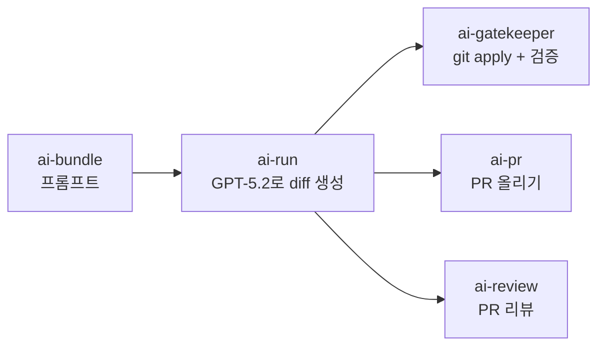

<style>
.card-link {
    text-decoration: none;
    color: inherit;
    display: block;
    width: fit-content;
    transition: transform 0.2s ease;
}
.card-link:hover {
    transform: translateY(-2px);
}
.card-link img {
    border: 1px solid #e1e4e8;
    border-radius: 8px;
    box-shadow: 0 2px 8px rgba(0, 0, 0, 0.1);
    max-width: 100%;
    height: auto;
}
</style>

"AI한테 아이디어만 주면 앱이 자동으로 만들어진다."

이걸 진짜로 만들어보기로 했습니다. 결과부터 말하면, **GPT한테 코드를 짜라고 시켰더니 성공한 적이 단 한 번도 없었습니다.** 한 번도요.

이 글은 그 처참한 실패에서 시작해서 결국 실제로 동작하는 자동화 파이프라인을 만들기까지의 기록입니다.

---

## 왜 이걸 시작했는가

클로드 코드, Cursor, Windsurf 같은 AI 코딩 도구들이 엄청 쏟아져 나오고 있잖아요. "AI가 코딩을 대신 해준다"는 말이 점점 현실이 되어가고 있는 게 느껴지고 있습니다.

저는 이런 흐름을 보면서 솔직히 두 가지 감정이 동시에 들었습니다.

1. **호기심** — AI가 정말 앱 하나를 처음부터 끝까지 만들 수 있을까? 현재 수준이 어디까지인지 직접 부딪혀보고 싶다.
2. **두려움** — 이런 기술의 발전에 따라가지 못한다면 개발자로서 도태되지 않을까?

특히 2번이 컸습니다.. AI 기술은 계속 발전하는데 저만 가만히 있으면 안 될 것 같다는 생각이 들었습니다.

그래서 "직접 해봐야 알겠다"는 마음으로 **AI Factory**를 시작하게 되었습니다!! 아이디어 하나 넣으면 AI가 설계부터 코딩, 배포까지 전부 해주는 자동화 파이프라인입니다.

바로 본론으로 들어가겠습니다!!

---

## 처음 구상: 단순한 3단계 파이프라인

처음 머릿속에 그린 구조는 정말 단순합니다.

```
설계 에이전트 → 코딩 에이전트 → 리뷰 AI
```

1. 아이디어를 넣으면 AI가 PRD(Product Requirements Document)와 스펙을 짜주고
2. 그 스펙을 기반으로 AI가 코드를 작성해서 PR을 올리고
3. 다른 AI가 그 PR을 리뷰해주는 것

"이 정도면 되지 않을까?"라는 가벼운 마음으로 시작했습니다 ㅎㅎ

---

## coding-agent 레포: 스크립트 6개의 시대

가장 처음 만든 레포가 `coding-agent`입니다. Next.js + TypeScript + Vitest 기반 템플릿에 `scripts/` 폴더 안에 각 역할의 스크립트를 넣는 구조로 잡았습니다.

| 스크립트 | 역할 |
|---------|------|
| `ai-run.mjs` | LLM에게 diff + PR 본문을 생성시키는 핵심 코딩 스크립트 |
| `ai-pr.mjs` | 생성된 diff로 브랜치 만들고 PR을 올리는 스크립트 |
| `ai-review.mjs` | GitHub API로 PR diff를 가져와 자동 리뷰 코멘트 |
| `ai-gatekeeper.mjs` | 테스트/린트/타입체크 게이트 통과 검증 |
| `ai-bundle.mjs` | 프롬프트 번들링 |
| `ai-next.mjs` | 다음 작업 결정 |

코딩 스크립트(`ai-run.mjs`)의 동작 방식은 이렇습니다.

1. TASK 파일(스펙 에이전트의 산출물)을 읽고
2. LLM에게 **unified diff + PR 본문**을 강제 형식으로 뽑게 하고
3. 생성된 diff를 `git apply --check`로 검증
4. 테스트/린트/타입체크 같은 게이트(dry-run)를 통과하면
5. 브랜치 만들고 커밋하고 PR을 올림

꽤 그럴듯해 보이죠? 하지만 여기서부터 문제가 시작됩니다..

---

## 왜 처음에 OpenAI(GPT)를 선택했는가

코딩 에이전트의 첫 모델로 GPT-5.2를 선택한 이유는 기술적으로 세 가지가 있었습니다.

1. **Responses API의 구조화된 출력**: GPT는 Responses API를 통해 JSON이나 특정 포맷을 강제할 수 있는 기능이 있습니다. diff + PR body라는 정해진 포맷을 뽑아야 하는 상황에 적합하다고 판단했습니다.
2. **문서 생성 능력**: PRD, SPEC 같은 설계 문서를 생성하는 것은 GPT가 상당히 잘합니다. 설계 → 코딩 → 리뷰 전체 파이프라인을 한 프로바이더로 통일하면 API 키 관리도 편하고 비용 추적도 쉬울 것이라 생각했습니다.
3. **토큰당 비용**: GPT-5.2 기준으로 토큰당 비용이 Claude Sonnet에 비해 저렴했습니다.

그래서 설계(문서 생성)도 GPT, 코딩(diff 생성)도 GPT로 구성하고, 코드 검토/수정만 클로드에게 맡기는 **"OpenAI = 생성, Claude = 검토"** 구조로 잡았습니다.

---

## OpenAI 코딩 성공률: 거의 0%

결과는... 참담합니다.

실제 로그를 분석해보니 실패 유형이 크게 3가지입니다.

### 실패 유형 1: 응답 포맷 불일치
```
"No diff block found"
```
LLM에게 "unified diff 코드블록으로 응답해라"라고 지시했는데, GPT가 자꾸 diff 형식이 아닌 일반 코드블록으로 응답합니다. Responses API의 구조화된 출력을 쓰더라도 **diff 내부의 정확한 포맷**(--- a/file, +++ b/file, @@ hunk header 등)까지 강제하는 것은 불가능했습니다.

이 문제 때문에 `salvageDiff()`라는 다단계 파서를 만들었습니다.

```javascript
// Strategy 1: 정규 ```diff 블록에서 추출
// Strategy 2: 다른 언어 태그(```patch, ```text) 안에 diff가 있는 경우
// Strategy 3: 코드블록 없이 본문에 diff --git이 있으면 거기서부터 추출
```

3단계 fallback을 만들었는데도 일정 확률로 포맷을 무시합니다..

### 실패 유형 2: 패치 적용 불가
```
"Generated patch is not applicable"
```
diff 형식으로 응답이 오더라도 `git apply --check`에서 실패합니다. GPT가 **레포의 실제 파일 내용을 정확히 인지하지 못하기 때문**입니다.

이건 LLM의 컨텍스트 윈도우와 관련된 구조적 문제입니다. 프롬프트에 파일 내용을 전부 넣으면 토큰이 폭증하고, 안 넣으면 정확한 diff를 만들 수 없습니다. diff는 기존 코드의 정확한 줄 번호와 내용을 알아야 하는데, LLM에게 이걸 기대하는 것 자체가 무리였던 것 같습니다.

### 실패 유형 3: API 파라미터 호환 문제
```
"temperature unsupported with this model"
```
모델 버전에 따라 지원하지 않는 파라미터가 있어서 400 에러가 납니다. 코딩 실력과 무관한 문제이지만, 자동화 파이프라인에서는 이런 사소한 것도 전체 실행을 중단시킵니다.

이 세 가지 실패를 겪으면서 깨달은 것이 있습니다.

> "LLM에게 diff를 직접 생성하라고 하는 방식 자체가 근본적으로 취약하다."

LLM은 자연어 생성은 뛰어나지만, **바이트 단위로 정확한 패치 파일**을 일관되게 만들어내는 것은 완전히 다른 종류의 작업입니다. diff의 특성상 한 줄이라도 틀리면 전체 패치가 실패하니까요.

---

## 브랜치 전략의 교훈

코딩 외에 Git 운영에서도 교훈이 있습니다.

처음에는 `feat/ai-run`이라는 동일한 브랜치를 계속 사용해서 PR을 올리고 있었는데요. 여러 번 실행하다 보니 원격과 로컬의 히스토리가 갈라져서 **non-fast-forward 충돌**으로 push가 거절되는 문제가 생겼습니다.

해결은 간단합니다. 매 실행마다 **타임스탬프가 붙은 새 브랜치명**을 사용하도록 바꿨습니다.

```
feat/ai-run-20260301-143022
feat/ai-run-20260301-151547
```

작은 문제이지만 자동화 파이프라인에서는 "당연히 되겠지"라고 넘기는 부분에서 에러가 터진다는 걸 체감하고 있습니다..

---

## PR 리뷰 자동화: 리뷰 봇

코딩 쪽에서 삽질을 하면서도, 한편으로는 **PR 리뷰 자동화**도 구현했습니다!

`ai-review.mjs`가 GitHub API로 PR의 diff와 체크런 결과를 가져와서, OpenAI에 섹션 고정 리뷰 지시문(Summary / Spec compliance / Risk / Test plan / Score)을 넣고 PR에 코멘트를 자동으로 다는 방식입니다.

이 부분은 코딩 에이전트에 비하면 꽤 안정적으로 동작합니다! 리뷰는 "코드를 읽고 자연어를 쓰는" 작업이라 LLM의 강점이 잘 발휘되는 것 같습니다. 코딩(diff 생성)과는 확실히 난이도 차이가 크다는 걸 느끼고 있습니다.

---

## Claude 전환을 결정한 기술적 이유

계속되는 OpenAI 코딩 실패에, 결국 코딩 에이전트를 클로드로 전환하기로 결정했습니다.

클로드를 선택한 기술적 이유는 세 가지입니다.

1. **코드 이해력**: Claude Sonnet은 기존 코드의 맥락을 파악하고 수정하는 능력이 GPT에 비해 눈에 띄게 좋습니다. diff를 생성할 때 기존 파일의 구조를 정확히 반영하는 비율이 높았습니다.
2. **지시 따르기(instruction following)**: "이 형식으로만 응답해라"라는 제약을 GPT보다 일관되게 지킵니다. 이는 diff 포맷 불일치 문제(실패 유형 1)를 줄일 수 있는 핵심 요소였습니다.
3. **장문 출력 안정성**: diff는 수백 줄이 넘는 경우가 흔한데, Claude는 긴 출력에서도 포맷 구조가 깨지지 않는 경향이 있습니다.

전환하기 전에 먼저 OpenAI의 실패 패턴 로그를 클로드에게 던져서 분석시켰습니다. 그리고 추가 보완 장치도 넣었습니다.

1. **salvage 파서 강화**: 기존 3단계 fallback에 더해 fenced code block 자체가 없어도 `diff --git`부터 추출하는 로직
2. **format-repair 재요청**: 포맷이 잘못되면 에러 내용을 포함해서 같은 모델에 재요청
3. **lint 에러 피드백**: 린트 에러가 나면 에러 메시지를 컨텍스트에 추가해서 수정 재요청

클로드로 전환하고 보완 장치를 추가하니 성공률이 확실히 올라가기 시작했습니다!!

하지만 근본적으로 "LLM이 직접 diff를 생성하는 방식"의 한계는 여전합니다.. 이 문제는 나중에 Claude Code, Aider 같은 코딩 에이전트 도구를 도입하면서 해결하게 됩니다.

---

## 역할별 모델 분리: "각자 잘하는 걸 시키자"

이 시점에서 **"OpenAI = 코딩, Claude = 검토"**라는 초기 설계가 완전히 뒤집어졌습니다.

직접 경험해보니 각 모델의 강점은 이렇습니다.

| 역할 | 적합한 모델 | 이유 |
|------|-----------|------|
| 설계 문서 생성 (PRD, SPEC) | GPT | 구조화된 문서를 빠르게 생성, 비용 저렴 |
| 코딩 (diff 생성) | Claude | 코드 이해력, 포맷 준수, 장문 안정성 |
| 코드 리뷰 | 둘 다 양호 | 자연어 생성 영역이라 모델 차이가 적음 |
| 코드 수정/fix | Claude | 기존 코드 맥락 파악 능력이 핵심 |

결론적으로 **"GPT = 문서 생성/설계, Claude = 코딩/수정"**으로 재배치했습니다. 처음 구상과 정반대가 된 셈입니다!! "모델을 하나로 통일하려 하지 말고, 각 모델의 강점에 맞는 역할을 배정하라"는 것이 가장 큰 교훈입니다.

---

## 1편을 마치며

정리하면 현재까지 얻은 교훈은 이렇습니다.

1. **LLM에게 diff를 직접 생성시키는 방식은 취약하다** — 바이트 단위 정확도가 필요한 작업은 LLM의 강점이 아님
2. **모델마다 강점이 확실히 다르다** — GPT는 문서 생성, Claude는 코드 이해/수정. 직접 실패해보고 나서야 체감됨
3. **자동화에서는 "당연한 것"이 없다** — 브랜치 전략, API 파라미터 호환성 같은 사소한 부분에서 전체가 중단됨
4. **개별 스크립트의 한계가 보이기 시작** — 6개 스크립트가 독립적으로 돌아가다 보니 관리가 점점 어려워지고 있음

특히 4번이 점점 심해지고 있습니다.. 스크립트를 하나 고치면 다른 스크립트에 영향이 가고, 환경변수도 제각각이고, 전체 파이프라인을 한눈에 파악하기가 어렵습니다.

그래서 다음 단계에서는 이 스크립트들을 **하나의 통합 플랫폼**으로 묶는 작업을 시작하려 합니다!

다음 글에서 이어가겠습니다!!

감사합니다!!

---

### 현재 시점의 파이프라인 구조



---

### 이 시점의 파이프라인 구조


---
