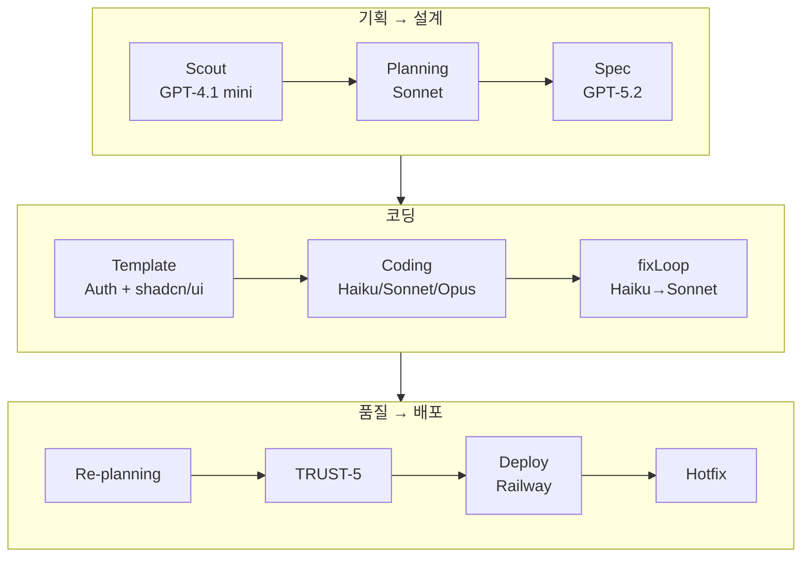

<style>
.card-link {
    text-decoration: none;
    color: inherit;
    display: block;
    width: fit-content;
    transition: transform 0.2s ease;
}
.card-link:hover {
    transform: translateY(-2px);
}
.card-link img {
    border: 1px solid #e1e4e8;
    border-radius: 8px;
    box-shadow: 0 2px 8px rgba(0, 0, 0, 0.1);
    max-width: 100%;
    height: auto;
}
</style>

> **이 글의 핵심 수치**
>
> | | Before | After |
> |---|---|---|
> | 패킷당 비용 | $2.58 | $0.13 |
> | 완성률 | 50% | 100% |
> | 10패킷 전체 비용 | ~$25 | $5.56 |
> | 완주 시간 | - | 45.8분 |
> | LLM 모델 | 1~2종 | 6종 (적재적소) |

패킷 하나 코딩하는 데 $2.58이 들었습니다. 최적화 후에는 $0.13이 되었습니다. **20배 절감.**

하지만 이 글에서 정말 하고 싶은 이야기는 비용이 아닙니다.

이 프로젝트를 시작할 때 저는 **"좋은 모델을 쓰면 무조건 좋은 결과물이 나올 것"**이라고 생각했습니다. Opus처럼 비싸고 강력한 모델을 쓰면 저렴한 모델을 여러 번 돌리는 것보다 무조건 좋을 거라고요.

**완전히 틀렸습니다.**

실제로 경험해보니 답은 이랬습니다. 좋은 모델 하나에 모든 걸 맡기는 것보다, **저렴한 모델과 강력한 모델을 역할에 맞게 배치하고 + 품질을 보장하는 체계(TDD, 검증 루프, 품질 게이트)를 도입하는 것**이 비용도 낮고 품질도 높았습니다.

간단한 에러 수정에 Opus를 쓰는 건 택시 기본요금으로 앞 건물 가는 것과 같습니다. Haiku면 충분한 작업에 Sonnet을 쓰는 것도 마찬가지입니다. 반대로, 복잡한 통합 패킷에 Haiku를 쓰면 실패 → 재시도 → 재시도로 오히려 비용이 더 들었습니다.

결국 **"적재적소"**가 답이었습니다. 이 글에서는 그 과정을 처음부터 끝까지 다루겠습니다!

바로 본론으로 들어가겠습니다!!

---

## Auth 보일러플레이트: 왜 Template Repo가 필요했는가

2편에서 "scaffold의 품질이 결과물의 품질을 결정한다"는 교훈을 얻었는데요. 이걸 더 밀어붙인 결과물이 **ai-factory-template** 레포입니다.

문제 상황은 이랬습니다. 파이프라인을 돌릴 때마다 Claude Code가 인증(auth) 로직을 매번 처음부터 만듭니다. 한 번은 cookie 세션으로 만들고, 한 번은 JWT로 만들고, 한 번은 세션 스토리지로 만들고.. **매번 다른 방식으로 구현하니까 테스트도 불안정하고 시간도 오래 걸립니다.**

auth는 사실 앱마다 거의 같은 패턴이잖아요. 이걸 매번 AI에게 새로 만들라고 하는 것 자체가 비효율적이라고 판단했습니다.

그래서 **auth를 포함한 보일러플레이트 Template Repo**를 만들기로 결정했습니다.

`ai-factory-template`에 포함된 것들:

- **Cookie + bcrypt 인증 시스템**: JWT 대신 cookie 세션을 선택한 이유는 Next.js의 미들웨어와 궁합이 좋고, 클라이언트 사이드 토큰 관리가 불필요하기 때문
- **better-sqlite3**: Turso(원격 SQLite) 대신 로컬 SQLite를 선택한 이유는 생성되는 앱은 단일 서버 배포이므로 원격 DB가 불필요하고, 빌드 타임에 DB 의존성 에러를 줄이기 위함
- 로그인/회원가입 API + UI 페이지
- 다크/라이트 테마 토글
- **shadcn/ui 컴포넌트 5종** (Button, Card, Input, Badge, Alert)
- vitest 테스트 설정 + 테스트 헬퍼 (`test-utils.ts`)
- **CLAUDE.md**: AI 코딩 에이전트가 지켜야 할 규칙 문서

특히 **CLAUDE.md**가 핵심입니다. 이 파일이 AI 코딩 에이전트의 "사내 규정집" 같은 역할을 합니다.

```markdown
## CRITICAL: STANDALONE Next.js app
- INDEPENDENT app, NOT monorepo. Only import from node_modules or src/
- DB: use better-sqlite3 (already configured in src/lib/db.ts)

## Pre-built Auth (DO NOT RECREATE)
- src/lib/auth.ts — cookie sessions + bcrypt
- CRITICAL: NEVER call destroySession() in Server Components
```

"이미 만들어진 auth를 다시 만들지 마라", "이 DB 라이브러리를 써라" 같은 구체적 규칙을 적어두면 Claude Code가 이걸 읽고 규칙을 지키면서 코딩합니다.

Template Repo 도입 후 auth 관련 실패가 거의 사라졌습니다!!

---

## Aider 제거 결정: 왜 Claude Code 단일 엔진으로 바꿨는가

2편에서 "Aider 1차 → Claude Code 에스컬레이션" 하이브리드 전략을 선택했다고 했는데요. 실제로 돌려보니 Aider의 실패율이 너무 높았습니다.

실패 원인을 분석해보니:

1. **컨텍스트 이해 부족**: Aider는 지정된 파일만 수정하는 방식인데, 패킷 간 의존성이 있는 경우 관련 파일을 누락하는 경우가 많음
2. **프롬프트 해석력 차이**: 복잡한 UI 요구사항이나 디자인 시스템 규칙을 Claude Code만큼 정확히 따르지 못함
3. **비용 절감 효과가 기대보다 작음**: Aider가 실패하면 결국 Claude Code로 에스컬레이션하니까, Aider 실행 비용이 그냥 낭비되는 셈

결국 v0.4에서 **Aider 관련 코드를 전면 삭제**하고 Claude Code 단일 엔진으로 전환했습니다.

대신 Claude Code 내에서 **적응형 모델 선택**을 도입했습니다. 이게 바로 "적재적소" 전략의 핵심입니다. 과거 실행 통계를 기반으로 패킷 유형에 따라 모델을 자동 선택합니다.

| 패킷 유형 | 모델 | 이유 |
|----------|------|------|
| 간단한 패킷 (2~3파일, infra/logic) | **Haiku 4.5** | 비용 최저, 간단한 작업은 충분 |
| 일반 패킷 | **Sonnet 4.6** | 비용/성능 균형 |
| 복잡한 패킷 (8파일+, 통합) | **Opus 4.6** | 성능 최고, 복잡한 작업에 필요 |

Aider라는 "다른 도구"로 비용을 아끼려는 전략보다, **같은 도구(Claude Code) 안에서 모델을 지능적으로 배치하는 전략**이 훨씬 효과적이었습니다.

---

## TDD 전략의 진화: test-first → test-alongside

2편에서 도입한 TDD는 **Spec Agent가 먼저 테스트를 생성 → 코딩 에이전트가 테스트를 통과시키는 코드 작성** 방식(test-first)이었는데요.

실전에서 운영하면서 몇 가지 문제가 발견되었습니다.

1. **테스트 생성 비용**: 테스트를 별도 LLM 호출로 생성하면 패킷당 ~$0.15 추가 비용이 발생
2. **테스트 품질 문제**: Spec Agent가 만든 테스트가 실제 구현과 맞지 않는 경우가 있음 (예: 존재하지 않는 API 경로를 테스트)
3. **JSON 잘림 문제 지속**: 여러 패킷의 테스트를 한번에 생성하면 maxTokens 한계에 걸림

그래서 TDD 전략을 **test-alongside**로 진화시켰습니다. 코딩 에이전트가 코드와 테스트를 **동시에 작성**하는 방식입니다.

변경 전 (test-first):
```
Spec Agent → 테스트 생성 (별도 LLM 호출) → 코딩 에이전트 (테스트 통과 코드 작성)
```

변경 후 (test-alongside):
```
Spec Agent → Work Packet에 AC 명세 → 코딩 에이전트 (코드 + 테스트 동시 작성)
```

대신 CLAUDE.md에 **MANDATORY Test Pattern**을 추가해서 테스트 작성을 강제했습니다. 또한 template에 `test-utils.ts`를 미리 넣어서 테스트 인프라(setupTestLifecycle, createTestUser, makeAuthedRequest 등)를 제공했습니다.

테스트 생성을 위한 별도 LLM 호출이 사라지면서 비용이 줄었고, 코딩 에이전트가 자기가 만든 코드에 맞는 테스트를 쓰니까 테스트 품질도 오히려 올라갔습니다!

---

## 비용 최적화 대전환: 패킷당 $2.58 → $0.13

핵심 변경 3가지입니다.

### 1. TDD 전략 변경 (위에서 설명한 test-alongside)

### 2. 수정 루프 제한 + 모델 다운그레이드
- typecheck 수정: 최대 1회만 시도
- 테스트 수정: 최대 1회, **Haiku 모델** 사용

왜 Haiku를 쓰는가? typecheck 에러나 테스트 실패 수정은 "에러 메시지를 읽고 한 줄 고치기" 수준의 작업이 대부분입니다. import 경로 오타, 타입 불일치, 세미콜론 누락 같은 것들인데, 이런 작업에 Sonnet급 모델을 쓸 필요가 없습니다.

- 누적 수정 비용이 $0.50을 초과하면 중단 → "이 패킷은 포기"

### 3. 의존 패킷 자동 스킵
Work Packet 간에 `depends_on` 필드가 있는데, 선행 패킷이 실패하면 후속 패킷을 자동으로 스킵합니다. 선행 패킷의 API가 없는데 후속 패킷에서 그 API를 import해봐야 무조건 실패하니까요.

### 결과

| 지표 | Before | After |
|------|--------|-------|
| Packet 0001 비용 | $2.58 | $0.13 |
| 패킷당 평균 비용 | ~$2.50 | ~$0.56 |
| 10패킷 전체 비용 | - | $5.56 |
| 완성률 | 50% | 100% |
| 완주 시간 | - | 45.8분 |

**20배 절감에 완성률은 50% → 100%로 올라갔습니다.** 비용을 줄였는데 품질이 올라간 이유가 바로 서두에서 말한 것과 같습니다. 비싼 모델을 한 번 쓰는 것보다, 저렴한 모델을 적재적소에 배치하고 체계(TDD, 검증 루프)를 갖추는 것이 더 효과적이기 때문입니다.

---

## 프롬프트 품질 개선: "모호함 = 모호한 코드"

비용을 줄이면서도 품질을 높이려면 **프롬프트를 잘 짜는 것**이 핵심입니다.

### Spec Agent: 모호한 표현 금지

기존에는 Acceptance Criteria에 "should work well", "properly handle errors" 같은 모호한 표현이 허용되었는데, 이걸 **금지 단어 목록**으로 차단했습니다.

금지 전: `User should be able to properly handle login`
금지 후: `Given a user submits valid email/password, When POST /api/auth/login is called, Then response is 200 with Set-Cookie header containing session token`

**Given/When/Then 형식을 강제**하니까 코딩 에이전트가 정확히 뭘 구현해야 하는지 알게 됩니다. 이것도 결국 TDD 사상의 연장선입니다 — "명확한 명세 → 명확한 구현"이라는 원칙이 Spec 단계에까지 적용된 것입니다.

---

## 패킷 간 코드 컨텍스트 전달: $0, 0.1초의 해결책

패킷이 독립적으로 코딩되다 보니, 앞 패킷에서 만든 컴포넌트를 뒤 패킷이 다시 만드는 **중복 생성** 문제가 있었습니다.

이걸 해결하기 위해 `generatePacketContext()` 함수를 만들었습니다.

핵심 설계 결정: **LLM을 호출하지 않습니다.** 실제 소스 파일에서 regex로 export 시그니처, 컴포넌트 이름, API 라우트, DB 스키마를 추출합니다. 비용 $0, 시간 0.1초.

왜 LLM을 쓰지 않았는가? "이전 패킷에서 뭘 만들었는지 요약해줘"를 LLM에게 시키면 패킷당 $0.05~0.10 추가 비용이 발생합니다. 10개 패킷이면 $0.50~1.00인데, regex로 동일한 정보를 $0에 추출할 수 있습니다. LLM을 안 써도 되는 곳에 쓰지 않는 것도 비용 최적화의 일부입니다.

---

## 핫픽스 미니 파이프라인

파이프라인이 완주되어도 자잘한 버그는 남기 마련입니다. 처음에는 핫픽스를 하나의 큰 프롬프트로 한번에 고치려 했는데.. **600초 타임아웃으로 조용히 실패**합니다.

큰 프롬프트가 실패하는 이유: 버그 3개를 한번에 고치라고 하면, Claude Code가 하나씩 수정하다가 중간에 막히면 전체가 타임아웃됩니다.

그래서 핫픽스도 **미니 파이프라인**으로 만들었습니다.

1. **Phase 1**: **Haiku**로 작업 분석 → 1~5개 서브태스크 자동 분할 (30초, ~$0.01)
2. **Phase 2**: 서브태스크별 순차 실행 (각 180초 타임아웃)
3. **Phase 3**: 최종 검증 + git push

여기서도 "적재적소" 원칙이 적용됩니다. Phase 1은 분석 작업이라 Haiku면 충분합니다. Phase 2의 실제 코딩만 Sonnet급을 사용합니다.

Git 안전장치도 넣었습니다. 시작 전에 백업 브랜치를 만들고, 실패하면 자동 롤백합니다.

---

## v0.9: 품질 체계 대수술 — TRUST-5, fixLoop, Re-planning Gate

13일간 개발하면서 기능은 계속 추가되는데, "생성된 앱의 품질을 정량적으로 어떻게 측정하고 보장할 것인가?"라는 근본적인 문제가 남아있었습니다.

v0.9에서 이걸 본격적으로 다루었습니다. 16개 커밋에 걸친 대수술이었습니다..

### TRUST-5: 정량적 품질 메트릭

기존에는 "green/yellow/red"라는 정성적 판단이었는데, 이걸 5가지 축의 정량적 메트릭으로 바꿨습니다. 이 체계는 **MoAI-ADK(Multi-agent Orchestrator AI — Agent Development Kit)**의 품질 관리 프레임워크를 참고해서 AI Factory에 맞게 변형한 것입니다.

- **T**ested: 테스트 커버리지 + 테스트 통과율
- **R**eadable: ESLint warning/error 수
- **U**nified: 디자인 시스템(CLAUDE.md) 준수 여부
- **S**ecured: 보안 패턴 준수
- **T**rackable: 변경 추적 가능성

### fixLoop: 자율 반복 수정 엔진

기존에는 typecheck 실패 → 1회 수정, lint 실패 → 1회 수정, test 실패 → 1회 수정을 각각 독립적으로 했습니다. 하지만 typecheck을 고치면 lint가 깨지고, lint를 고치면 test가 깨지는 연쇄 문제가 발생했습니다.

이걸 **하나의 통합 수정 루프**로 만들었습니다.

- tsc + lint + tests를 한번에 검사, 최대 5회 반복
- 1~2회차: **Haiku** (간단한 수정에 충분) → 3회차~: **Sonnet으로 에스컬레이션** (복잡한 수정 필요)
- **교착 감지**: 동일 에러 시그니처가 3회 반복되면 "이건 자동으로 못 고친다" → 중단
- 비용 상한 도달 시 중단

여기서도 Haiku → Sonnet 에스컬레이션 패턴이 적용됩니다. 대부분의 에러는 Haiku로 해결되니까 비용이 크게 절감됩니다.

### Re-planning Gate: 설계 자체를 재검토

패킷이 실패했을 때 **원인을 자동 분류**합니다.

| 분류 | 대응 |
|------|------|
| `CODE_BUG` | 코딩 에이전트 재시도 (fixLoop) |
| `DESIGN_FLAW` | **설계 자체가 잘못됨 → 패킷 재설계 후 retry** |
| `DEPENDENCY_ISSUE` | 외부 의존성 문제 → 스킵 또는 대안 |
| `SCOPE_TOO_LARGE` | 패킷이 너무 큼 → 분할 |

핵심은 `DESIGN_FLAW`입니다. 예를 들어 Spec Agent가 "이 API는 GET으로 만들어라"라고 했는데 실제로는 POST여야 하는 경우, 같은 설계로 아무리 재시도해도 계속 실패합니다. 이때 코딩을 재시도하는 게 아니라 **설계를 다시 하는 것**이 정답입니다.

---

## 모바일 확장: 왜 scaffold만 바꾸면 되는가

웹 파이프라인이 안정화된 후, **Expo SDK 52 + React Native 기반 모바일 앱 생성**도 추가했습니다!

| 항목 | 웹 | 모바일 |
|------|-----|--------|
| Scaffold | Next.js + Tailwind + shadcn/ui | Expo + NativeWind + RN 컴포넌트 |
| CLAUDE.md | "Tailwind CSS 사용" | "NativeWind 사용, SafeAreaView 필수" |
| 빌드 검증 | `next build` | `expo-doctor` + `expo export` |
| 배포 | Railway | EAS Build |

코딩 에이전트, Spec Agent, fixLoop 등 핵심 파이프라인 로직은 **그대로 재사용**됩니다.

---

## 배포 전환: Vercel → Railway

처음에는 Vercel에 대시보드를 배포하고 거기서 파이프라인을 실행하려 했습니다. 하지만 근본적인 문제가 있었습니다.

**Vercel의 서버리스 환경에서는 코딩 에이전트를 실행할 수 없습니다.**

AI Factory의 파이프라인은 서버에서 Claude Code CLI를 실행해야 합니다. Claude Code는 파일 시스템을 직접 읽고 쓰면서 코딩하는 도구인데, Vercel의 서버리스 함수는 실행 시간 제한(10초~60초)이 있고, 영구적인 파일 시스템 접근이 불가능하며, CLI 도구를 설치해서 실행하는 것 자체가 지원되지 않습니다.

즉 Vercel은 **대시보드(웹 UI)를 호스팅하는 데는 좋지만, 코딩 에이전트가 실제로 동작하는 "작업 서버" 역할은 할 수 없었습니다.**

Railway는 **컨테이너 기반** 서비스라서 이 문제가 없습니다. 일반 Linux 서버처럼 CLI 도구를 설치하고, 파일 시스템에 자유롭게 접근하고, 장시간 프로세스를 실행할 수 있습니다. `output: "standalone"` 모드로 Next.js를 빌드하면 자체 서버로 동작하기 때문에 대시보드와 파이프라인 엔진을 같은 컨테이너에서 돌릴 수 있습니다.

---

## 현재 AI Factory의 모습

v0.1에서 시작해서 v0.9.2까지 진행한 결과 현재 전체 아키텍처는 이렇습니다.

```
Scout Agent (아이디어 발굴, 5중 필터)
    ↓
Planning AI (대화형 기획, PRD 생성, 10항목 검증)
    ↓
Spec Agent (PRD → SPEC → TASK → Work Packets)
    ↓     (Given/When/Then AC, EARS 분류, 파일 충돌 탐지)
Scaffold + CLAUDE.md + Template
    ↓
Coding Phase (wave 기반 병렬 코딩)
    ↓     적응형 모델 선택 (Haiku/Sonnet/Opus)
    ↓     fixLoop (tsc+lint+test 통합 수정 ×5)
    ↓     Re-planning Gate (설계 문제 시 재설계)
    ↓     패킷 간 코드 컨텍스트 전달
Verification → Sync (README+CHANGELOG) → Deploy
```

**사용 중인 LLM 모델 6종과 그 이유:**

| 모델 | 역할 | 선택 이유 |
|------|------|----------|
| **Sonnet 4.6** | 코딩 메인 | 비용/성능 균형, 대부분의 코딩 작업에 적합 |
| **Opus 4.6** | 복잡한 패킷 | 여러 파일을 유기적으로 수정해야 할 때 |
| **Haiku 4.5** | 수정/분석 | 에러 수정, 서브태스크 분할 같은 단순 작업 |
| **GPT-5.2** | Spec 설계 | 구조화된 문서 생성에 강점 |
| **GPT-4.1 mini** | 뉴스 수집 | Scout의 웹 검색에 저렴한 모델이면 충분 |
| **Gemini 3.1 Pro** | 대안 모델 | 특정 설계 작업에서 GPT-5.2의 대안 |

앱 1개 생성 비용은 **~$2.87**, 추가 최적화 시 **~$2.10**까지 가능합니다.

<!-- 이미지: AI Factory 대시보드 전체 스크린샷 -->
<!-- 이미지: 파이프라인 타임라인 화면 -->

---

## 솔직한 현재 평가

현재 AI Factory는 **"꽤 쓸만한"** 수준이라고 평가하고 있습니다. 파이프라인이 안정적으로 완주되고 실제로 앱을 배포할 수 있는 수준이 되었습니다.

하지만 솔직히 아직 갈 길이 멀기도 합니다.

- 생성되는 앱의 **UI 품질**은 아직 사람이 만든 것에 비하면 부족함
- **복잡한 비즈니스 로직**이 들어가면 코딩 에이전트가 헤맬 때가 있음
- **수익화까지는 아직 미도달**

그래도 "아이디어 하나 넣으면 실제로 동작하는 웹앱이 자동으로 배포된다"는 것 자체가 몇 주 전에는 상상하기 어려운 일이었으니까요!!

---

## 시리즈를 마치며

### AI 코딩의 현재 수준

AI는 **정해진 틀 안에서 코드를 채워넣는 것**은 꽤 잘합니다. scaffold, 테스트, 디자인 시스템, API 계약 같은 "틀"을 잘 잡아주면 생각보다 괜찮은 결과물이 나옵니다.

하지만 **창의적인 설계 결정, 복잡한 아키텍처 판단, "이게 사용자에게 좋은 경험인가?"를 고민하는 것**은 아직 사람의 영역이라고 생각합니다.

AI 코딩은 "개발자를 대체한다"가 아니라 **"개발자의 생산성을 극대화한다"**가 맞는 표현인 것 같습니다.

### 비싼 모델 = 좋은 결과가 아니었다

이번 프로젝트에서 가장 의외였던 발견입니다. 처음에는 "Opus에 다 맡기면 되지 않을까?"라고 생각했지만, 실제로는 **Haiku + Sonnet + Opus를 역할에 맞게 배치하고 + TDD/검증 루프/품질 게이트라는 체계를 갖추는 것**이 비용도 낮고 품질도 높았습니다.

사람 조직에서도 시니어 개발자 한 명이 모든 걸 하는 것보다, 시니어/미드/주니어가 적절히 역할 분담하고 코드 리뷰/CI 같은 체계를 갖추는 것이 더 효과적이잖아요. AI 모델도 똑같았습니다.

### 앞으로의 계획

현재 가장 큰 목표는 **AI 에이전트를 실무에 도입하여 팀 내 생산성을 높이는 것**입니다.

AI Factory를 만들면서 AI 코딩의 가능성과 한계를 둘 다 체감했고, 이 경험이 실무에서 AI 에이전트를 도입할 때 큰 도움이 될 것이라 생각합니다.

처음에 "AI 기술 발전에 뒤처지면 도태되지 않을까?"라는 두려움으로 시작한 프로젝트였는데, 직접 부딪혀보니 두려움보다는 **"이걸 잘 활용하면 정말 대단한 것들을 만들 수 있겠구나"**라는 확신이 생겼습니다.

이 시리즈가 AI 코딩이나 AI 에이전트에 관심 있는 분들에게 조금이라도 도움이 되었으면 좋겠습니다!!

감사합니다!!

---

### 이 시점의 파이프라인 구조



---

## 부록: AI Factory 핵심 수치 요약

| 항목 | 수치 |
|------|------|
| 전체 코드 | ~6,000줄 |
| 총 커밋 | 86회 |
| 개발 기간 | 13일 |
| 파이프라인 모듈 수 | 20개 |
| 에이전트 패키지 | 4종 (Scout, Spec, Planning, Review) |
| LLM 모델 | 6종 병행 |
| 앱 1개 생성 비용 | ~$2.87 (최적화 시 ~$2.10) |
| 패킷당 비용 절감 | $2.58 → $0.13 (20배) |
| 지원 플랫폼 | Web (Next.js) + Mobile (Expo) |
| 배포 | Railway (웹) / EAS Build (모바일) |
