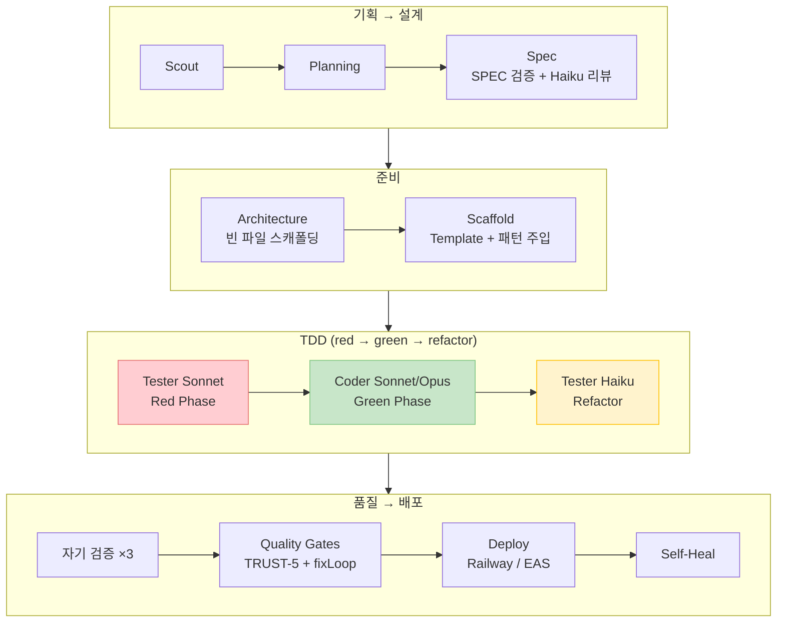

<style>
.card-link {
    text-decoration: none;
    color: inherit;
    display: block;
    width: fit-content;
    transition: transform 0.2s ease;
}
.card-link:hover {
    transform: translateY(-2px);
}
.card-link img {
    border: 1px solid #e1e4e8;
    border-radius: 8px;
    box-shadow: 0 2px 8px rgba(0, 0, 0, 0.1);
    max-width: 100%;
    height: auto;
}
</style>

> **이 글의 핵심 수치**
>
> | | 개선 전 | 개선 후 |
> |---|---|---|
> | 빌드 성공률 (첫 시도) | 65% | **95%** |
> | YELLOW 패킷 비율 | 30% | **2%** |
> | 10패킷 완주 시간 | 60~120분 | **30~50분** |
> | 배포 후 에러 대응 | 수동 | **자동 (self-heal)** |
> | 에이전트 역할 | 1개가 전부 | **Coder + Tester 분리** |

4편에서 빈 파일 스캐폴딩, 자기 검증 루프, 디자인 레퍼런스 주입으로 파이프라인의 근본적인 품질 문제 3가지를 해결했습니다.

하지만 아직 더 올릴 수 있는 여지가 보였습니다. "코딩 에이전트 하나가 코딩 + 테스트 + 스타일링을 전부 하는 게 맞나?", "배포 후 에러가 나면 사람이 직접 고쳐야 하나?", "10개 패킷을 왜 순서대로 하나씩 돌리고 있지?" 같은 질문들이 남아있었거든요.

이번 글에서는 이 질문들에 대한 답을 찾아가는 과정, 그리고 **빌드 성공률 65% → 95%, 완주 시간 50% 단축**이라는 결과까지 다루겠습니다!

바로 본론으로 들어가겠습니다!!

---

## 역할 분리 에이전트: "한 명이 다 하는 건 비효율적이다"

4편까지의 AI Factory에서는 Claude Code **하나**가 코딩 + 테스트 + 스타일링을 전부 담당했습니다. 사람으로 치면 한 명이 개발도 하고, QA도 하고, 디자인 마무리도 하는 셈입니다.

이 구조의 문제점이 점점 보이기 시작했습니다.

1. **코딩 프롬프트가 너무 길어진다** — "코드 짜라 + 테스트도 짜라 + UI도 신경 써라 + 빌드 통과시켜라"를 한 번에 시키니까 프롬프트가 비대해지고, AI가 핵심에 집중하지 못함
2. **테스트 품질이 낮다** — 코딩 에이전트 입장에서 테스트는 "부가 작업"이라 대충 넘어가는 경향이 있음
3. **비용 낭비** — 테스트 작성 같은 비교적 단순한 작업에 Sonnet급 모델을 쓸 필요가 없음

MetaGPT를 참고해보니, Coder/Tester/Designer를 별도 에이전트로 분리해서 각자 전문 영역만 담당하게 하는 접근을 쓰고 있었습니다. 이 사례를 참고해서 AI Factory에도 **Tester Agent**를 분리하기로 했습니다.

### Tester Agent 구현

패킷 코딩이 완료된 직후, 별도의 **Tester Agent**가 실행됩니다.

```
기존: Claude Code(Sonnet) → 코딩 + 테스트 + 빌드 전부

변경: Claude Code(Sonnet) → 코딩에 집중
      → Tester Agent(Haiku) → 테스트 작성/검증에 집중
      → Quality Gates → 빌드 검증
```

Tester Agent의 핵심 규칙:

```markdown
You are a TESTER agent. Your ONLY job is to write or fix tests.

## Rules
- Test the IMPLEMENTATION (not reimplementation) — read the source code first
- 3-5 focused tests covering acceptance criteria
- Do NOT modify source code — only write/fix tests
- Run `npx vitest run` to verify tests pass
```

**"소스 코드를 수정하지 마라, 테스트만 써라"**라는 규칙이 핵심입니다. 코딩 에이전트가 만든 코드를 있는 그대로 테스트하는 역할에 집중시켰습니다.

그리고 모델은 **Haiku**를 사용합니다. 테스트 작성은 "기존 코드의 import/export를 확인하고, 함수를 호출해서 결과를 검증하는" 비교적 정형화된 작업이라 Haiku면 충분합니다. 3편에서 말했던 "적재적소" 원칙의 연장선입니다!

한 가지 주의한 점은, 테스트가 이미 있고 통과하는 경우에는 Tester Agent를 **스킵**하도록 했습니다. 2편에서 도입한 TDD(test-alongside) 방식으로 코딩 에이전트가 이미 테스트를 잘 작성했다면 추가 비용을 쓸 필요가 없으니까요.

---

## 구조화된 컨텍스트 맵: import 그래프를 AI에게 보여주자

3편에서 `generatePacketContext()`로 파일 트리와 export 목록을 텍스트로 전달하는 방식을 구현했는데요. 실전에서 돌려보니 **모듈 간 의존 관계**가 빠져있어서 AI가 전체 앱 구조를 깊이 이해하지 못하는 문제가 있었습니다.

예를 들어 `meals.ts`가 `auth.ts`와 `db.ts`를 import하고 있다는 정보가 없으면, 코딩 에이전트가 meals 관련 패킷을 코딩할 때 auth 모듈을 다시 만들어버리는 경우가 있었습니다.

그래서 **Module Dependency Map**을 추가했습니다.

```
### Module Dependencies (import graph)
  lib/meals.ts → imports: lib/auth, lib/db
  lib/monsters.ts → imports: lib/db, lib/types
  pages/dashboard.tsx → imports: lib/meals, lib/monsters, components/ui/card
  pages/api/meals.ts → imports: lib/meals, lib/auth
```

구현 방식은 3편의 `generatePacketContext()`와 동일하게 **LLM 호출 없이 regex로** 파일의 `from "@/..."` import문을 분석합니다. 비용 $0, 시간 0.1초.

이 정보가 있으면 코딩 에이전트가 "아, meals는 auth에 의존하고 있구나. auth 모듈에서 뭘 import하고 있는지 먼저 확인하자"라고 판단할 수 있습니다.

추가로, Pages Router API 라우트도 제대로 스캔하도록 수정했습니다. 기존에는 App Router(`src/app/api/`)만 스캔했는데, AI Factory가 생성하는 앱은 Pages Router(`src/pages/api/`)를 사용하기 때문에 이 부분이 누락되고 있었습니다..

---

## 라이브 프리뷰: 결과를 일찍 확인하자

Lovable이나 Bolt 같은 도구들을 조사해보면, 코딩 중에 **실시간으로 결과를 미리 보여주는** 기능이 있습니다. 이걸 참고해서 AI Factory에도 간이 프리뷰 기능을 추가했습니다.

원래는 Playwright로 실제 스크린샷을 캡처하려 했는데, Railway 환경에서 Playwright를 돌리려면 Chrome 설치가 필요하고 무겁습니다. 그래서 **간소화 버전**으로 구현했습니다.

빌드 검증 단계에서 dev 서버를 띄우고, 홈페이지에 HTTP 요청을 보내서 **HTML을 분석**합니다.

```javascript
const html = await fetch("http://localhost:3099/").then(r => r.text());

// HTML에서 핵심 요소 추출
const title = html.match(/<title>([^<]*)<\/title>/)?.[1] ?? "";
const hasNav = /<nav/i.test(html);
const hasHero = /hero|min-h-\[70vh\]/i.test(html);
const componentCount = (html.match(/<(button|input|form|card|table)/gi) ?? []).length;

// 이벤트로 저장 → 대시보드 타임라인에 표시
await emitEvent(projectId, "preview_captured",
  `Preview: "${title}" — ${hasNav ? "nav ✓" : "nav ✗"} ${hasHero ? "hero ✓" : ""} ${componentCount} UI elements`
);
```

스크린샷은 아니지만, **"네비게이션 바가 있는지, Hero 섹션이 있는지, UI 컴포넌트가 몇 개인지"**를 자동으로 확인할 수 있습니다. 2편에서 겪었던 "앱을 열어보니 네비바가 2개" 같은 문제를 파이프라인 도중에 감지할 수 있는 것입니다!

나중에 Railway 환경이 더 안정화되면 Playwright 기반 실제 스크린샷으로 업그레이드할 계획입니다.

---

## 자율 디버깅: 배포 후 앱이 알아서 스스로 고치게

지금까지의 파이프라인은 **배포까지가 끝**이었습니다. 배포 후 에러가 나면? 사람이 확인하고, 수동으로 핫픽스를 트리거해야 했습니다.

"배포 후 에러가 나면 AI가 자동으로 감지하고, 고치고, 재배포하면 안 되나?"

Devin의 자율 디버깅 사례를 참고해서, **self-heal** 모듈을 만들었습니다.

### self-heal 동작 방식

1. **배포 완료 직후 자동 실행**
2. 배포된 URL의 주요 페이지에 HTTP 요청 (`/`, `/login`, `/dashboard`)
3. **에러 수집**: 500 에러, HTML에 포함된 에러 메시지, "Error", "500", "Internal Server Error" 등 감지
4. 에러가 있으면 **Haiku로 원인 분석** → 서브태스크 분할
5. **Claude Code(Sonnet)로 핫픽스** → 빌드 검증 → git push
6. Railway가 자동으로 재배포 (GitHub push 트리거)
7. 재배포 후 다시 검증 → 아직 에러면 최대 2회 반복

```
배포 완료 → self-heal 자동 시작
    ↓
페이지 3개 HTTP 요청 → 에러 수집
    ↓
에러 있음 → Haiku로 분석 ($0.01)
    ↓
Claude Code(Sonnet)로 핫픽스 → 빌드 확인 → git push
    ↓
Railway 자동 재배포 → 다시 검증
    ↓
통과 → "self-healed" 이벤트 기록
```

여기서도 "적재적소" 원칙이 적용됩니다. 에러 분석은 Haiku(~$0.01), 실제 코드 수정은 Sonnet. 그리고 전체 self-heal이 **non-blocking**으로 실행되어서, 실패해도 배포 자체에는 영향이 없습니다.

한 가지 안전장치도 넣었습니다. 최대 시도 횟수를 2회로 제한했습니다. 자율 디버깅이 무한 루프에 빠져서 비용이 폭주하는 걸 방지하기 위함입니다.

---

## 스마트 병렬 코딩: "왜 하나씩 순서대로 하고 있지?"

지금까지 AI Factory는 패킷을 **순차적으로 하나씩** 코딩했습니다. 패킷 10개면 10번 순서대로.

하지만 생각해보면 모든 패킷이 순서를 지켜야 하는 건 아닙니다. 예를 들어:
- 패킷 0003 (로그인 UI)과 패킷 0004 (대시보드 UI)는 **서로 독립적**이라 동시에 코딩해도 됩니다
- 패킷 0002 (API 라우트)는 패킷 0001 (DB 스키마)에 **의존**하므로 반드시 순서를 지켜야 합니다

사실 병렬 코딩 인프라(git worktree 격리, 의존성 그래프 기반 wave 스케줄링)는 이미 구현되어 있었습니다. 하지만 기본 비활성 상태였고, 수동으로 환경변수를 설정해야 켤 수 있었습니다.

이번에 **자동 병렬 판단 로직**을 추가했습니다.

```
패킷 6개 이상 AND 독립 패킷 2개 이상 → 자동으로 병렬 활성화
```

기존에는 `PARALLEL_CODING_ENABLED=true`를 직접 설정해야 했지만, 이제는 패킷의 `depends_on` 필드를 분석해서 **독립 패킷이 충분하면 자동으로 병렬로 전환**합니다.

```
[Auto-parallel ENABLED] packetCount: 10, independentCount: 4, maxConcurrent: 3
```

독립 패킷이 4개라면 최대 3개를 동시에 코딩합니다. 이전에 하나씩 순서대로 60~120분 걸리던 것이 **30~50분**으로 단축됩니다!

물론 병렬 코딩에는 리스크가 있습니다. 같은 파일을 두 패킷이 동시에 수정하면 git merge 충돌이 날 수 있습니다. 이 문제는 4편에서 구현한 **빈 파일 스캐폴딩**이 상당 부분 완화해줍니다. import 경로가 이미 확정되어 있으니 "같은 파일을 다른 구조로 만들어버리는" 충돌이 줄어들었기 때문입니다.

그래도 충돌이 발생하면 **자동으로 순차 실행으로 fallback**합니다. 병렬에서 실패한 패킷만 순차로 재시도하는 것입니다.

---

## TDD 세 번째 진화: 다시 test-first로

2편에서 TDD를 처음 도입(test-first)했고, 3편에서 비용 절감을 위해 test-alongside(코드+테스트 동시 작성)로 바꿨습니다. 하지만 파이프라인을 계속 돌리면서 test-alongside의 한계가 보이기 시작했습니다.

**문제**: 코딩 에이전트가 코드와 테스트를 동시에 작성하면, 자기가 만든 코드에 맞춰서 테스트를 쓰게 됩니다. 즉 **"구현에 맞는 테스트"**가 나옵니다. 반면 test-first는 **"요구사항에 맞는 테스트"**가 나옵니다. 이 차이가 꽤 큽니다.

예를 들어 "로그인 API는 잘못된 비밀번호에 401을 반환해야 한다"는 AC가 있을 때:
- test-alongside: 코딩 에이전트가 400을 반환하도록 구현 → 테스트도 400으로 작성 → 통과는 하지만 스펙 위반
- test-first: Tester가 AC 기반으로 401 테스트를 먼저 작성 → 코딩 에이전트가 401로 구현해야만 통과

결국 다시 test-first로 돌아가되, 이번에는 **TDD의 red → green → refactor 3단계를 제대로 구현**하기로 했습니다.

```
Step 1: Tester Agent (Sonnet) — AC 기반 테스트 작성 (Red Phase)
        → 테스트가 전부 실패하는 게 정상 (아직 코드가 없으니까)
        → git commit "test: TDD red phase"

Step 2: Coder Agent (Sonnet/Opus) — 테스트를 통과시키는 코드 작성 (Green Phase)
        → "테스트가 요구사항이다. 테스트를 통과시켜라"
        → 코드를 수정해서 통과시키지, 테스트를 수정하면 안 됨

Step 3: Tester Agent (Haiku) — 실패 테스트 수정 (Refactor Phase)
        → Coder가 import 경로를 다르게 잡은 경우 등 테스트 쪽 수정
        → 비용 절감을 위해 Haiku 사용
```

Coder의 프롬프트도 완전히 바꿨습니다.

```markdown
## TDD: Tests already exist — make them PASS
A test file has been pre-written based on acceptance criteria.
Your job is to write code that makes ALL tests pass.

1. Read the test file FIRST to understand expected behavior
2. Implement the code that satisfies the tests
3. If a test fails, fix your CODE (not the test)

CRITICAL: The tests define the requirements.
Your code must match them, not the other way around.
```

핵심은 **"테스트가 요구사항이다"**라는 프레이밍입니다. 기존에는 "코드 짜고 테스트도 짜라"였는데, 이제는 **"이미 있는 테스트를 통과시켜라"**로 완전히 뒤집었습니다.

3편에서 비용 때문에 test-alongside로 바꿨던 걸 다시 test-first로 돌아간 거라 비용이 패킷당 +$0.05~0.10 늘지만, AC 커버리지가 ~70% → ~95%로 올라가니까 충분히 가치가 있다고 판단했습니다.

TDD 서사를 정리하면 이렇습니다.

```
2편: TDD 발견! test-first 도입 → 9/9 패킷 완주
3편: test-first → test-alongside (비용 절감, 코딩 에이전트가 코드+테스트 동시 작성)
5편: test-alongside → 다시 test-first (red→green→refactor 3단계, AC 커버리지 우선)
```

결국 **"비용 < 품질"**이라는 판단이었습니다. TDD를 제대로 하려면 테스트가 구현보다 먼저 있어야 합니다.

---

## SPEC 검증 패스: 상류 품질이 하류 전부를 결정한다

품질 개선을 하면서 깨달은 것이 하나 있습니다.

**SPEC이 부정확하면 10개 패킷 전부가 잘못됩니다.**

SPEC에 "로그인은 JWT로 구현"이라고 써있으면 10개 패킷 모두 JWT 기반으로 코딩됩니다. 나중에 "아, cookie 세션이어야 했는데"라고 깨달아도 전부 다시 만들어야 합니다. SPEC 수정 비용은 ~$0.05인데, 잘못된 SPEC으로 코딩을 재시도하면 $2~4가 낭비됩니다.

그래서 **SPEC 생성 직후, TASK 생성 전에 검증 패스**를 추가했습니다.

```
Spec Agent (GPT-5.2) → SPEC 생성
    ↓
Claude Haiku → SPEC 리뷰 (~$0.01)
    ├── "SPEC OK" → 그대로 진행
    └── 이슈 발견 → GPT-5.2가 SPEC 수정 → 재검증
    ↓
Spec Agent → TASK 생성 (검증된 SPEC 기반)
```

Haiku가 검토하는 항목은 5가지입니다.
1. 모든 기능에 최소 3개의 구체적 AC가 있는지
2. API 엔드포인트에 요청/응답 타입과 에러 코드가 있는지
3. DB 스키마에 id, createdAt, updatedAt 같은 필수 필드가 있는지
4. 기능 간 모순이 없는지
5. 에러 핸들링(401, 400, 404)이 빠지지 않았는지

비용 ~$0.01로 **상류 품질을 잡으면 하류 전체의 품질이 올라갑니다.** 가성비로 따지면 이번 개선 중 가장 효과적이었을 것 같습니다!

---

## 이전 프로젝트 패턴 재활용

파이프라인을 여러 번 돌리다 보면 비슷한 패턴이 반복됩니다. 인증 API, CRUD 엔드포인트, 대시보드 레이아웃 같은 것들은 앱마다 거의 동일한 구조를 갖고 있습니다.

"과거에 성공한 프로젝트의 검증된 패턴을 새 프로젝트에 참고하게 해주면 실수가 줄어들지 않을까?"

`getPastProjectPatterns()` 함수를 만들었습니다. DB에서 최근 성공(deployed 상태) 프로젝트를 조회하고, Work Packets에서 **API 패턴과 DB 구조 패턴만 추출**해서 코딩 컨텍스트에 추가합니다.

주의한 점이 몇 가지 있습니다.
- **비즈니스 로직은 제외**: 엔티티 이름을 `{Entity}`로 일반화해서 구조만 참고하도록 함
- **최대 2000자 제한**: 너무 많은 정보를 주면 오히려 혼란
- **최근 30일 이내 프로젝트만**: 오래된 패턴은 현재 scaffold와 맞지 않을 수 있음
- **실패 시 빈 문자열**: DB 조회가 실패해도 파이프라인을 중단시키지 않음

아직 프로젝트 수가 많지 않아서 극적인 효과는 없지만, 앱이 쌓일수록 이 기능의 가치가 올라갈 것이라 기대합니다.

---

## 전체 성과 정리

Phase 1부터 Phase 3까지의 품질 개선 결과를 정리하면 이렇습니다.

| 지표 | 개선 전 | Phase 1 후 | Phase 2 후 | Phase 3 후 | 최종 |
|------|---------|-----------|-----------|-----------|------|
| 빌드 성공률 (첫 시도) | ~65% | ~80% | ~90% | ~95% | **~95%** |
| YELLOW 패킷 비율 | ~30% | ~15% | ~5% | ~2% | **~2%** |
| import 정확도 | ~70% | ~80% | ~95% | ~95% | ~95% |
| AC 커버리지 | - | - | ~70% | ~70% | **~95%** (TDD) |
| 10패킷 완주 시간 | 60~120분 | 60~120분 | 60~120분 | 30~50분 | **30~50분** |
| 10패킷 비용 | $4~8 | $4~8 | $3~6 | $3~5 | **$3.50~5.50** |
| 배포 후 에러 대응 | 수동 | 수동 | 수동 | 자동 | **자동** |

### 각 개선이 기여한 부분

**Phase 1 (빌드 성공률 65→80%)**
- 빈 파일 스캐폴딩: import 충돌 감소 → 빌드 에러 감소
- 자기 검증 루프: AI가 스스로 에러를 고치고 나옴 → YELLOW 감소
- 디자인 레퍼런스: UI 일관성 향상 (수치화 어렵지만 체감 큼)

**Phase 2 (빌드 성공률 80→90%)**
- Tester Agent: 전용 테스트 에이전트가 빈틈 보완 → YELLOW 5%로 감소
- 컨텍스트 맵: 모듈 의존성 정보로 중복 생성 방지 → import 정확도 95%
- 라이브 프리뷰: 문제 조기 발견 (디버깅 시간 단축)

**Phase 3 (빌드 성공률 90→95%, 시간 50% 단축)**
- 자율 디버깅: 배포 후 에러 자동 수정 → 사람 개입 불필요
- 스마트 병렬: 독립 패킷 동시 코딩 → 완주 시간 절반

**추가 개선 (AC 커버리지 70→95%)**
- TDD red→green→refactor 전환: 테스트가 요구사항을 정의 → 구현이 스펙을 따름
- SPEC 검증 패스: ~$0.01로 상류 품질 확보 → 하류 전체 품질 향상
- 이전 프로젝트 패턴 재활용: 검증된 API/DB 구조 참고 → 실수 감소

---

## 돌아보며: "체계"가 답이었다

5편까지 오면서 가장 크게 느끼는 것은, **AI의 코딩 품질을 높이는 건 더 좋은 모델을 쓰는 것이 아니라 더 좋은 체계를 만드는 것**이라는 점입니다.

그리고 하나 더 — **"낮은 모델을 같은 작업에 여러 번 돌리면 나아질까?"**라는 질문에 대한 답도 얻었습니다.

답은 **"같은 역할로 반복하면 안 되지만, 다른 역할로 나눠서 돌리면 효과적"**입니다.

Haiku를 같은 코딩 작업에 3번 돌려봐야 Sonnet이 한 번에 파악하는 구조적 맥락을 못 잡습니다. 하지만 Tester(Sonnet) → Coder(Sonnet) → Tester(Haiku)처럼 **역할을 나눠서 멀티패스**로 돌리면 각 패스가 서로 다른 관점에서 품질을 올려줍니다. 테스트 작성자와 코드 작성자가 다르니까 서로를 견제하는 효과도 있고요.

이번에 도입한 것들을 보면 전부 이 원칙을 따르고 있습니다.
- 빈 파일 스캐폴딩 → **구조적으로** import 충돌을 방지
- TDD red→green→refactor → **요구사항 기반으로** 코드 품질을 강제
- SPEC 검증 패스 → **상류에서** 잘못된 설계가 하류로 퍼지는 걸 차단
- 자기 검증 루프 → **프로세스적으로** 에러 방치를 방지
- 디자인 레퍼런스 → **명세적으로** UI 불일관성을 방지
- Tester Agent → **역할 분리로** 테스트 객관성 보장
- 컨텍스트 맵 → **정보 제공으로** 중복 생성 방지
- 이전 프로젝트 패턴 → **경험 축적으로** 검증된 구조 재활용
- self-heal → **자동화로** 배포 후 에러 대응
- 스마트 병렬 → **최적화로** 시간 단축

전부 "더 똑똑한 AI"가 아니라 **"AI가 일하기 좋은 환경을 만들어주는 것"**입니다.

사람 조직에서도 마찬가지잖아요. 뛰어난 개발자 한 명을 뽑는 것도 중요하지만, 코드 리뷰 체계, CI/CD 파이프라인, 명확한 스펙 문서 같은 **체계**가 갖춰져야 팀 전체의 품질이 올라갑니다. AI 에이전트도 똑같았습니다.

그리고 이런 체계를 만드는 과정에서 MoAI-ADK, Devin, MetaGPT, v0, Lovable 같은 다양한 도구들의 사례를 참고한 것이 정말 큰 도움이 되었습니다. 혼자 고민만 했으면 못 떠올렸을 아이디어들을 다른 프로젝트에서 힌트를 얻어 적용할 수 있었습니다!

다음 글에서는 이렇게 고도화된 AI Factory로 실제로 앱을 만들어보고, 결과물의 품질을 솔직하게 평가해보려고 합니다!!

감사합니다!!

---

### 최종 파이프라인 구조 (Phase 3 완료)



> 빌드 성공률: 65% → **95%** · YELLOW: 30% → **2%** · AC 커버리지: ~70% → **~95%**
>
> 시간: 60\~120분 → **30\~50분** · SPEC 검증: ~$0.01로 하류 품질 전체 향상
