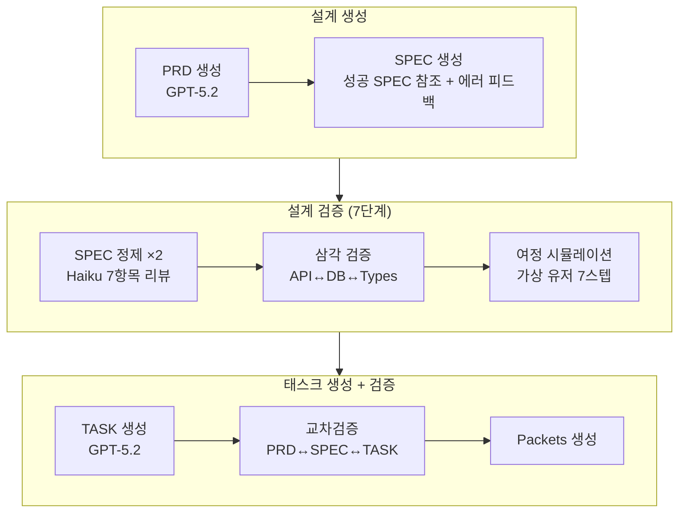

<style>
.card-link {
    text-decoration: none;
    color: inherit;
    display: block;
    width: fit-content;
    transition: transform 0.2s ease;
}
.card-link:hover {
    transform: translateY(-2px);
}
.card-link img {
    border: 1px solid #e1e4e8;
    border-radius: 8px;
    box-shadow: 0 2px 8px rgba(0, 0, 0, 0.1);
    max-width: 100%;
    height: auto;
}
</style>

5편까지 빌드 성공률을 65% → 95%로 끌어올렸습니다. 코딩 단계에서 할 수 있는 건 거의 다 한 것 같았습니다.

그런데 파이프라인을 계속 돌려보면서 한 가지 패턴을 발견했습니다. **코딩이 실패하는 경우의 절반 이상이 코딩 에이전트의 문제가 아니라 SPEC 자체의 문제**였다는 것입니다.

SPEC에 "DB에 meals 테이블"이라고만 써있고 calories 컬럼이 빠져있으면, 코딩 에이전트가 아무리 잘해도 테스트에서 `no such column: calories`로 실패합니다. 이걸 코딩 에이전트한테 재시도시키면 $2~4가 낭비되는데, SPEC 수정 비용은 ~$0.05입니다.

**SPEC 품질 1% 향상 = 하류 전체 품질 10% 향상.**

이번 글에서는 이 깨달음을 바탕으로 설계 단계를 근본적으로 강화한 과정을 다루겠습니다!

바로 본론으로 들어가겠습니다!!

---

## 기존 설계 흐름의 한계

5편까지의 설계 흐름은 이랬습니다.

```
PRD → SPEC (1회 생성) → Haiku 검증 → TASK → Work Packets
```

문제점을 정리하면:

1. **한 번에 만들고 끝** — 사람 설계자는 여러 번 다듬는데, AI는 1회 생성으로 끝남
2. **PRD↔SPEC↔TASK 교차 검증 없음** — 각 단계가 독립적. SPEC에는 있는 기능이 TASK에 빠져있어도 감지 못함
3. **사용자 관점 검증 없음** — "이 앱을 실제로 쓰면 어떤 느낌일까?" 시뮬레이션이 없음
4. **AC가 모호** — "should work properly" 같은 표현이 남아있어서 코딩 에이전트가 추측해야 함
5. **API↔DB↔Types 불일치** — API가 반환하는 필드와 DB 컬럼이 안 맞는 경우가 빈번

---

## 개선 1: SPEC 다단계 정제 (2라운드 리뷰→수정)

기존의 1회 검증을 **2라운드 리뷰→수정 루프**로 바꿨습니다.

```
SPEC 생성 (GPT-5.2)
    ↓
라운드 1: Claude Haiku 리뷰 (7가지 체크)
    ├── "SPEC OK" → 통과
    └── 이슈 발견 → GPT-5.2가 수정 → 재검증
    ↓
라운드 2: Claude Haiku 재리뷰
    ├── "SPEC OK" → 통과
    └── 이슈 발견 → GPT-5.2가 수정
    ↓
확정된 SPEC
```

Haiku가 검토하는 7가지 항목:

1. 모든 기능에 **4개 이상의 AC** + EARS 분류 + 구체적 pass/fail 조건
2. API 엔드포인트: method, path, request body type, response type, **모든 에러 코드 (400/401/404)**
3. DB 스키마: 모든 엔티티에 id, createdAt, updatedAt + **모든 필드 명시적 타입**
4. 기능 간 모순 없음 (예: 기능 A는 "공개"인데 기능 B는 "인증 필수")
5. 모든 기능에 **최소 2개의 실패 AC** (에러/엣지 케이스)
6. 리스트 엔드포인트에 **페이지네이션** 필드 (`{ items, total, page }`)
7. **외래 키와 cascade 동작** 명시

이전에는 1회 검증으로 빠져나가던 이슈들이, 2라운드를 거치면서 확실히 잡히기 시작했습니다!

---

## 개선 2: BDD 시나리오 — AC에 구체적 값을 강제하다

5편에서 TDD를 red→green→refactor 3단계로 전환했는데, Tester Agent가 작성하는 테스트의 품질은 **AC의 구체성**에 달려있었습니다.

기존 AC:
```
AC-1 [E]: When user submits form, system saves record
```

이걸로는 Tester가 어떤 값을 넣고 어떤 결과를 기대해야 하는지 모릅니다. 그래서 **BDD(Behavior-Driven Development) 시나리오 형식**을 도입했습니다.

변경 후 AC:
```
AC-1 [E]: Scenario: 식단 등록 성공
  Given 로그인된 유저가 있을 때
  When POST /api/meals { food: "샐러드", calories: 350 }
  Then 201 반환 { id: string, food: "샐러드", calories: 350, createdAt: string }
  And 해당 유저의 total_calories가 350 증가

AC-2 [S]: Scenario: 비로그인 식단 등록
  Given 로그인하지 않은 상태에서
  When POST /api/meals { food: "샐러드", calories: 350 }
  Then 401 반환 { error: "Unauthorized" }

AC-3 [W]: Scenario: 빈 음식명 거부
  Given 로그인된 유저가 있을 때
  When POST /api/meals { food: "", calories: 350 }
  Then 400 반환 { error: "Food name is required" }
```

차이가 보이시나요? **요청 JSON, 응답 JSON, HTTP 상태 코드, 에러 메시지가 전부 구체적인 값**으로 명시됩니다.

이렇게 하면 Tester Agent가 이 AC를 거의 그대로 테스트 코드로 변환할 수 있습니다. "샐러드를 POST하면 201이 오고 calories가 350이어야 한다"는 테스트가 자동으로 나오는 것입니다!!

SPEC 프롬프트에 BDD 형식을 강제하는 규칙과 예시를 추가했고, 모호한 표현("properly", "correctly", "should work")은 금지 단어 목록에 넣었습니다.

---

## 개선 3: 사용자 여정 시뮬레이션

SPEC이 기술적으로 완벽해도, **사용자 관점에서 빠진 것이 있을 수 있습니다.**

예를 들어 "식단 등록 API"와 "몬스터 진화 로직"이 SPEC에 잘 정의되어 있어도, "회원가입 후 처음 대시보드에 들어왔을 때 뭘 보여줄 건지"가 빠져있을 수 있습니다.

SPEC 완성 후 **Claude Haiku가 가상 유저로 앱 사용을 시뮬레이션**합니다.

```
1. 랜딩 페이지 방문 — CTA가 있는가?
2. 회원가입 — 어떤 필드? 어떤 validation?
3. 메인 화면 진입 — 뭐가 보이는가? 뭘 할 수 있는가?
4. 핵심 기능 사용 — step by step
5. 내 데이터 확인 — 조회/수정/삭제 가능?
6. 엣지 케이스 — 빈 값 제출하면? 오프라인이면?
7. 로그아웃 후 재접속 — 데이터가 남아있는가?
```

각 스텝마다 "OK / MISSING / UNCLEAR"로 판정합니다. MISSING이 있으면 **GPT-5.2가 자동으로 누락된 AC/기능을 SPEC에 추가**합니다.

실제로 돌려보니 "빈 상태(empty state) UI"나 "삭제 확인 모달" 같은 것들이 빠져있는 경우가 꽤 있었습니다. 이런 건 코딩 단계에서 발견하면 이미 늦습니다..

---

## 개선 4: API↔DB↔Types 삼각 검증

SPEC에서 가장 빈번한 불일치 유형은 이런 것이었습니다.

- API가 `{ calories: number }`를 반환하는데 DB에 calories 컬럼이 없음
- API가 `{ tags: string[] }`를 받는데 DB에 tags 컬럼이나 junction table이 없음
- API 응답 타입 이름이 `MealLog`인데 DB 테이블 이름이 `meal_entries`
- 리스트 API가 페이지네이션 없이 전체 배열만 반환

이런 불일치가 코딩 단계에서 터지면 코딩 에이전트가 "API 설계대로 할까, DB 스키마대로 할까?" 혼란에 빠집니다.

**API ↔ DB ↔ Types 삼각 교차 검증**을 추가했습니다. Claude Haiku가 6가지 항목을 체크합니다.

1. API 응답 필드가 DB 컬럼과 매칭되는가?
2. API 요청 필드를 DB가 저장할 수 있는가?
3. 외래 키가 실제 존재하는 테이블을 참조하는가?
4. 리스트 엔드포인트에 페이지네이션이 있는가?
5. 에러 상태 코드가 일관적인가? (인증 필요한 곳이 다 401인가)
6. TypeScript 타입 이름과 DB 엔티티 이름의 매핑이 명확한가?

불일치가 발견되면 `[MISMATCH]` 태그와 함께 보고되고, GPT-5.2가 자동 수정합니다.

---

## 개선 5: PRD↔SPEC↔TASK 교차검증

SPEC과 TASK가 각각 잘 만들어져도 **서로 안 맞는 경우**가 있습니다.

- PRD에 "소셜 로그인" 기능이 있는데 SPEC에는 빠져있음
- SPEC의 AC 10개 중 3개가 어떤 TASK에도 커버되지 않음
- TASK 순서가 잘못됨 — UI 패킷이 API 패킷보다 먼저 실행되도록 되어있음
- 두 TASK가 같은 파일을 수정하는데 의존성 표시가 없음

TASK 생성 후 **Claude Haiku가 역방향 일관성 체크**를 합니다.

```
1. PRD → SPEC: 모든 PRD 기능이 SPEC에 AC로 존재하는가?
2. SPEC → TASK: 모든 SPEC AC가 최소 1개 TASK에 커버되는가?
3. TASK 순서: 데이터 레이어 → API → UI 순서가 맞는가?
4. 파일 충돌: 같은 파일을 수정하는 TASK 간 의존성이 있는가?
5. PRD 목표 달성: 이 TASK들로 PRD의 목표를 달성할 수 있는가?
```

GAP이 발견되면 GPT-5.2가 TASK를 자동으로 보완합니다.

---

## 개선 6: 에러 기반 SPEC 피드백 — 실패에서 배우기

지금까지의 개선은 "SPEC을 잘 만들자"에 집중했는데, 한 가지 더 중요한 것이 있었습니다.

**과거에 코딩이 왜 실패했는지를 다음 SPEC에 피드백하는 것.**

DB에 쌓인 코딩 에이전트의 실패 로그를 분석해서, 빈도 높은 에러 패턴 상위 5개를 추출합니다.

```
=== COMMON FAILURE PATTERNS (avoid these in your SPEC) ===
- DB schema mismatch (table/column not found) — 12 occurrences
- Import/export mismatch (missing module or member) — 8 occurrences
- API response shape mismatch (wrong status or body) — 6 occurrences
- DB constraint violation (missing required fields) — 4 occurrences
- TypeScript type mismatch between API and DB — 3 occurrences
```

이 패턴을 SPEC 생성 프롬프트에 주입합니다. "과거에 이런 실수가 많았으니, DB 스키마에 모든 컬럼을 명시하고, API 응답 타입을 DB 컬럼과 정확히 매칭시켜라."

파이프라인을 돌릴수록 실패 데이터가 쌓이고, 다음 프로젝트의 SPEC 품질이 올라가는 **누적 학습 효과**가 있습니다!

---

## 개선 7: 이전 성공 SPEC 참조

6번째 개선은 "실패에서 배우기"였다면, 이건 **"성공에서 배우기"**입니다.

과거에 성공적으로 배포된 프로젝트의 SPEC에서 **구조 패턴만 추출**해서 새 SPEC 생성 시 참조로 제공합니다.

```
=== REFERENCE: Successful SPEC patterns from "다이어트 몬스터 배틀" ===
Feature structure: ## F1 식단 관리, ## F2 몬스터 시스템, ## F3 대시보드
AC patterns: AC-1 [E] Given 로그인된 유저 When POST /api/meals...
API patterns: POST /api/meals → 201, GET /api/meals?page=1 → 200
```

비즈니스 로직은 제외하고 **Feature 헤더 구조, AC 작성 패턴, API 엔드포인트 패턴**만 참조합니다. "이런 식으로 쓰면 된다"는 좋은 예시를 보여주는 것이죠.

---

## 파이프라인 고도화 8항목

설계 품질 외에도 파이프라인 전반에 걸쳐 8가지 개선을 한번에 적용했습니다.

1. **Rebuild 기능**: 실패한 프로젝트를 처음부터(fresh) 다시 빌드하는 옵션 추가
2. **비용 추적 보완**: Claude Code CLI 실행 비용이 중앙 추적기에 안 잡히던 문제 수정 — 실제 비용이 표시 비용보다 높았던 원인
3. **코딩 실패 패턴 학습**: 실패한 에이전트 실행의 에러를 분류/저장해서 다음 실행에 피드백
4. **스텁 페이지 감지 Quality Gate**: 코딩 에이전트가 빈 스텁 페이지(`return null`)를 그대로 두고 넘어가는 경우를 감지
5. **@testing-library/dom 누락 해결**: 테스트 실행 시 자주 발생하던 의존성 누락 자동 설치
6. **이벤트 메시지 한글화**: 대시보드 타임라인의 메시지를 한글로 전환해서 진행 상황을 더 쉽게 파악
7. **CLAUDE.md 모듈화**: 200줄짜리 단일 파일 → 핵심 50줄 + `.claude/rules/` 4개 파일로 분리 (testing, railway-deploy, ui-design, pages-router)
8. **Hooks 자동 검증**: `.claude/hooks/`에 post-write(파일 수정 후 자동 typecheck), pre-commit(커밋 전 typecheck 강제) 추가

특히 7번(CLAUDE.md 모듈화)은 패킷당 ~500 토큰을 절약하면서도 규칙 준수율이 올라가는 효과가 있었습니다. 필요한 규칙만 로드하니까 AI가 더 집중할 수 있는 것 같습니다.

---

## Reflection Loop: fix loop이 같은 실수를 반복하는 이유

설계 품질을 강화하면서 동시에 **코딩 단계의 수정 루프**도 분석했습니다.

5편에서 fixLoop(tsc+lint+test 통합 수정 ×5)을 도입했는데, 실전에서 돌려보니 한 가지 패턴이 보였습니다. **fix loop이 3번 돌아도 같은 에러가 반복되다가 deadlock으로 포기하는 경우가 많았습니다.**

원인을 분석해보니 두 가지였습니다.

### 원인 1: 에러 "개수"만 비교하는 deadlock 감지

기존 deadlock 감지 로직은 이랬습니다.

```
tsc:3|lint:0|test:1 → 수정 시도 → tsc:3|lint:0|test:1 → "같은 에러!" → 포기
```

에러 **개수**만 비교하니까, 실제로는 다른 에러인데 개수가 우연히 같으면 "deadlock"으로 판단해버립니다. 에러 메시지 **내용**을 해싱해서 비교하도록 바꿨습니다.

### 원인 2: "왜 실패했는지" 분석 없이 다시 시도

기존 fix loop은 에러가 나면 "고쳐라"라고만 합니다. 왜 이전 시도가 실패했는지, 다른 접근법은 뭔지 분석하지 않습니다.

코넬(Cornell)의 Agentic AI 아키텍처 과정에서 다루는 **Reflection Loop** 패턴을 참고했습니다. 핵심은 **Generation → Critique → Refinement** 루프입니다.

fix loop 2회차부터 GPT-4.1-mini로 **"이전 시도가 왜 실패했는지" 분석**을 먼저 하고, 그 분석 결과를 fix 프롬프트에 포함시킵니다.

```
fix loop 1회차: "에러를 고쳐라" (기존 방식)
fix loop 2회차: "이전 시도에서 import 순서를 바꿨는데 순환 참조가 생겼다.
                다른 접근법을 시도해라" (Reflection critique 추가)
```

분석 비용은 GPT-4.1-mini 1회 호출로 ~$0.002. 거의 무시할 수 있는 수준인데, 이걸로 불필요한 재시도 $2~5를 줄일 수 있습니다.

### 패킷 간 교훈 전달

또 하나 발견한 것이, **이전 패킷에서 한 실수를 다음 패킷에서도 반복**한다는 것이었습니다.

예를 들어 패킷 0006에서 TDS inline style 위반으로 compliance에 걸렸는데, 패킷 0007도 0008도 같은 실수를 합니다. 이전 패킷의 경험이 다음 패킷에 전달되지 않기 때문입니다.

패킷 완료 시마다 **Reflection Memory**를 축적하도록 했습니다. 고생한 패킷(yellow이거나 재시도가 많았던 패킷)에서 "무엇이 어려웠고 어떻게 해결했는가"를 GPT-4.1-mini로 추출해서, 다음 패킷의 코딩 프롬프트에 "이전 패킷에서 배운 교훈"으로 전달합니다.

비용은 12패킷 기준 ~$0.02. 이걸로 같은 compliance 위반이 반복되는 걸 방지합니다.

---

## "품질 체크가 너무 늦다" — 구조적 문제 발견

파이프라인을 여러 번 돌리면서 발견한 **구조적 문제**가 하나 있었습니다.

```
현재: 코딩 → (완료 후) 리뷰 → (실패 시) fix → re-review → compliance fix → fix loop
```

**코딩이 전부 끝난 후에야** 품질 체크가 시작됩니다. 그래서 코딩에 $0.30 쓰고, 리뷰에서 점수 68 나오고, fix에 $0.34 쓰고, re-review에서 오히려 58로 떨어지는 패턴이 반복됩니다.

패킷 하나당 비용의 **40~60%가 "뒤늦은 수정"**이었습니다.

해결 방향: 리뷰 후에 고치는 게 아니라, **코딩 단계에서 처음부터 맞게 작성하도록** 해야 합니다.

구체적으로 CLAUDE.md에 핵심 금지 규칙 5줄을 추가했습니다. 104KB짜리 TDS 문서 전체를 넘기면 컨텍스트가 희석되는데, **핵심 금지 목록 5줄이 더 효과적**이었습니다.

```markdown
## 절대 금지 (위반 시 빌드 실패)
1. style={{}} 에 margin/padding/fontSize 금지 → TDS Spacing/Text props 사용
2. HEX 색상 하드코딩 금지 → var(--tds-color-*) 사용
3. window.open / location.href 금지
4. 외부 로그인/결제/광고 SDK 금지
```

이것만으로 compliance 위반 자체가 예방되어, 사후 fix 사이클이 대폭 줄었습니다!

---

## 검증 단계 근본 강화: 코딩이 아니라 검증을 고쳐야 했다

설계 품질을 올리는 것과 동시에, **검증 단계에서 잡아야 할 것들이 통과되고 있는 문제**도 해결했습니다.

실제로 파이프라인을 돌려보니 12패킷 중 7개가 yellow(테스트 미통과) 상태로 머지되고, `navigate("/input")`을 쓰는데 `/input` 라우트가 없어도 통과하고, 에이전트가 `main.tsx`의 ThemeProvider를 삭제해도 아무도 못 잡고 있었습니다.

5가지 검증을 추가했습니다.

1. **@AI:ANCHOR 보호** — `main.tsx` 첫 줄에 `// @AI:ANCHOR` 주석을 추가해서, 코딩 에이전트가 이 파일을 수정하면 Quality Gate에서 violation 발생. ThemeProvider 삭제를 원천 차단. (5분)
2. **라우트 매니페스트 검증** — verification 단계에서 `navigate()`, `<Link to>` 호출을 전부 파싱하고, `App.tsx`의 Route 목록과 대조. 누락 라우트 자동 감지 + 자동 수정. LLM 호출 없이 정적 분석으로. (1시간)
3. **Yellow 머지 기준 강화** — `consecutiveYellows ≥ 3`에서 `≥ 2`로 변경. 2연속 yellow면 즉시 debt cleanup 실행. (10분)
4. **E2E 페이지별 스모크 테스트** — App.tsx에서 Route path를 추출하고 각 경로에 HTTP 요청. SPA이므로 모든 경로가 200 OK여야 함. (2시간)
5. **페이지 간 데이터 계약 (RouteState)** — SPEC에서 `navigate`로 전달하는 state 타입을 명시하게 강제. `types.ts`에 `RouteState` 타입을 정의하면 contractTypes 주입으로 모든 패킷에 자동 전달. (반나절)

핵심은 이 검증들이 대부분 **LLM 호출 없이 정적 분석으로 동작**한다는 것입니다. 비용 $0으로 라우트 누락, Provider 삭제, 페이지 간 데이터 불일치를 잡습니다.

---

## 6편을 마치며

이번 글의 핵심은 하나입니다.

**"설계가 틀리면 코딩을 아무리 잘해도 소용없다."**

5편까지 코딩 단계에서 할 수 있는 건 거의 다 했습니다. 하지만 코딩 실패의 절반이 SPEC 문제에서 오고 있었습니다.

그리고 하나 더 — 이 과정에서 **"과잉 설계의 함정"**도 경험했습니다.

플로우 엔지니어링(LangGraph 상태 머신), 메이커-체커 패턴(교차 모델 리뷰), AST 기반 동적 컨텍스트 주입 같은 최신 방법론들을 조사하고 적용을 검토했는데, 분석할수록 **AI Factory에 이미 기본 형태가 구현되어 있거나, 더 가벼운 방법으로 대체 가능**하다는 결론에 도달했습니다.

예를 들어:
- "플로우 엔지니어링(상태 머신으로 잘게 쪼개기)" → 이미 5단계 DAG + 패킷 의존성이 있음. **프롬프트에서 통합 패킷을 2개로 분리하는 규칙 추가**만으로 충분
- "AST 기반 컨텍스트 주입" → RouteState 타입을 types.ts에 정의하게 강제하면 **contractTypes 주입으로 자동 전달**. AST 파싱 엔진 구축 불필요
- "Guardrails 전용 모듈(guardrails.ts)" → coding.ts에 **에러 눈덩이 감지 5줄**만 추가하면 됨

처음에는 Guardrails 전용 모듈, Worker 전문화 파일 분리, 상태 머신 리팩토링(2~4주), MCP/A2A 프로토콜 통합 같은 거창한 아키텍처 변경을 계획했습니다. 하지만 실제 코드와 로그를 깊이 분석할수록, **문제의 80%는 scaffold 결함 수정과 프롬프트 5줄 추가로 해결**된다는 게 보였습니다.

**"2시간 작업으로 30~40% 비용 절감"**이 가능한데, 2~4주짜리 리팩토링을 먼저 할 이유가 없었습니다. 거창한 아키텍처보다 정확한 5줄 수정이 더 효과적이라는 교훈이었습니다.

소프트웨어 개발에서 "상류 품질이 하류 전부를 결정한다"는 원칙이 AI 코딩에서도 똑같이 적용된다는 걸 체감한 시기였습니다!

감사합니다!!

---

### 이 시점의 설계 파이프라인 구조


