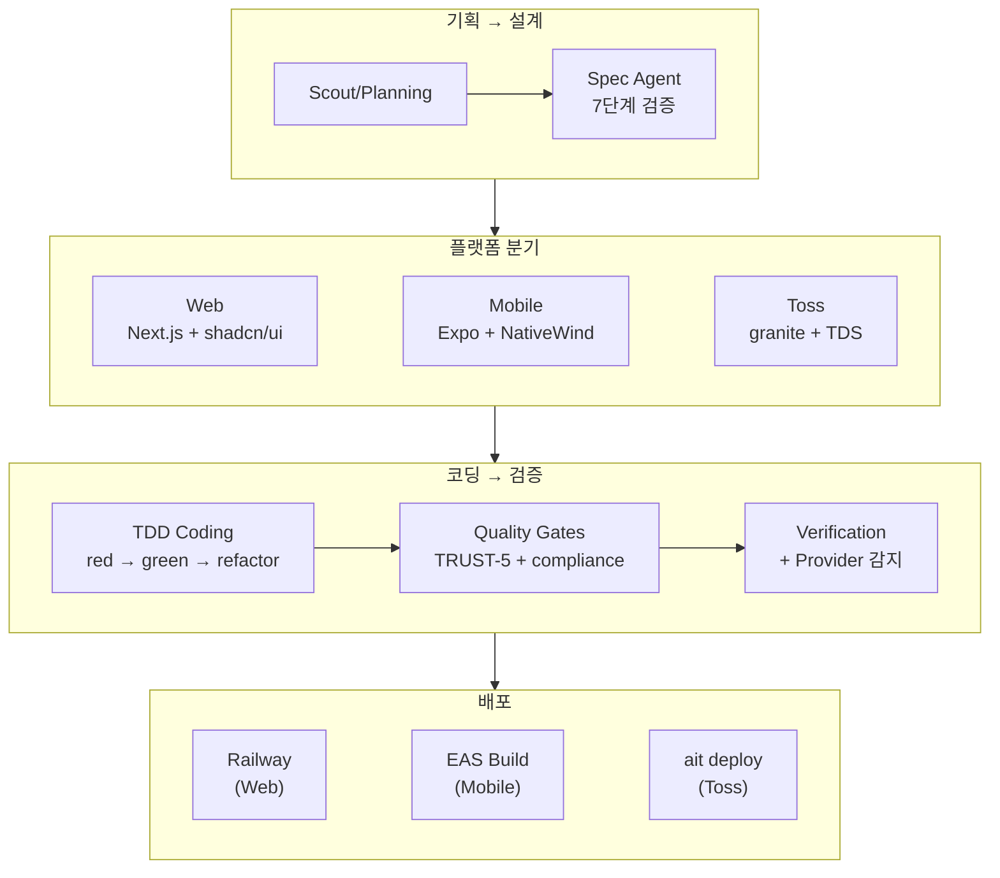

<style>
.card-link {
    text-decoration: none;
    color: inherit;
    display: block;
    width: fit-content;
    transition: transform 0.2s ease;
}
.card-link:hover {
    transform: translateY(-2px);
}
.card-link img {
    border: 1px solid #e1e4e8;
    border-radius: 8px;
    box-shadow: 0 2px 8px rgba(0, 0, 0, 0.1);
    max-width: 100%;
    height: auto;
}
</style>

AI Factory는 지금까지 **Web(Next.js)**과 **Mobile(Expo)** 두 가지 플랫폼을 지원했습니다.

여기에 세 번째 플랫폼을 추가하기로 했습니다. **앱인토스(App-in-Toss)** — 토스 앱 안에서 동작하는 서비스를 자동으로 만들어주는 것입니다.

"scaffold만 바꾸면 되니까 금방 하겠지" 하고 시작했는데... **커밋 50개, Dockerfile 삽질, OOM 20연타, 환각 방지까지.** 꽤나 험난한 여정이었습니다.

바로 본론으로 들어가겠습니다!!

---

## 왜 토스 플랫폼인가

세 번째 플랫폼으로 토스를 선택한 이유는 두 가지입니다.

첫째, **배포가 쉽습니다.** 토스 앱 안에서 동작하는 서비스는 별도 앱 스토어 심사 없이 `ait deploy` 한 번이면 배포됩니다. Railway처럼 서버를 관리할 필요도, EAS Build처럼 빌드 큐를 기다릴 필요도 없습니다.

둘째, **사용자를 모으기 가장 편합니다.** 토스는 국내 핀테크 앱 중 사용자가 가장 많은 슈퍼앱입니다. 토스 앱 안에 서비스를 올리면 이미 수천만 명이 깔고 있는 앱 안에서 노출되니까, 별도 마케팅 없이도 사용자 유입이 가능합니다. 앱을 만들어서 돈을 벌려면 결국 사용자가 있어야 하는데, 그 관점에서 토스 플랫폼이 가장 현실적이라고 판단했습니다.

토스 플랫폼은 기존 웹/모바일과 몇 가지 차이가 있습니다.

| | Web (Next.js) | Mobile (Expo) | Toss (App-in-Toss) |
|---|---|---|---|
| UI 시스템 | shadcn/ui + Tailwind | NativeWind + RN | **TDS (Toss Design System)** |
| 빌드 도구 | next build | expo export | **ait build (Toss CLI)** |
| 배포 | Railway | EAS Build | **ait deploy** |
| 라우터 | Pages Router | Expo Router | **granite (Toss 자체)** |
| 제약 사항 | 거의 없음 | SafeAreaView 등 | **서비스 오픈 정책 compliance** |

가장 큰 차이는 **TDS**와 **ait CLI**입니다. shadcn/ui 대신 토스의 디자인 시스템을 써야 하고, Railway 대신 ait CLI로 배포해야 합니다.

---

## 첫 번째 벽: Dockerfile과 Claude Code

토스 플랫폼을 추가하기 전에, Railway 환경을 먼저 정리해야 했습니다.

4편에서 Railway의 git 관련 삽질(exit code null)을 해결했었는데, 이번에는 **Claude Code가 root로 실행되는 것을 거부하는 문제**가 새로 발생했습니다.

```
Error: Claude Code refuses to run as root user
```

Railway의 기본 컨테이너는 root로 실행되는데, Claude Code는 보안 정책상 root 실행을 거부합니다. 이걸 해결하려면 **Dockerfile에 non-root 유저를 만들어야** 합니다.

```dockerfile
# non-root 유저 생성
RUN useradd -m -s /bin/bash claude && \
    mkdir -p /home/claude/.npm-global && \
    chown -R claude:claude /home/claude

# Claude Code CLI 사전 설치 (non-root)
USER claude
RUN npm install -g @anthropic-ai/claude-code
```

하지만 non-root로 바꾸면 **npm/pnpm 권한, git 권한, HOME 디렉토리** 등 온갖 곳에서 퍼미션 에러가 터집니다.. 이걸 하나씩 잡는 데만 커밋 5개가 들었습니다.

추가로 Node 24로 업그레이드하면서 `@apps-in-toss/web-framework`가 esbuild SIGSEGV를 일으키는 문제도 있었는데, 이건 코딩 단계와 배포 단계를 분리해서 해결했습니다. 코딩할 때는 해당 패키지를 설치하지 않고, 배포할 때만 설치하는 방식입니다.

---

## 토스 파이프라인 구축: 기획→설계→코딩→검증→배포

Dockerfile 정리가 끝나고 본격적으로 토스 파이프라인을 구축했습니다.

### Scaffold: scaffold-toss.ts

웹용 scaffold가 Next.js + shadcn/ui를 세팅해주듯, 토스용 scaffold는 **TDS(Toss Design System) + granite 라우터**를 세팅합니다.

처음에는 `scaffold-toss.ts`에 모든 템플릿을 코드로 넣었는데, 토스의 모노레포 구조가 너무 복잡해서 **별도 템플릿 레포(ai-factory-template-toss)를 만들고 거기서 가져오는 방식**으로 전환했습니다.

### CLAUDE.md: App-in-Toss Master Guide

토스 플랫폼용 CLAUDE.md는 웹용과 완전히 다릅니다.

```markdown
## TDS (Toss Design System) — MANDATORY
- Import from @toss/tds: Button, TextField, Typography, Spacing, etc.
- NEVER use raw HTML (<button>, <input>) or shadcn/ui
- NEVER delete @toss/tds from package.json

## granite Router
- File-based routing under src/pages/
- NO Next.js patterns (getServerSideProps, useRouter from next/router)
```

특히 **"TDS를 절대 삭제하지 마라"**라는 규칙이 중요했습니다. 코딩 에이전트가 빌드 에러를 만나면 "이 패키지가 문제인가보다"라고 판단해서 `@toss/tds`를 `package.json`에서 제거해버리는 경우가 있었거든요..

이걸 방지하기 위해 **strict-dependency-policy Quality Gate**를 추가했습니다. 코딩 완료 후 `package.json`을 검사해서, 필수 패키지가 삭제되었으면 자동으로 복원합니다.

---

## TDS 환각 방지: AI가 존재하지 않는 API를 쓰는 문제

토스 파이프라인에서 가장 힘들었던 문제는 **TDS 환각(hallucination)**이었습니다.

코딩 에이전트가 `@toss/tds`에 없는 컴포넌트를 import하거나, 존재하지 않는 props를 사용하는 것입니다.

```tsx
// 환각 예시 — 이런 컴포넌트/props는 실제 TDS에 없음
import { Card, Badge, Tooltip } from "@toss/tds"; // Card, Badge, Tooltip 없음
<Button variant="primary" size="lg" /> // variant, size props 없음
```

LLM의 학습 데이터에 TDS의 실제 API가 충분히 포함되어 있지 않기 때문에 발생하는 문제입니다. shadcn/ui는 많이 학습되어 있어서 환각이 적은데, TDS는 상대적으로 데이터가 적습니다.

해결 방법은 **정확한 TDS API를 CLAUDE.md에 명시**하는 것이었습니다.

```markdown
## EXACT TDS Components (ONLY use these — anything else is hallucination)
Available: Button, TextField, Typography, Spacing, Tabs, List, Toggle, BottomSheet
NOT available: Card, Badge, Tooltip, Dialog, Select, Dropdown

## EXACT TDS Props
Button: children, onClick, disabled, loading (NO variant, NO size)
TextField: label, value, onChange, placeholder, error (NO type="password")
```

"이것만 사용할 수 있다. 여기 없는 건 환각이다."라고 명시적으로 알려주니 환각이 크게 줄었습니다.

추가로 **정적 검증(static analysis)**도 도입했습니다. 코딩 완료 후 소스 코드를 스캔해서 `@toss/tds`에서 import하는 컴포넌트가 실제 존재하는지 자동으로 체크합니다. 존재하지 않는 컴포넌트를 발견하면 코딩 에이전트에게 수정을 요청합니다.

---

## 서비스 오픈 정책 compliance

토스 앱 안에서 서비스를 오픈하려면 **토스의 서비스 오픈 정책**을 준수해야 합니다. 이건 웹이나 모바일에는 없는 토스만의 제약 사항입니다.

compliance 검증을 자동화했는데, 처음에는 **전체 소스 코드를 스캔**하는 방식이었습니다. 문제는 매번 전체를 스캔하면 시간이 오래 걸리고, 이전 패킷에서 이미 통과한 파일까지 다시 검사한다는 것이었습니다.

이걸 **변경 파일 스코프**로 최적화했습니다. 현재 패킷에서 수정/생성된 파일만 검사하고, compliance 위반이 발견되면 자동 수정(fix pass)을 한 번 시도합니다. 그래도 안 되면 `--fresh` 옵션으로 처음부터 재실행합니다.

---

## ait CLI 배포 삽질: OOM 20연타

토스 파이프라인에서 가장 많은 커밋이 발생한 구간이 **ait CLI 배포**입니다. 약 20개 커밋이 ait 관련입니다..

### 문제: ait deploy가 OOM으로 죽음

`ait deploy`를 실행하면 메모리가 부족해서 프로세스가 죽습니다. Railway 컨테이너의 메모리 제한(512MB~1GB)에서 ait CLI + vite build + granite build가 동시에 돌아가면 터지는 것입니다.

### 삽질 과정 (시간순)

1. **npx로 실행** → 설치 시간이 매번 듦 + 여전히 OOM
2. **node_modules에 사전 설치** → 설치는 빨라졌지만 여전히 OOM
3. **Dockerfile에 전역 설치** → 런타임 설치 제거, 하지만 여전히 OOM
4. **vite build만 따로 실행** → OOM은 해결됐지만 `.ait` 번들이 안 생김
5. **granite.config.ts build를 no-op으로 패치** → `.ait` 번들은 생기는데 내용이 비어있음
6. **granite 패치 제거 + ait build로 통합** → 드디어 정상 동작!
7. **ait CLI 경로 자동 탐색** → `which ait` + `/usr/local/bin/ait` 체크
8. **@apps-in-toss/web-framework 심볼릭 링크** → 모노레포 의존성 해결

핵심은 **ait build와 vite build를 분리하지 말고 ait build가 내부적으로 vite build를 실행하게 하는 것**이었습니다. 중간에 "직접 vite build를 실행하면 빠르지 않을까?"라고 우회를 시도했는데, `.ait` 번들 구조가 달라져서 배포가 안 됐습니다.

교훈: **플랫폼의 공식 빌드 도구를 우회하려 하지 말고, 해당 도구가 동작하는 환경을 맞춰주는 것이 정답입니다.**

---

## Provider 와이어링 자동 감지

마지막으로 해결한 문제는 **ThemeProvider 누락**이었습니다.

토스 앱은 TDS의 `ThemeProvider`로 전체를 감싸야 하는데, 코딩 에이전트가 가끔 이걸 빠뜨립니다. Provider가 없으면 TDS 컴포넌트의 스타일이 전혀 적용되지 않아서 앱이 깨져 보입니다.

verification 단계에 **Provider 와이어링 자동 감지**를 추가했습니다. 엔트리 파일(`main.tsx` 또는 `_app.tsx`)을 읽고 `ThemeProvider`가 있는지 체크합니다. 없으면 **자동으로 추가**합니다.

```typescript
const hasThemeProvider = content.includes("ThemeProvider");
if (!hasThemeProvider) {
  /* 자동으로 import + 래핑 추가 */
}
```

---

## 현재 지원 플랫폼 3종

토스 플랫폼 추가로 AI Factory가 지원하는 플랫폼이 3종이 되었습니다!

| 플랫폼 | Scaffold | 디자인 시스템 | 빌드 | 배포 |
|--------|----------|-------------|------|------|
| **Web** | Next.js (Pages Router) | shadcn/ui + Tailwind | next build | Railway |
| **Mobile** | Expo SDK 52 | NativeWind + RN | expo export | EAS Build |
| **Toss** | App-in-Toss (granite) | TDS | ait build | ait deploy |

---

## AI Factory는 정말 독특한 프로젝트인가?

토스 플랫폼을 추가하면서 "비슷한 프로젝트가 있을까?" 궁금해져서 시장을 본격적으로 조사했습니다. 4편에서 MoAI, Devin, v0 등을 간략히 비교했었는데, 이번에는 **Pythagora(GPT Pilot), Metaswarm, Gastown** 같은 멀티에이전트 프로젝트까지 깊이 분석했습니다.

### 가장 비슷한 3개 프로젝트

**Pythagora(GPT Pilot)** — Product Owner, Architect, DevOps, Tech Lead, Developer, Code Monkey 6개 에이전트로 TDD 기반 앱을 만드는 프로젝트. AI Factory와 에이전트 수(6개)와 TDD 접근이 거의 동일합니다. 하지만 결정적 차이는 Pythagora가 **human-in-the-loop**(사람이 옆에서 피드백) 모델인 반면, AI Factory는 **fully autonomous**(서버에서 혼자 완주) 모델이라는 것입니다. 그리고 Pythagora는 배포를 안 해줍니다.

Pythagora에서 배운 중요한 인사이트가 하나 있는데, **"task 크기가 품질에 결정적"**이라는 것입니다. task가 너무 넓으면 버그가 폭발하고, 너무 좁으면 통합이 어렵습니다. AI Factory에서도 가장 비싼 패킷이 항상 "라우팅+통합+마무리" 같은 scope이 넓은 패킷이었는데, 이 연구 결과를 참고해서 적정 패킷 크기(2~4개 파일, AC 3~5개)를 기준으로 잡게 되었습니다.

**Metaswarm** — 18개 에이전트와 **cross-model adversarial review**가 특징. 코드를 쓴 모델과 리뷰하는 모델을 다르게 사용하는 패턴입니다. 같은 모델이 쓰고 리뷰하면 같은 맹점을 공유할 수 있거든요. AI Factory도 코딩(Claude)과 리뷰(Claude)가 같은 모델 계열이라서, 리뷰 모델을 다른 계열로 바꾸는 것을 검토하게 되었습니다.

**Gastown** — 20~30개 Claude Code 인스턴스를 병렬로 돌리는 극한 병렬화 프로젝트. AI Factory도 병렬 코딩을 지원하지만 실전에서는 패킷 간 의존성이 많아 순차 실행이 대부분이었습니다.

### AI Factory만의 독보적인 점

전체 조사를 마치고 내린 결론은, **"아이디어 발굴 → 설계 → TDD 코딩 → 배포 → 자가 치유 → 수익화"까지 전체 비즈니스 루프를 자동화하는 프로젝트는 AI Factory 외에 없다**는 것이었습니다.

다른 프로젝트들은 이 중 **일부 구간만** 커버합니다. Pythagora는 배포를 안 하고, Devin은 단일 이슈 수정에 특화되어 있고, Lovable/Bolt은 프로토타입 수준이며, MetaGPT는 학술 연구 성격이 강합니다.

특히 **토스 인앱**이라는 특정 플랫폼을 타겟팅하는 건 AI Factory만의 해자(moat)입니다. TDS 컴포넌트, ait CLI 빌드, 서비스 오픈 정책 compliance까지 자동화하는 프로젝트는 어디에도 없습니다.

---

## scaffold가 실패의 근원이었다

토스 파이프라인을 여러 번 돌리면서 발견한 불편한 진실이 하나 있습니다.

**반복되는 실패의 상당수가 scaffold 자체의 결함에서 시작되고 있었습니다.**

- `@types/react`가 `package.json`에 빠져있어서 → 매 프로젝트 TypeScript 에러 → Claude Code auto-fix 호출 ($0.10)
- `TossRewardAd.tsx`에 inline style이 포함된 채 생성 → 매 패킷에서 compliance 위반 → fix pass 반복 ($0.15~0.22 x 여러 패킷)
- `react/jsx-runtime` 타입 에러 → scaffold 직후 typecheck 실패

scaffold가 **"typecheck 실패하는 코드"**를 생성하고 있었고, 이걸 **매 프로젝트마다 AI한테 돈 주고 고치게** 하고 있었던 것입니다..

해결: scaffold-toss.ts를 직접 수정해서 `@types/react`, `@types/react-dom`을 추가하고, inline style을 TDS 컴포넌트로 교체했습니다. 30분 작업으로 매 프로젝트 $1~3을 절감하는 효과가 있었습니다.

장기적으로는 scaffold를 **"검증된 템플릿 레포"**로 전환할 계획입니다. 코드로 하드코딩해서 파일을 생성하는 대신, typecheck + lint + test가 통과하는 상태의 GitHub 레포를 clone해서 사용하면 scaffold 결함 자체가 발생하지 않습니다.

---

## 비용 구조 분석: $24.59의 해부

토스 앱(RentCheck) 하나를 만드는 데 $24.59가 들었습니다. 이 비용이 어디에 쓰였는지 분석했습니다.

| 항목 | 비용 | 비중 | 비고 |
|------|------|------|------|
| 코딩 (Sonnet/Opus) | ~$9.84 | 40% | 필수 비용 |
| Fix loop 수정 | ~$3.69 | 15% | 절반은 불필요한 재시도 |
| TDD 테스트 작성 | ~$2.95 | 12% | Haiku로 전환 가능 |
| 리뷰 | ~$2.46 | 10% | 리뷰 자체는 저렴, fix가 비쌈 |
| Debt cleanup | ~$1.97 | 8% | 4번 중 4번 "partially resolved" |
| Spec 설계 | ~$1.48 | 6% | 7단계 검증 포함 |
| 기타 | ~$2.20 | 9% | README, sync 등 |

**핵심 발견: 비용의 40~60%가 "뒤늦은 수정"에 쓰이고 있었습니다.**

### 품질 무영향 비용 최적화

비용 분석 후, **품질에 전혀 영향을 주지 않으면서** 절감할 수 있는 항목들을 찾았습니다.

1. **Fix loop 5→3회** — deadlock 감지가 3회차에서 이미 발동하므로 4~5회차는 dead iteration. $0.30 절감
2. **TDD tester 모델 최적화** — types.ts, storage.ts 같은 순수 로직 패킷의 테스트는 Haiku로 충분. UI 패킷만 Sonnet 유지. $0.40 절감
3. **Opus 에스컬레이션 제한** — 단순 패킷(3 files 이하)에서는 Opus 대신 Sonnet retry 한 번 더. $1~3 절감
4. **TDS reference 선택적 읽기** — 데이터 레이어 패킷은 TDS를 안 쓰므로 104KB 문서를 읽을 필요 없음. UI 패킷에서만 로드. $0.50~1.00 절감

| | Before | After |
|---|---|---|
| 총 비용 | $24.59 | **~$12~15** |
| 시간 | 175분 | **~120분** |
| Yellow 패킷 | 7개 | **2~3개** |
| 절감율 | - | **40~50%** |

6편에서 다룬 설계 품질 강화(SPEC 7단계 검증)와 이번 편의 scaffold 결함 수정, CLAUDE.md 금지 규칙 5줄 추가, 그리고 비용 최적화까지 합치면 **같은 앱을 절반 비용으로, 더 높은 품질로** 만들 수 있게 되었습니다.

3편에서 "scaffold와 CLAUDE.md를 교체하면 다른 플랫폼으로 확장 가능한 구조"라고 했었는데, 실제로 해보니 **scaffold 교체만으로 안 되는 부분이 꽤 많았습니다.** 빌드 도구, 배포 방식, 디자인 시스템 환각 방지, compliance 검증 등 플랫폼별로 완전히 다른 로직이 필요했습니다.

하지만 핵심 파이프라인(Spec Agent → TDD → Coding → Quality Gates → Verification)은 **그대로 재사용**되었습니다. 이 부분은 3편의 예상이 맞았습니다!

---

## 7편을 마치며

토스 플랫폼 추가와 심층 분석을 통해 느낀 점을 정리하면:

1. **"scaffold만 바꾸면 된다"는 반쪽짜리 진실** — 핵심 파이프라인은 재사용되지만, 빌드/배포/검증은 플랫폼마다 완전히 다름
2. **AI의 환각은 학습 데이터 부족에서 온다** — TDS처럼 데이터가 적은 라이브러리는 정확한 API를 명시적으로 알려줘야 함
3. **플랫폼 공식 도구를 우회하지 마라** — ait build를 직접 vite build로 대체하려다 20커밋을 낭비함
4. **scaffold 결함이 전체 비용의 핵심 원인** — 30분 수정으로 매 프로젝트 $1~3 절감. 가장 가성비 좋은 개선
5. **AI Factory는 "전체 비즈니스 루프 자동화"라는 독보적 포지션** — 비슷한 시도는 많지만 아이디어→배포→수익화까지 이어지는 건 없음

특히 비용 분석을 통해 깨달은 것이 있습니다. **"비용의 절반이 코딩이 아니라 수정에 쓰인다."** 이건 사람 개발에서도 마찬가지잖아요. 처음에 제대로 만들면 디버깅 시간이 줄어드는 것처럼, AI 코딩에서도 SPEC 품질과 scaffold 품질을 올리는 것이 코딩 모델을 바꾸는 것보다 효과적이었습니다.

다음에 또 새로운 플랫폼(Flutter? SwiftUI?)을 추가한다면 이번보다는 훨씬 빠를 것 같습니다. 삽질에서 얻은 패턴들이 이미 정리되어 있으니까요!!

감사합니다!!

---

### 이 시점의 파이프라인 구조 (3 플랫폼)


