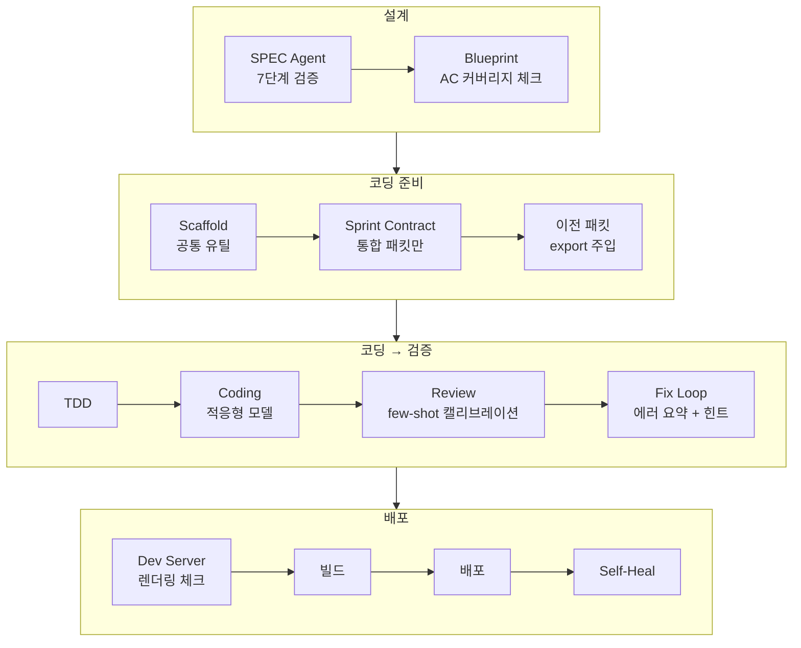

<style>
.card-link {
    text-decoration: none;
    color: inherit;
    display: block;
    width: fit-content;
    transition: transform 0.2s ease;
}
.card-link:hover {
    transform: translateY(-2px);
}
.card-link img {
    border: 1px solid #e1e4e8;
    border-radius: 8px;
    box-shadow: 0 2px 8px rgba(0, 0, 0, 0.1);
    max-width: 100%;
    height: auto;
}
</style>

7편에서 토스 플랫폼을 추가하고 RentCheck 앱을 파이프라인으로 만들어봤는데, 결과가 좋지 않았습니다. 12패킷 중 7개가 yellow(테스트 미통과) 상태로 머지되었고, 아키텍처 리뷰 57/100, 총 비용 $24.59.. 수동으로 10번 넘게 패치했는데 고칠 때마다 다른 곳이 깨졌습니다.

이때 앤트로픽(Anthropic) 공식 블로그에 올라온 AI 하네스 디자인 글들을 읽게 되었습니다. 읽고 나서 "아, 내가 이걸 놓치고 있었구나" 하는 깨달음이 여러 개 있었고, 그걸 AI Factory에 적용해서 **25곳을 고쳤습니다.**

이번 글에서 참고한 앤트로픽 공식 글 6개입니다.

1. [Harness design for long-running coding agents](https://www.anthropic.com/engineering/harness-design-long-running-apps) — 프론트엔드 디자인 + 장시간 자율 코딩을 위한 Generator-Evaluator 구조
2. [Effective harnesses for long-running agents](https://www.anthropic.com/engineering/effective-harnesses-for-long-running-agents) — 초기 하네스 실험에서 배운 태스크 분해와 아티팩트 핸드오프 패턴
3. [Building a C compiler with parallel Claude teams](https://www.anthropic.com/engineering/building-c-compiler) — 멀티 에이전트의 시간 맹점(Time blindness)과 컨텍스트 오염 방지를 위한 테스트 하네스 설계
4. [Demystifying evals for AI agents](https://www.anthropic.com/engineering/demystifying-evals-for-ai-agents) — 에이전트 평가(Evals) 체계 설계: 코드/모델/인간 채점관 조합과 역량 테스트 vs 회귀 테스트
5. [Long-running Claude for scientific computing](https://www.anthropic.com/research/long-running-Claude) — 단일 에이전트의 서브 에이전트 스폰과 진행도 파일 유지 패턴
6. [Measuring real-world agent autonomy](https://www.anthropic.com/research/measuring-agent-autonomy) — Claude Code 실사용 데이터 기반 에이전트 자율 주행 시간 분석

바로 본론으로 들어가겠습니다!!

---

## 앤트로픽의 하네스 디자인 핵심

앤트로픽 블로그에서 가장 인상 깊었던 구절이 있습니다.

> "Harness design is key to performance at the frontier of agentic coding."

AI 모델의 성능도 중요하지만, **모델을 감싸는 하네스(파이프라인)의 설계가 최종 결과를 결정한다**는 것입니다. 이건 AI Factory를 만들면서 체감하고 있던 것이기도 했습니다.

앤트로픽의 접근법은 세 가지 핵심으로 요약됩니다.

1. **Generator-Evaluator 구조** — GAN(적대적 생성 신경망)에서 영감을 받아, 코드를 생성하는 에이전트와 평가하는 에이전트를 분리
2. **Sprint Contract** — 코딩 전에 "무엇을 만들고 어떻게 검증할지" 생성자와 평가자가 합의
3. **Evaluator가 실제 앱을 조작** — Playwright MCP로 라이브 페이지를 직접 클릭하며 평가

---

## AI Factory와의 결정적 차이 — Evaluator

앤트로픽 글을 읽으면서 가장 충격받은 부분은 **Evaluator의 차이**였습니다.

| | 앤트로픽 | AI Factory (기존) |
|---|---|---|
| 평가 방식 | Playwright로 실제 앱을 조작하며 평가 | git diff만 보고 코드 리뷰 |
| 평가 대상 | 라이브 페이지 스크린샷 + 네비게이션 + 클릭 | 정적 코드 분석 |
| 발견 가능한 버그 | "버튼 눌러도 반응 없음", "레이아웃 깨짐" | "타입 에러", "누락된 import" |
| 발견 못 하는 버그 | 거의 없음 | **ThemeProvider 누락, 무한 로딩, 라우트 미연결** |

RentCheck에서 발생한 문제들 — ThemeProvider 삭제, `navigate("/input")` 쓰는데 `/input` 라우트가 없는 것, 화면이 안 뜨는 것 — 이게 전부 **코드 diff만 보는 리뷰로는 잡을 수 없는 것들**이었습니다.

앤트로픽은 Playwright MCP로 실제로 앱을 열어서 "화면이 뜨는가", "버튼이 동작하는가"를 확인합니다. AI Factory의 리뷰 에이전트는 코드 텍스트만 읽고 점수를 매기고 있었습니다. 이 격차가 품질 차이의 근본 원인이었습니다.

---

## AI 친화적 테스트 환경

앤트로픽 블로그 + 관련 논문들에서 반복적으로 강조하는 내용이 있었습니다.

**"테스트 환경은 사람을 위한 게 아니라 AI를 위한 것이어야 한다."**

구체적으로:

1. **컨텍스트 오염 방지** — 에러가 수천 줄 터져도 AI에게 전부 보여주면 과부하. 에러 로그를 잘라내고, 한 줄 요약을 달아서 AI가 쉽게 찾을 수 있게 가공해야 합니다
2. **에러 패턴 분류** — "에러 15개"가 아니라 "3종류의 에러, TS2741이 12건"으로 그룹화해서 AI가 한 번에 인식할 수 있게
3. **해결 힌트 자동 제공** — 자주 발생하는 에러에 대해 "이 에러는 이렇게 고쳐라"를 미리 알려주면 fix loop 효율이 올라감

이걸 AI Factory에 대입해보니, fix loop에서 에러 15줄을 그냥 나열해서 넘기고 있었습니다. AI가 "이 15개가 사실 같은 유형이고, TDS 컴포넌트 필수 prop만 추가하면 된다"는 걸 스스로 파악해야 했습니다. 비효율적이었습니다!

---

## 다른 방법론 조사

앤트로픽 블로그 외에도 여러 AI 코딩 방법론을 분석했습니다.

### 1. 랄프 루프 (Ralph Loop) — "AI의 퇴근 본능 막기"

AI가 "다 했습니다!"라고 선언해도 실제로 목표를 달성했는지 파이프라인이 자동으로 확인하고, 안 됐으면 **강제로 다시 작업시키는** 무한 루프입니다.

AI Factory에는 이미 maxTurns, deadlock 감지, TDD + quality gates가 있어서 비슷한 역할을 하고 있었습니다. 하지만 "테스트에 안 잡히는 미구현"(버튼은 있지만 onClick이 비어있음)은 못 잡고 있었습니다.

### 2. CHANGELOG.md — "AI의 장기 기억 장치"

AI는 세션이 끊기면 기억을 잃습니다. **"무엇을 시도했고 왜 실패했는지"를 파일로 기록**하면, 다음 세션에서 같은 실수를 반복하지 않습니다.

AI Factory에서 가장 부족했던 부분이었습니다. fix loop에서 "이전 시도가 실패했다"는 정보는 전달하지만, **구체적으로 어떤 코드를 시도했고 왜 안 됐는지**는 기록하지 않고 있었습니다.

### 3. 테스트 오라클 — "절대 정답지"

완벽한 기존 코드를 정답지로 삼아 AI가 만든 코드와 계속 비교하는 방식입니다. AI Factory에서는 SPEC의 AC(Acceptance Criteria)가 부분적 오라클 역할을 합니다. 하지만 AC가 테스트로 모두 커버되는지 확인하는 장치는 없었습니다.

### 4. Eval Suite — 역량 테스트 + 회귀 테스트 분리

앤트로픽은 두 가지 시험을 분리하라고 강조합니다.

- **역량 테스트**: "AI가 얼마나 어려운 것까지 할 수 있나?" (처음엔 10~20%로 낮아야 정상)
- **회귀 테스트**: "원래 잘하던 걸 갑자기 못하게 되진 않았나?" (항상 100% 통과해야 함)

AI Factory에는 회귀 테스트(tsc + vitest + 스모크)는 있지만 역량 테스트가 없었습니다. 모델을 바꾸거나 프롬프트를 수정할 때 "이게 진짜 개선인가?"를 정량적으로 판단할 방법이 없었습니다.

---

## 기존 파이프라인 실측 데이터 분석

방법론을 공부만 하지 않고, **실제 RentCheck 파이프라인 로그를 패킷별로 상세 분석**했습니다.

### 패킷별 실측 비용

| 패킷 | 비용 | 결과 | 주요 비용 원인 |
|------|------|------|--------------|
| 0001 (타입 정의) | $2.61 | GREEN | 1차 타임아웃(360s) + 리뷰 28점 → fix $0.33 |
| 0002 (storage) | $1.08 | GREEN | 리뷰 62점 → fix $0.34 |
| 0005 (홈 페이지) | $1.75 | YELLOW (차단) | tsc 에러 2건이 fix loop 3회 동안 해결 안 됨 |

### 발견한 비용 초과 패턴 3가지

**1. review→fix가 매 패킷 100% 트리거됩니다.**

모든 패킷에서 리뷰 점수가 낮았습니다 (28, 62, 58). 리뷰 에이전트가 AI가 생성한 코드를 사람 기준으로 채점하고 있어서, 정상적인 AI 코드도 낮은 점수를 받았습니다. 매번 review→fix가 트리거되어 패킷당 $0.18~0.34가 추가로 소모되었습니다.

**2. fix loop에서 같은 에러를 3회 반복합니다.**

패킷 0005에서 tsc 에러 2건이 fix loop 3회 내내 해결되지 않았습니다. AI에게 "에러를 고쳐라"만 전달하고, **왜 이전 시도가 실패했는지, 다른 접근법은 뭔지** 정보를 주지 않았기 때문이었습니다.

**3. 코딩 비용이 fix cap을 소진합니다.**

패킷 0001에서 코딩에 $1.25를 쓰고 나니 fix 예산이 $0만 남았습니다. fix loop 기회 자체가 박탈된 것입니다.

---

## 25곳 수정 — P0부터 단기까지

분석 결과를 바탕으로 우선순위를 P0(즉시)~P3(단기)~AI 피드백~단기 품질까지 단계적으로 수정했습니다.

### P0: 즉시 수정 (버그/설정) — 3건

**P0-1. tsc 경로 수정** — `npx tsc`가 엉뚱한 패키지를 다운로드하는 문제. `./node_modules/.bin/tsc` 직접 호출로 변경.

**P0-2. fix loop 최소 예산 보장** — 코딩 비용이 cap을 소진해도 **최소 $0.30의 fix 예산을 보장**.

**P0-3. 리뷰 critical 기준 재정의** — critical을 "앱이 동작하지 않는 버그"로만 한정. review→fix 트리거 조건 완화.

### P1: 리뷰/타임아웃/에러전달 — 4건

**P1-1. 리뷰 few-shot 캘리브레이션** — 앤트로픽의 "Evaluator 캘리브레이션" 적용. 리뷰 프롬프트에 구체적 점수 예시 추가.

**P1-2. dev server 렌더링 체크** — 앤트로픽의 "Evaluator가 실제 앱을 조작" 적용. 빌드 전 vite dev 서버로 모든 라우트 HTTP 체크.

**P1-3. 타임아웃 적응형 조정** — 첫 패킷(복잡도 높음) 타임아웃 1.5배, UI 패킷 TDD tester 180초로 상향.

**P1-4. fix loop 에러 패턴 전달** — 2회차부터 "이전 시도가 왜 실패했는지" 정보를 프롬프트에 포함.

### P2: 라우팅/컨텍스트/리뷰 — 4건

**P2-1. stats routing 우선순위 수정** — 강제 규칙을 stats보다 먼저 체크.

**P2-2. 이전 패킷 export 목록 주입** — 패킷 간 타입 불일치 방지.

**P2-3. 토스 전용 리뷰 criteria** — 13개 기준 추가 (TDS props, ThemeProvider, Route 연결 등).

**P2-4. 통합 패킷 체크리스트** — 통합/라우팅 패킷에 6항목 체크리스트 자동 주입.

### P3: re-review/SPEC/체크리스트 — 3건

**P3-1. re-review 생략** — fix 성공 시 critical=0으로 간주. 패킷당 $0.10 절감.

**P3-2. SPEC 데이터 흐름 명세 강화** — outgoing/incoming navigate state 모두 명시.

**P3-3. CLAUDE.md Pre-submission Checklist 강화** — main.tsx 수정 금지, Route 확인, RouteState 확인 추가.

---

## 근본 수정 4건

같은 로직이 여러 파일에 흩어져 있어서 한 곳만 고치고 나머지를 빠뜨리는 패턴을 발견했습니다. **공통 유틸 함수**로 해결했습니다.

```typescript
export function runNpmInstall(workDir) { ... }
export function runTypecheck(workDir) { ... }
```

추가로:
- **비용 상세 이벤트** — 웹 UI에 `[코딩$0.65 수정$0.13 리뷰72점]` 형태로 비용 분해 표시
- **Epic 4 자동 생성** — SPEC agent가 통합 패킷을 생성하지 않으면 코드로 자동 추가

---

## AI용 에러 피드백 최적화

앤트로픽의 "테스트 환경은 AI를 위한 것이어야 한다" 인사이트를 적용했습니다.

### 에러 요약 통계

```
## 기존 (AI에게 불친절)
TypeScript Errors (15)
src/pages/HomePage.tsx(38,10): error TS2741...
... (15줄 나열)

## 개선 (AI에게 친절)
TypeScript Errors — 15개 (3종류)
  TS2741 x 12건 → TDS 컴포넌트 필수 prop 누락
  TS2322 x 2건 → 타입 불일치
  TS2307 x 1건 → 모듈 못 찾음
```

### 실패 접근법 파일 기록

CHANGELOG 개념 적용. fix loop 실패 시 `.ai-factory/failed-approaches.md`에 **어떤 에러를 시도했고 deadlock에 빠졌는지** 기록. retry 시 같은 실수 반복 방지.

---

## 단기 품질 강화 — 3건

**1. AC 커버리지 체크** — SPEC의 AC가 테스트로 커버되는지 정적 분석. 비용 $0.

**2. Sprint Contract** — 앤트로픽 핵심 방법론. 통합 패킷 코딩 전에 "만들 항목 + 검증 방법 + 금지 사항" 계약서 생성.

**3. 패킷 실패 원인 분류 기록** — `[FAIL:timeout]`, `[FAIL:deadlock]` 등 실패 유형 자동 기록. Eval Suite 기초 데이터.

---

## 효과 검증 — 4차 Rebuild 실측 데이터

25곳을 고치고 RentCheck를 4차 Rebuild 했습니다. 결과가 놀라웠습니다.

### Scaffold typecheck — 처음으로 통과

```
Scaffold typecheck passed — clean base for coding
```

3차까지 매번 실패하던 scaffold typecheck가 **처음으로 통과**했습니다. `runNpmInstall()` 공통 함수 + `--include=dev`가 동작하여 TypeScript가 정상 설치되었고, auto-fix 비용 **$0**.

### Epic 4 자동 생성 동작 확인

```
[spec] Auto-added integration packet 0010 (Epic 4 was missing)
[spec] 10 work packets generated
```

SPEC agent가 3번 retry에서도 Epic 4 패킷을 생성하지 못했지만, **코드가 자동으로 통합 패킷을 추가**했습니다. "프롬프트 규칙보다 코드 강제가 확실하다"의 실증입니다.

### 패킷 0001 — 비용 81% 절감

| 실행 | 비용 | scaffold fix | 코딩 | 리뷰 점수 | review→fix | 결과 |
|------|------|-------------|------|----------|-----------|------|
| 2차 (개선 전) | **$2.61** | $0.18 | $1.25 (타임아웃+재시도) | 28점 | $0.33 | GREEN |
| 3차 (P0-P3) | $0.95 | $0.24 | $0.65 (1회 성공) | 62점 | 미트리거 | GREEN |
| 4차 (전체 적용) | **$0.50** | $0 | $0.41 (1회 성공) | 72점 | 미트리거 | GREEN |

**$2.61 → $0.50 = -81% 비용 절감.** scaffold fix $0, 리뷰 72점으로 review→fix 미트리거, 1회 성공.

### 패킷 0002 — 비용 74% 절감

| 실행 | 비용 | 코딩 | 리뷰 점수 | review→fix | 결과 |
|------|------|------|----------|-----------|------|
| 2차 | $1.08 | $0.32 | 62점 | $0.34 | GREEN |
| 3차 | **$2.05** | $0.59 (실패) + $0.47 (retry) | 38점 | $0.34 | GREEN (retry) |
| 4차 | **$0.53** | $0.53 (1회 성공) | 81점 | 미트리거 | GREEN |

**$2.05 → $0.53 = -74% 절감.** 리뷰 **81점** — 역대 최고점. few-shot 캘리브레이션 효과가 확실합니다. fix loop 즉시 통과, fix 비용 $0.

### 개선 항목별 동작 확인

| 개선 | 동작 | 증거 |
|------|------|------|
| runNpmInstall (--include=dev) | ✅ | scaffold typecheck passed |
| 첫 패킷 sonnet 강제 | ✅ | "Forcing sonnet for first packet" |
| few-shot 캘리브레이션 | ✅ | 리뷰 28→62→72→81점 |
| review→fix 트리거 완화 | ✅ | critical 0 → 미트리거 |
| re-review 생략 | ✅ | review→fix 안 됨 |
| Toss 전용 리뷰 | ✅ | "Claude Sonnet 4.5 (toss)" |
| 비용 상세 이벤트 | ✅ | [코딩$0.41 수정$0.09 리뷰72점] |
| Epic 4 자동 생성 | ✅ | "Auto-added integration packet 0010" |

### 전체 프로젝트 비용 재추정

2패킷 합산 **$1.03** (이전 최고 $2.03 대비 -49%).

| 항목 | 예상 비용 |
|------|----------|
| 설계 | $1.73 |
| scaffold | $0 (처음으로!) |
| 데이터 패킷 3개 | ~$1.50 |
| UI 패킷 5개 | ~$5.00 |
| 통합 패킷 2개 | ~$2.40 |
| verification | $0.50 |
| **총 예상** | **~$7.53** |

**이전 $24.59 대비 -69% 절감 예상.** "같은 앱을 1/3 비용으로" 만들 수 있게 되었습니다.

---

## 8편을 마치며

이번 글의 핵심은 하나입니다.

**"AI 모델의 성능보다 하네스(파이프라인)의 설계가 결과를 결정한다."**

앤트로픽 공식 블로그를 읽으면서 확인한 것은, AI Factory가 이미 올바른 방향(멀티에이전트, TDD, 품질 게이트)으로 가고 있었지만 **Evaluator의 품질**과 **에러 피드백의 AI 최적화**에서 격차가 있었다는 것입니다.

그리고 가장 큰 교훈: **프롬프트에 규칙을 추가하는 것보다, 코드로 검증을 강제하는 것이 효과적입니다.** SPEC agent에게 "통합 패킷을 분리해라"고 20번 말하는 것보다, "Epic 4에 패킷이 없으면 자동으로 추가하는 코드"가 확실합니다.

앤트로픽의 마지막 문장이 계속 머릿속에 남습니다.

> "The space of interesting harness combinations doesn't shrink as models improve. Instead, it moves."

모델이 좋아져도 하네스 설계의 중요성은 줄어들지 않습니다. 다만 재미있는 조합이 달라질 뿐입니다. AI Factory를 계속 고도화하면서 그 "다음 재미있는 조합"을 찾아나가겠습니다!!

감사합니다!!

---

### 이 시점의 파이프라인 구조



---

## 참고한 앤트로픽 공식 글

1. [Harness design for long-running coding agents](https://www.anthropic.com/engineering/harness-design-long-running-apps)
2. [Effective harnesses for long-running agents](https://www.anthropic.com/engineering/effective-harnesses-for-long-running-agents)
3. [Building a C compiler with parallel Claude teams](https://www.anthropic.com/engineering/building-c-compiler)
4. [Demystifying evals for AI agents](https://www.anthropic.com/engineering/demystifying-evals-for-ai-agents)
5. [Long-running Claude for scientific computing](https://www.anthropic.com/research/long-running-Claude)
6. [Measuring real-world agent autonomy](https://www.anthropic.com/research/measuring-agent-autonomy)
