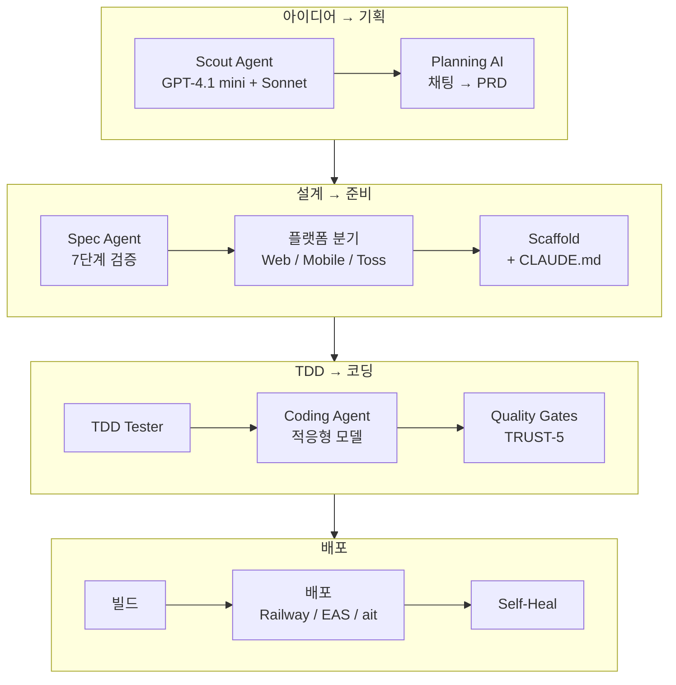

<style>
.card-link {
    text-decoration: none;
    color: inherit;
    display: block;
    width: fit-content;
    transition: transform 0.2s ease;
}
.card-link:hover {
    transform: translateY(-2px);
}
.card-link img {
    border: 1px solid #e1e4e8;
    border-radius: 8px;
    box-shadow: 0 2px 8px rgba(0, 0, 0, 0.1);
    max-width: 100%;
    height: auto;
}
</style>

9편까지 파이프라인 내부의 기술적 이야기를 계속 했는데, 정작 **"이 시스템이 실제로 어떻게 생겼고 어떻게 돌아가는지"**를 보여드린 적이 없었습니다.

이번 글은 중간 점검입니다. AI Factory의 대시보드 UI를 하나씩 둘러보면서, 아이디어 발굴부터 앱 배포까지 **실제 화면으로** 파이프라인이 어떻게 동작하는지 보여드리겠습니다!!

바로 본론으로 들어가겠습니다!!

---

## 대시보드 전체 구조

AI Factory 대시보드는 Railway에 배포되어 있고, 웹 브라우저에서 접속합니다.


```
사이드바 메뉴:
├── 🏠 대시보드 (홈)
├── 💡 아이디어
├── 💬 기획 채팅
├── 📁 프로젝트
└── ⚙️ 설정
```

---

## 1단계: 아이디어 발굴 — Scout Agent

**💡 아이디어** 탭을 열면 Scout Agent가 자동으로 수집한 앱 아이디어 목록이 나옵니다.


Scout Agent는 매일 자동으로 뉴스와 트렌드를 수집하고, AI가 아이디어를 5개씩 생성합니다. GPT-4.1 mini로 뉴스를 수집하고, Claude Sonnet으로 아이디어를 구체화하는 2단계 구조입니다.

마음에 드는 아이디어를 클릭하면 상세 페이지로 이동하고, **"프로젝트로 전환"** 버튼을 누르면 다음 단계로 넘어갑니다.

---

## 2단계: 기획 — Planning AI 채팅

**💬 기획 채팅** 탭은 AI와 대화하면서 프로젝트를 구체화하는 공간입니다.


아이디어를 프로젝트로 전환하면 자동으로 채팅 세션이 시작됩니다. Planning AI가 질문을 하면서 **PRD(Product Requirements Document)**를 만들어갑니다.

대화가 끝나면 AI가 자동으로 PRD를 생성하고, **"기획 확정"** 버튼이 나타납니다. 이 버튼을 누르면 파이프라인이 시작됩니다.


---

## 3단계: 프로젝트 탭 - Pipeline

기획이 확정되면 프로젝트 탭에 해당 프로젝트가 들어갑니다. **프로젝트 상세 페이지**에서 확인할 수 있습니다.

프로젝트 탭은 AI Factory의 핵심 화면입니다. 기획이 확정된 프로젝트들이 카드 형태로 나열되고, 각 프로젝트의 파이프라인 상태를 실시간으로 모니터링할 수 있습니다.


각 프로젝트 카드에는 상태 배지가 있습니다.
배지의미📐 설계 중Spec Agent가 돌아가는 중⚡ 코딩 중패킷들이 순차적으로 코딩되는 중🚀 배포 준비빌드 + 배포 진행 중✅ 라이브배포 완료, 서비스 가동 중❌ 실패파이프라인 중단

프로젝트 카드를 클릭하면 프로젝트 상세 페이지로 이동합니다. 여기에 Overview, Work Packets, 이벤트 로그 등 모든 정보가 있습니다.


3단계에서는 파이프라인 예시를 보여드리겠습니다.

---

## 3-1딘계: 설계 - Spec Agent

3단계: 설계 — Spec Agent
기획이 확정되면 Spec Agent(GPT-5.2)가 자동으로 돌아갑니다. 프로젝트 상세 페이지의 이벤트 로그에서 실시간으로 확인할 수 있습니다.
Spec Agent가 하는 일:
PRD
↓
SPEC (7단계 검증)
↓
TASK (기능별 작업 정의)
↓
Work Packets (패킷별 파일 목록 + AC)
프로젝트 상세 페이지의 이벤트 로그에서 Spec Agent의 진행 상황이 실시간으로 표시됩니다.


각 문서들이 생성되고 Design Documents의 PRD, SPEC, TASK 각 요소들을 클릭하면 AI가 생성한 설계 문서들을 볼 수 있습니다.


---

## 3-2단계: 코딩 — Work Packets

**프로젝트 상세 → Work Packets 탭**에서 각 패킷의 상태를 확인할 수 있습니다.

<!-- 이미지: Work Packets 탭 — 패킷 목록. GREEN/YELLOW/RED 상태 표시 -->

| 상태           | 의미                        |
| -------------- | --------------------------- |
| 🟢 **GREEN**   | 테스트 + 리뷰 통과          |
| 🟡 **YELLOW**  | 테스트 통과, 리뷰 점수 낮음 |
| 🔴 **RED**     | 테스트 실패                 |
| ⚡ **코딩 중** | Claude Code 작업 중         |

패킷을 클릭하면 **비용 분해**가 나옵니다. `[코딩$0.65 수정$0.13 리뷰72점]` 형태로 코딩 비용, fix loop 비용, 리뷰 점수가 한눈에 보입니다. 8편에서 추가한 기능입니다.


---

## 3-3단계: 품질 검증 — Quality Gates

코딩이 완료된 패킷은 자동으로 Quality Gates를 거칩니다.

```
[review] Reviewing PR #3 with Claude Sonnet 4.5 (toss)
[review] Score: 74/100 — PASS
[quality] TRUST-5 판정: GREEN
```

체크 항목:

1. **TypeScript 컴파일** — tsc 에러 0개
2. **테스트 실행** — vitest 전부 통과
3. **AI 코드 리뷰** — 플랫폼별 criteria
4. **TRUST-5 판정** — Tested/Readable/Unified/Secured/Trackable


---

## 3-4단계: 빌드 & 배포

모든 패킷이 머지되면 빌드 + 배포 단계입니다.

| 플랫폼 | 빌드          | 배포         |
| ------ | ------------- | ------------ |
| Web    | `next build`  | Railway API  |
| Mobile | `expo export` | EAS Build    |
| Toss   | `ait build`   | `ait deploy` |

---

## 이벤트 로그: 파이프라인의 블랙박스

프로젝트 상세 페이지의 **이벤트 로그**는 파이프라인의 모든 활동을 기록합니다.


각 줄에 **비용**이 표시되어서 어디서 돈이 많이 쓰이는지 바로 파악할 수 있습니다.

---

## 프로젝트 Overview: 통계 카드

| 카드         | 내용                        | 예시            |
| ------------ | --------------------------- | --------------- |
| 💰 총 비용   | LLM 비용                    | $23.50          |
| 📦 패킷      | 전체 / GREEN / YELLOW / RED | 13 / 11 / 2 / 0 |
| ✅ 성공률    | GREEN 패킷 비율             | 85%             |
| ⏱️ 소요 시간 | 시작~완료                   | 157분           |

진행 타임라인:

```
Spec ━━━✅━━━ Scaffold ━━━✅━━━ Coding ━━━⚡━━━ Review ━━━⬜━━━ Deploy
                                    (7/13)
```

---

## 플랫폼 선택

|           | Web                  | Mobile          | Toss          |
| --------- | -------------------- | --------------- | ------------- |
| UI 시스템 | shadcn/ui + Tailwind | NativeWind + RN | TDS           |
| CLAUDE.md | web용 (237줄)        | mobile용        | toss용 (98줄) |
| 환각 방지 | 불필요               | 일부 필요       | **필수**      |

---

# 실제 결과: RentCheck

가장 최근 파이프라인 결과입니다. 1~9편의 모든 개선이 반영된 상태입니다.

### 전체 요약

| 항목     | 값                                                |
| -------- | ------------------------------------------------- |
| 프로젝트 | RentCheck — 전세·월세·매매 순자산 비교 시뮬레이터 |
| 총 패킷  | 13개                                              |
| 성공     | **11/13** (85%)                                   |
| 실패     | 2개 (통합 패킷 — compliance 오탐)                 |
| 총 시간  | 157.9분                                           |
| 총 비용  | $23.50                                            |

### 패킷별 상세

| ID   | 제목               | 코딩  | 수정  | 리뷰   | tsc에러 | 결과    |
| ---- | ------------------ | ----- | ----- | ------ | ------- | ------- |
| 0001 | 도메인/타입 정의   | $0.48 | $0.11 | 74     | **0**   | GREEN   |
| 0002 | localStorage 헬퍼  | $0.46 | $0.44 | 62→65  | 7→0     | GREEN   |
| 0003 | Context + 디바운스 | $0.28 | $0    | **80** | **0**   | GREEN   |
| 0004 | 프리셋 상수        | $0.16 | $0    | **84** | **0**   | GREEN   |
| 0005 | 시뮬레이션 엔진    | $1.14 | $0.58 | 62→65  | **0**   | GREEN   |
| 0006 | 공유 인코드/디코드 | $0.37 | $0    | 74     | **0**   | GREEN   |
| 0007 | 홈 페이지          | $0.37 | $0.44 | 62→65  | 2→0     | GREEN   |
| 0008 | 입력 페이지        | $0.81 | $0.17 | 42→65  | **0**   | GREEN   |
| 0009 | 결과 페이지        | $0.60 | $0.69 | 68     | 2→0     | GREEN   |
| 0010 | 히스토리 페이지    | $0.68 | $0.92 | 66     | 3→2→0   | GREEN   |
| 0011 | 공유 진입 페이지   | $0.20 | $0.17 | **80** | **0**   | GREEN   |
| 0012 | 통합(App.tsx)      | $0.45 | —     | 68→72  | **0**   | **RED** |
| 0013 | 라우팅 와이어링    | $0.18 | —     | **76** | **0**   | **RED** |

### TDS tsc 에러 극적 감소

9편에서 TDS 문서를 통일하고 CLAUDE.md를 98줄로 축소한 효과입니다.

|                        | Run 4 (이전) | Run 5 (이번) |
| ---------------------- | ------------ | ------------ |
| UI 패킷 최대 tsc 에러  | **15개**     | **3개**      |
| UI 패킷 평균 tsc 에러  | ~8개         | **~1.4개**   |
| tsc 에러로 인한 YELLOW | 1건          | **0건**      |

### 통합 패킷 실패 원인

실패한 0012, 0013은 **tsc 0에러, 테스트 통과**인데 Quality RED가 나왔습니다. compliance 체커가 App.tsx의 flex/grid 레이아웃용 `style={{}}`를 "TDS 오버라이드"로 잘못 탐지한 것입니다. 이미 수정 완료했습니다. **이 2개가 성공했으면 13/13 GREEN이었습니다.**

---

## 현재 수치 요약

| 항목        | 수치                    |
| ----------- | ----------------------- |
| 전체 코드   | ~8,000줄                |
| 총 커밋     | 112회+                  |
| 개발 기간   | 약 3주                  |
| 에이전트    | 6종                     |
| LLM 모델    | 6종 병행                |
| 지원 플랫폼 | 3종 (Web, Mobile, Toss) |
| 앱 1개 비용 | ~$23 (토스, 13패킷)     |
| 패킷 성공률 | 85% (Run 5)             |

---

## 10편을 마치며

1편에서 성공률 0%였던 파이프라인이 10편 시점에서는 **85% 성공률(실질 100%), 6개 에이전트, 3개 플랫폼**을 지원하는 시스템이 되었습니다.

대시보드에서 아이디어를 선택하고 기획을 확정하면, 나머지는 파이프라인이 자동으로 처리합니다. 사람이 할 일은 기획 채팅에서 몇 번 대화하고 확정 버튼을 누르는 것뿐입니다.

남은 과제:

1. **Visual Review 활성화** — 토스에서 Playwright + Claude Vision 시각 평가
2. **벤치마크 Eval Suite** — 파이프라인 변경 효과 정량 측정
3. **UI 패킷 리뷰 점수 개선** — 현재 평균 63점

감사합니다!!

---

### 현재 파이프라인 전체 구조


