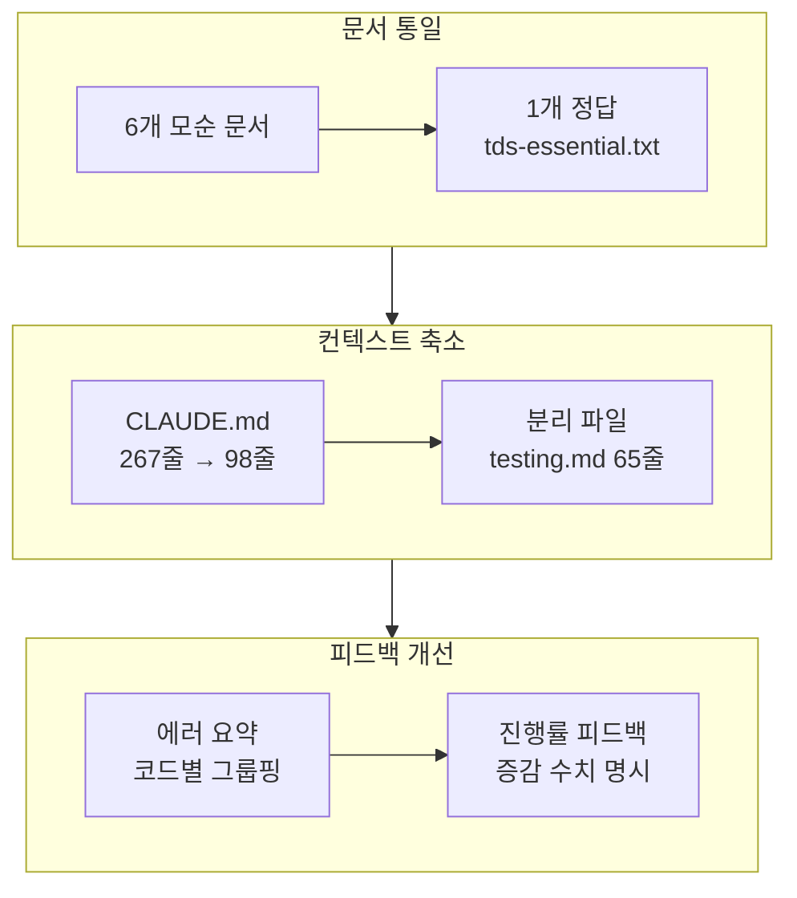

<style>
.card-link {
    text-decoration: none;
    color: inherit;
    display: block;
    width: fit-content;
    transition: transform 0.2s ease;
}
.card-link:hover {
    transform: translateY(-2px);
}
.card-link img {
    border: 1px solid #e1e4e8;
    border-radius: 8px;
    box-shadow: 0 2px 8px rgba(0, 0, 0, 0.1);
    max-width: 100%;
    height: auto;
}
</style>

8편에서 앤트로픽 블로그를 참고해 25곳을 고쳤습니다. 하지만 파이프라인을 다시 돌려보니 여전히 **TDS 환각**(존재하지 않는 API를 사용하는 문제)이 반복되었습니다.

이때 프린스턴 대학의 SWE-agent 논문을 읽게 되었는데, 한 문장이 머리를 때렸습니다.

**"같은 AI 모델을 쓰더라도, 인터페이스 설계만으로 성능이 2.5배 차이난다."**

모델을 바꾸지 않고, AI에게 **주는 정보의 형태**만 바꾸면 된다는 것이었습니다. 우리 파이프라인을 점검해보니, AI에게 **모순된 정보를 6곳에서 동시에 주고 있었습니다.**

이번 글에서 참고한 논문과 글입니다.

1. [SWE-agent: Agent-Computer Interfaces Enable Automated Software Engineering](https://arxiv.org/abs/2405.15793) (프린스턴, NeurIPS 2024) — AI 전용 인터페이스(ACI) 설계로 동일 모델 성능 2.5배 향상
2. [Anthropic Frontend-Design Skill](https://github.com/anthropics/skills/blob/main/skills/frontend-design/SKILL.md) — AI의 "분포적 수렴(AI Slop)" 방지를 위한 금지어 + 강제 규칙 설계
3. [Harness design for long-running coding agents](https://www.anthropic.com/engineering/harness-design-long-running-apps) — Playwright + Claude Vision으로 "눈으로 채점"하는 Visual Review

바로 본론으로 들어가겠습니다!!

---

## SWE-agent 논문: ACI(Agent-Computer Interface)

프린스턴 대학이 NeurIPS 2024에서 발표한 이 논문의 핵심 발견은 단순합니다.

**AI에게 사람용 인터페이스(HCI)를 그대로 주면 바보가 된다. AI 전용 인터페이스(ACI)를 설계하면 동일 모델에서 성능이 2.5배 올라간다.**

구체적인 실험 결과입니다.

| ACI 기능 | 제거 시 성능 하락 | 원리 |
|---------|-----------------|------|
| 커스텀 파일 에디터 | **-7.7%p** | `cat`으로 5000줄 읽으면 컨텍스트 폭발. 100줄 윈도우로 제한 |
| 검색 결과 요약 | **-6.0%p** | `grep` 결과를 그대로 주면 AI가 혼란. 핵심만 요약 |
| 린터 가드레일 | **-3.0%p** | 편집할 때마다 린터 실행 → 문법 오류면 편집 자체 거부 |
| 빈 출력 명시 | 미측정 | "출력 없음" → "명령이 성공적으로 실행되었으며 출력이 없습니다" |

Shell-only baseline: 7.3% → Full ACI: 18.0% = **+10.7%p (2.5배)**

핵심 메커니즘은 세 가지입니다.

1. **컨텍스트 윈도우 관리** — 매 턴마다 최근 5개 action+result만 유지, 이전 히스토리는 압축. "토큰 눈덩이(token snowballing)" 방지
2. **가드레일** — 편집 명령 시 린터 자동 실행, 문법 오류면 편집 거부. 검색 결과 50개 제한
3. **간결한 피드백** — 에러 100줄 → 핵심 10줄만 전달. 빈 출력에 성공 메시지 명시

---

## AI Factory의 ACI 문제: TDS 문서 6개의 모순

SWE-agent 논문을 읽고 우리 파이프라인을 ACI 관점에서 점검했습니다.

**충격적인 발견: TDS(토스 디자인 시스템) 관련 문서가 6곳에 흩어져 있었고, 서로 모순되는 내용이 있었습니다.**

| 파일 | 잘못된 내용 | 실제 API |
|------|-----------|---------|
| toss-mini-app.md | `Button variant="primary"` | **"primary" 없음 → "fill" \| "weak"** |
| ui-design.md | `ListRow padding="M"` | **padding prop 자체가 없음** |
| CLAUDE.md | `Typography variant="heading1"` | **Typography 없음 → Paragraph.Text typography="t4"** |
| prompts-toss.ts | `<AppBar title="...">` | **AppBar 없음 → Top title={<Top.TitleParagraph>}** |
| prompts-toss.ts | `<Dialog onConfirm={...}>` | **Dialog 없음 → AlertDialog alertButton + onClose** |
| claude-code-runner.ts | `#3182F6` 하드코딩 | **HEX 금지 → var(--tds-color-*)** |

AI가 이 6개 문서를 읽으면 **어떤 API가 맞는지 판단할 수 없어서 환각을 일으킵니다.** 이게 RentCheck에서 TDS 에러가 반복된 근본 원인이었습니다.

SWE-agent 논문의 용어로 하면, **"모순된 HCI를 6개 주고 있었던 것"**입니다. AI에게는 **"모순 없는 단일 ACI"**를 줘야 합니다.

---

## 6개 파일을 실제 .d.ts와 대조 수정

TDS의 실제 타입 정의 파일(`@toss/tds-mobile/dist/esm/index.d.ts`)을 직접 읽고, 모든 컴포넌트의 정확한 API를 확인한 뒤 6개 파일을 수정했습니다.

### 수정 1: 컴포넌트명 통일

```
Before: Typography, AppBar, Dialog
After:  Paragraph.Text, Top, AlertDialog
```

`Typography`는 TDS에 존재하지 않는 컴포넌트였습니다. 실제로는 `Paragraph.Text`이고, `typography` prop으로 `t1~t7`, `st1~st13`을 받습니다.

### 수정 2: 필수 prop 명시

```
Before: <Top>제목</Top>
After:  <Top title={<Top.TitleParagraph>제목</Top.TitleParagraph>} />
```

`Top` 컴포넌트의 `title` prop은 **필수(REQUIRED)**입니다. 이런 필수 prop 정보가 문서에 없어서 AI가 매번 틀렸습니다.

### 수정 3: 존재하지 않는 prop 제거

```
Before: <ListRow padding="M">
After:  <ListRow> + <Spacing size={16} />
```

`ListRow`에는 `padding` prop이 **존재하지 않습니다.** 6개 문서 중 3곳에서 사용하라고 안내하고 있었습니다.

### 수정 4: Blueprint 패턴 전면 수정

SPEC Agent가 참조하는 Blueprint 패턴(Pattern A~H) 전부를 실제 API로 수정했습니다. 12건의 수정.

### 수정 5: HEX 하드코딩 제거

```
Before: backgroundColor: '#fff'
After:  backgroundColor: 'var(--tds-color-background)'
```

---

## CLAUDE.md 267줄 → 98줄 (63% 축소)

SWE-agent 논문에서 **"파일 뷰어의 윈도우 크기가 성능에 직접 영향을 준다"**는 결과가 있었습니다. 전체 파일을 읽히면 -5.3%p, 30줄로 너무 줄이면 -3.7%p. 적정 크기가 중요합니다.

267줄짜리 CLAUDE.md에 TDS API 예시, 테스트 mock 패턴, 금지 목록, 체크리스트가 전부 들어있었습니다. AI가 이걸 다 읽으면 **정작 중요한 규칙을 놓칩니다.**

해결: **분리 + 포인터**

```
Before (267줄, 1파일에 전부):
  CLAUDE.md — TDS API + 테스트 mock + 금지 목록 + 체크리스트 전부

After (98줄, 핵심만 + 포인터):
  CLAUDE.md (98줄) — 핵심 규칙만
  .ai-factory/tds-essential.txt — 실제 .d.ts에서 검증된 API
  .claude/rules/testing.md — mock 패턴 (6줄→65줄로 확장)
```

CLAUDE.md에는 **"무엇을 해야 하는가"만** 남기고, **"어떻게 하는가"는 전용 파일로 분리**했습니다.

### 3회 검증: 모순 0건 확인

| 검증 항목 | 결과 |
|----------|------|
| Button primary/secondary/ghost | **0건** |
| ListRow padding S/M/L/XL | **0건** |
| Typography 단독 사용 | **0건** |
| AppBar (토스 컨텍스트) | **0건** |
| Dialog (AlertDialog 아닌) | **0건** |

6개 파일에서 **20건 이상의 모순을 제거**했습니다.

---

## ACI 원칙 추가 적용

### spec.md 컨텍스트 발췌

기존에는 모든 패킷에서 `spec.md` 전체(10~50KB)를 읽으라고 지시했습니다. SWE-agent가 지적한 **"5000줄 cat" 안티패턴**과 같습니다. **비통합 패킷에서는 spec.md 읽기를 제거**했습니다.

### fix loop 진행률 피드백

SWE-agent의 **"빈 출력 명시 피드백"** 원칙을 확장 적용했습니다.

```
## 이전 시도 결과 (1회차 → 2회차)
tsc 12개 해결됨 (15→3) — 올바른 방향입니다. 남은 에러에 집중하세요.
```

에러가 줄었으면 **"올바른 방향"**, 늘었으면 **"다른 접근 필요"**, 변화 없으면 **"같은 접근 금지"**로 분기합니다.

### AI Factory ACI 적용 현황

| ACI 원칙 | 적용 |
|---------|------|
| 컨텍스트 크기 제한 | **O** (CLAUDE.md 267→98줄) |
| 가드레일 (린터) | **△** (사후 검증) |
| 에러 피드백 요약 | **O** (8편에서 구현) |
| 빈 출력 명시 | **O** (진행률 피드백) |
| 히스토리 압축 | **O** (패킷 단위 격리) |
| TDS 문서 단일화 | **O** (6개 모순 → 1개 정답) |

---

## AI Slop: "분포적 수렴" 방지

앤트로픽의 [Frontend-Design Skill](https://github.com/anthropics/skills/blob/main/skills/frontend-design/SKILL.md)에서 다루는 **"분포적 수렴(Distributional Convergence)"** 문제도 분석했습니다.

AI에게 "랜딩 페이지 만들어줘"라고 하면 십중팔구 **흰색 배경 + 보라색 그라데이션 + Inter/Roboto 폰트 + 가운데 정렬 카드**를 뱉어냅니다. AI는 학습 데이터의 "통계적 중앙값"을 생성하기 때문입니다.

| 차원 | 금지 | 강제 |
|------|------|------|
| Typography | Inter, Roboto, Arial | 개성 있는 폰트 페어링 |
| Color | 보라 그라데이션 + 흰 배경 | 지배색 + 날카로운 액센트 |
| Layout | 예측 가능한 배치 | 비대칭, 겹침, 그리드 파괴 |
| Motion | 산발적 마이크로인터랙션 | 계단식 reveal, 스크롤 트리거 |

하지만 토스 미니앱에서는 TDS가 이미 폰트/색상을 강제하므로 일반적인 AI Slop은 덜합니다. **레이아웃 패턴의 수렴**은 발생하지만, 유틸리티 앱에서는 **"정보가 잘 보이고 빨리 사용 가능한 디자인"이 더 중요**합니다.

가장 가치 있는 인사이트는 **"분포적 수렴" 개념 자체**입니다. 디자인뿐 아니라 **코드 패턴의 수렴**도 발생하고, 이건 SPEC 단계에서 각 화면의 고유한 인터랙션을 강제하는 것이 효과적입니다.

---

## Visual Review: "디자인은 눈으로 채점"

앤트로픽 하네스 블로그에서 인상 깊었던 것은 **Playwright + Claude Vision으로 렌더링된 화면을 눈으로 채점**하는 방식이었습니다.

> "AI는 자기 작품의 나쁜 비평가다. 생성자에게 자기 작업을 평가하라고 하면, 품질이 명백히 떨어져도 자신 있게 칭찬한다."

코드가 tsc 통과 + 테스트 통과해도 **"버튼이 화면 밖으로 튀어나감"**은 잡을 수 없습니다. 실제 렌더링을 보고 판단해야 합니다.

AI Factory에 이미 `visual-review.ts`가 구현되어 있었지만 **Web 전용이고 토스에서는 비활성화**되어 있었습니다. TDS 전용 Visual Review 규칙 초안을 작성했습니다.

1. **전체 품질** — TDS 컴포넌트의 기본 스타일이 그대로 보이는가. 커스텀 CSS가 TDS를 덮어쓴 흔적이 없는가
2. **레이아웃** — Top이 상단에 위치하는가. 하단 CTA에 Safe Area 패딩이 적용되는가. 360~420px 뷰포트에 맞는가
3. **간격** — TDS 컴포넌트 사이 Spacing이 적절한가
4. **타이포그래피** — 텍스트가 읽히는가. Paragraph.Text 계층이 시각적으로 구분되는가
5. **다크 모드** — HEX 하드코딩으로 다크모드에서 안 보이는 부분이 없는가
6. **안티패턴** — 빈 화면, 요소 겹침, 버튼 화면 밖, 스크롤 없이 콘텐츠 잘림

TDS 문서 통일 효과를 확인한 뒤 활성화할 예정입니다.

---

## 9편을 마치며

이번 글의 핵심은 하나입니다.

**"AI에게 무엇을 시키느냐보다, 어떤 형태로 정보를 주느냐가 더 중요하다."**

SWE-agent 논문이 증명한 것처럼, 같은 모델이라도 인터페이스 설계만으로 2.5배 차이가 납니다. AI Factory에서 직접 경험한 것도 동일합니다.

- TDS 문서 6개 모순 → 1개 정답 통일: **환각 원인 자체를 제거**
- CLAUDE.md 267줄 → 98줄 축소: **AI가 중요한 규칙에 집중**
- spec.md 전체 → 해당 패킷만 발췌: **불필요한 컨텍스트 제거**
- fix loop 에러 나열 → 진행률 피드백: **AI가 상황을 정량적으로 파악**

모델을 바꾸지 않고, 프롬프트를 바꾸지 않고, **AI에게 주는 정보의 형태만 바꿔서** 품질을 올렸습니다. 비용 $0입니다.

감사합니다!!

---

### 이 시점의 ACI 개선 구조



---

## 참고 자료

1. [SWE-agent: Agent-Computer Interfaces Enable Automated Software Engineering](https://arxiv.org/abs/2405.15793) (프린스턴, NeurIPS 2024)
2. [Anthropic Frontend-Design Skill](https://github.com/anthropics/skills/blob/main/skills/frontend-design/SKILL.md)
3. [Harness design for long-running coding agents](https://www.anthropic.com/engineering/harness-design-long-running-apps)
