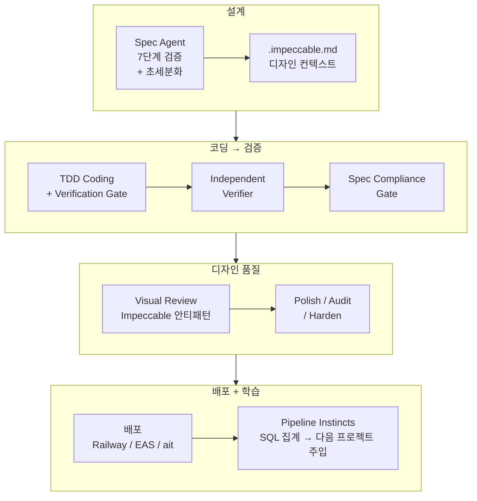

<style>
.card-link {
    text-decoration: none;
    color: inherit;
    display: block;
    width: fit-content;
    transition: transform 0.2s ease;
}
.card-link:hover {
    transform: translateY(-2px);
}
.card-link img {
    border: 1px solid #e1e4e8;
    border-radius: 8px;
    box-shadow: 0 2px 8px rgba(0, 0, 0, 0.1);
    max-width: 100%;
    height: auto;
}
</style>

프롬프트에 "TDD 순서를 지켜라"라고 적었습니다. 준수율을 측정해봤더니 **15%**였습니다. 같은 규칙을 코드로 강제했더니 **100%**였습니다.

이번 글은 오픈소스 AI 하네스 도구 3개를 뜯어보면서 발견한 것들, 그리고 **"프롬프트에 적는 것과 코드로 강제하는 것의 격차가 얼마나 큰지"**를 직접 측정한 이야기입니다.

바로 본론으로 들어가겠습니다!!

---

## 왜 다른 도구를 뜯어봤나

AI Factory를 만들면서 계속 느꼈던 것이 있습니다. **"나 말고 다른 사람들은 AI 코딩 에이전트를 어떻게 관리하고 있을까?"**

8~9편에서 앤트로픽 공식 블로그와 SWE-agent 논문을 분석했는데, 이번에는 **오픈소스 커뮤니티에서 뜨고 있는 AI 하네스 도구 3개**를 뜯어봤습니다.

1. **Impeccable** — AI가 만든 UI의 디자인 품질을 올리는 스킬 시스템
2. **Everything-Claude-Code (ECC)** — 7계층 에이전트 아키텍처 + 자기 진화 학습
3. **Superpowers** — 소프트웨어 개발 방법론 자체를 AI에게 주입하는 프레임워크 (GitHub Stars 12만+)

각각을 분석하고, AI Factory에 실제로 이식 가능한 원리를 추출해서 적용했습니다. 커밋 9개, 코드 변경 500줄 이상의 작업이었습니다.

---

## 1. Impeccable — "AI가 짠 UI는 왜 다 비슷하게 생겼을까"

### 이게 뭔가

[Impeccable](https://github.com/pbakaus/impeccable)은 AI 코딩 에이전트가 더 나은 UI/UX를 생성하도록 가이드하는 **디자인 스킬 시스템**입니다. 런타임 코드가 아니라 마크다운 파일로 된 규칙 묶음이라서, 프로덕션 번들에 코드가 추가되지 않고 비용도 거의 없습니다.

21개 스킬 파일(SKILL.md + 7개 도메인 참조: typography, color, spatial, motion, interaction, responsive, ux-writing)로 구성되어 있고, `/audit`, `/critique`, `/polish`, `/normalize`, `/harden` 같은 20개 명령을 제공합니다.

### 스킬 파일 21개를 복사만 해두고 있었습니다

처음에는 scaffold에 복사만 해두고, 실제로 활용하는 곳이 거의 없었습니다.. 분석해보니 **10개 갭**이 있었습니다.

| 문제 | 해결 |
|------|------|
| .impeccable.md 미생성 → 디자인 컨텍스트 없음 | PRD에서 Haiku로 사용자/브랜드/톤 자동 추출 |
| CLAUDE.md에 스킬 존재 안내 없음 | 스킬 디렉토리 + 사용법 추가 |
| UI 패킷에서 스킬 참조 안 함 | 프롬프트에 .impeccable.md 읽기 + 스킬 참조 지시 |
| Visual Review가 하드코딩 규칙만 사용 | fix 프롬프트에 안티패턴 참조 추가 |
| 배포 전 체계적 감사 없음 | /audit 게이트 + /harden 패스 추가 |

10개 갭을 메우고 나니 활용도가 **10% → 90%**로 올라갔습니다.

### 토스에서의 충돌 — 원리만 추출해서 재작성

여기서 중요한 발견이 있었습니다. **Impeccable 스킬 4/5개가 `frontend-design`이라는 상위 스킬을 필수로 로드**하는데, 이 스킬에 `oklch()`, `clamp()`, 비대칭 레이아웃 같은 웹 CSS 기법이 가득했습니다. 토스 미니앱에 그대로 적용하면 **TDS와 정면 충돌**합니다.

| Impeccable 지침 | TDS 규칙 | 충돌 |
|----------------|---------|------|
| oklch(), color-mix() 사용 | var(--tds-color-*) 전용 | Critical |
| clamp() 유동 타이포 | TDS t1-t7, st1-st13 전용 | Critical |
| 비대칭 레이아웃, 그리드 파괴 | TDS ListRow, Spacing 중심 | High |
| Container queries | 토스 앱 내 고정 뷰포트 | Medium |

그래서 **Impeccable 스킬을 토스에 복사하지 않고, 원리만 추출해서 TDS 전용 프롬프트로 재작성**했습니다. 토스 파이프라인에 3개 패스를 추가했습니다.

1. **Toss Polish** — TDS Spacing/Typography 토큰 기준 일관성 검사, 인터랙션 상태 완성도
2. **Toss Audit** — 접근성/성능/다크모드/TDS 준수 4차원 감사, P0/P1 자동 수정
3. **Toss Harden** — 텍스트 오버플로, 에러/로딩/빈 상태 처리, 더블 클릭 방지

모든 프롬프트에 "TDS 컴포넌트만 사용, Tailwind 금지, 새 패키지 금지"를 반복했습니다. 환경변수(`TOSS_DESIGN_AUDIT=false`, `TOSS_HARDEN_PASS=false`)로 개별 비활성화도 가능합니다.

비용 영향은 프로젝트당 약 $0.91 증가입니다.

| 패스 | Claude Code 호출 | 예상 비용 |
|------|----------------|----------|
| Toss Polish | 1회 (Sonnet, ~15턴) | ~$0.30 |
| Toss Audit | 1회 (Sonnet, ~20턴) | ~$0.40 |
| Toss Harden | 1회 (Sonnet, ~10턴) | ~$0.20 |
| .impeccable.md 생성 | 1회 (Haiku) | ~$0.01 |

$23.50짜리 파이프라인에 $0.91 추가(+4%)이므로 부담은 크지 않습니다.

---

## 2. Everything-Claude-Code — "AI가 스스로 배우는 시스템"

### 이게 뭔가

[Everything-Claude-Code (ECC)](https://github.com/affaan-m/everything-claude-code)는 **7계층 에이전트 아키텍처**입니다. 136개 스킬, 30개 에이전트, 60+ 슬래시 커맨드를 제공합니다.

| 계층 | 구성 | AI Factory 도입 가치 |
|------|------|---------------------|
| Rules (10 언어) | 코딩 표준 | 낮음 — 이미 자체 규칙 |
| Skills (136개) | 컨텍스트 감지 자동 발동 | 낮음 — 대부분 불필요 |
| Agents (30개) | 복잡 작업 위임 | 낮음 — 자체 파이프라인 |
| Commands (60+) | 슬래시 커맨드 | 낮음 — 자동화와 비호환 |
| Hooks (~15개) | 100% 확정 발동 | 중간 |
| **Instincts** | **자기 진화 학습** | **높음 ★** |
| AgentShield | 보안 파이프라인 | 중간 |

ECC는 **대화형 개발 환경**에 최적화되어 있고, AI Factory는 `claude -p`로 비대화형 실행하는 **자동화 파이프라인**이라서, 대부분의 기능이 맞지 않았습니다.

**AgentShield(보안 파이프라인)**는 1,282개 테스트와 102개 정적 분석 규칙으로 Red-team/Blue-team/Auditor 3중 보안 검증을 제공해서 꽤 매력적이었습니다. 하지만 AI Factory가 생성하는 앱은 **클라이언트 전용 유틸리티 앱**(가계부, 건강 기록 등)이라 서버 보안이 필요 없어서, 서버 사이드 로직을 자동 생성하게 될 때 다시 검토할 예정입니다.

유일하게 가져올 만한 것은 **Instincts(자기 진화 학습)**였습니다.

### Pipeline Instincts — LLM 없이 학습하는 시스템

ECC의 Instincts는 Haiku로 패턴을 분석하는데, **환각 위험**이 있습니다. Haiku가 존재하지 않는 패턴을 만들어내면 잘못된 규칙이 파이프라인에 주입되니까요.

그래서 **SQL 집계 + 템플릿 매핑** 방식으로 재설계했습니다. 결정론적이고, 비용 $0이고, 환각이 불가능합니다.

| | ECC (원본) | AI Factory (재설계) |
|---|---|---|
| 관찰 수단 | Hook 스크립트 | 기존 DB 데이터 |
| 패턴 감지 | Haiku 실시간 분석 | SQL 집계 (배치) |
| 환각 위험 | 있음 | **없음** (템플릿 매칭) |
| 비용 | $0.01~0.03/세션 | **$0** |
| 신뢰도 | LLM 판단 | Wilson score 수식 |
| 적용 | 스킬 파일로 주입 | CLAUDE.md "Learned Patterns" 섹션 |

4단계로 동작합니다.

**Phase A (관찰 수집):** 파이프라인 완료 시 실패 패턴을 **13개 카테고리**로 분류해서 DB에 저장합니다. LLM 호출 없이 regex 기반 분류만 하므로 비용 $0입니다.

에러 카테고리는 `import_error`, `type_mismatch`, `tds_violation`, `tds_padding`, `hardcoded_color`, `test_isolation`, `build_timeout`, `missing_state`, `scrollview_nest`, `provider_missing`, `next_import`, `dependency_deleted`, `unknown`의 13가지입니다.

**Phase B (패턴 감지):** platform + category별로 SQL 집계하고, 3회 이상 반복된 패턴만 미리 정의된 `INSTINCT_TEMPLATES`에서 매칭합니다. **Wilson score**로 신뢰도를 수학적으로 계산합니다.

| 관찰 | 반증 | 신뢰도 | 의미 |
|------|------|--------|------|
| 3회 | 0회 | 0.44 | 잠정 — 주입 안 함 |
| 5회 | 0회 | 0.57 | 보통 — 주입 안 함 |
| 10회 | 0회 | **0.74** | 강함 — **자동 주입 시작** |
| 20회 | 1회 | 0.81 | 강함 |
| 30회 | 0회 | 0.89 | 확정 — 영구 규칙 승격 후보 |

관찰이 적을 때는 보수적으로 판단하고, 충분히 쌓여야 자동 주입이 시작됩니다.

**Phase C (프롬프트 주입):** 신뢰도 0.8 이상인 instinct만 CLAUDE.md에 자동 주입합니다. 최대 5개까지, 플랫폼별로 스코핑됩니다. 금지어 블록리스트(Tailwind, shadcn, MUI 등)로 잘못된 조언을 자동 차단합니다.

**Phase D (영구 승격):** v1에서는 **제외**했습니다. 잘못된 규칙이 영구화되면 모든 미래 프로젝트에 영향을 주기 때문입니다. 여기는 보수적으로 가는 게 맞다고 판단했습니다.

예를 들어 토스 프로젝트에서 "ListRow에 padding prop 사용" 에러가 10회 이상 반복되면, 다음 프로젝트의 CLAUDE.md에 자동으로 이런 경고가 추가됩니다.

```
## Learned Patterns (자동 학습 — 신뢰도 0.8+)
- ⚠️ TDS ListRow에 padding prop 없음 → Spacing 컴포넌트 사용 (87%, 5회 관찰)
```

테스트 20건 전부 통과했습니다!!

---

## 3. Superpowers — "AI에게 소프트웨어 공학을 가르치다"

### 이게 뭔가

[Superpowers](https://github.com/obra/superpowers)는 GitHub Stars 12만+의 프로젝트입니다. AI 코딩 에이전트에 **구조화된 소프트웨어 개발 방법론 자체를 주입**합니다. 코드 라이브러리가 아니라 마크다운 기반 스킬 문서로, 에이전트의 의사결정 패턴을 변형시킵니다. Anthropic 공식 플러그인 마켓플레이스에도 등록되어 있습니다.

실전 검증도 확실합니다. 이 프레임워크로 개발한 chardet 7.0.0은 기존 대비 **41배 속도 향상, 96.8% 정확도**를 달성했고, 2,161개 파일/99개 인코딩을 테스트 커버했습니다.

6단계 워크플로우가 인상적이었습니다.

1. **Brainstorming** — 소크라테스식 질문, 2~3개 접근법 + 트레이드오프
2. **Git Worktree 격리** — 독립 작업공간, 클린 테스트 베이스라인
3. **초세분화 계획** — 2~5분 단위 태스크, Zero Placeholder
4. **서브에이전트 구현** — 구현자/스펙리뷰어/코드리뷰어 **3분리**
5. **Code Review** — git SHA 기반 diff 리뷰, Critical/Important/Minor 분류
6. **Finishing** — 테스트 통과 확인 후 4개 옵션만 제시

특히 TDD "핵 수준" 강제가 인상적이었습니다.

> "테스트 전에 코드를 썼다면? 삭제하라. 처음부터 다시. 참고용으로 보관하지 마라. 적응시키지 마라. 보지도 마라."

12개 이상의 변명 패턴에 대응하는 **반합리화 테이블**도 있었습니다. "너무 단순해서 테스트 불필요" → "단순한 코드에서 버그가 가장 많다" 같은 식입니다.

독특한 원칙 두 가지도 기억에 남습니다.

**"1% 규칙"** — "스킬이 적용될 가능성이 1%라도 있으면 반드시 호출하라." "권고형 언어(~하면 좋겠다)는 합리화되어 무시된다"며 의도적으로 권고를 폐기하고 강제만 남겼습니다.

**"스킬 자체를 TDD로 개발"** — 스킬 없이 에이전트가 실패하는 시나리오(RED)를 먼저 확인하고, 스킬을 작성(GREEN)하고, 허점을 보강(REFACTOR)합니다. "스킬 없이 에이전트가 실패하는 걸 직접 보지 않았다면, 스킬이 올바른 것을 가르치는지 알 수 없다"는 원칙입니다.

### 검토했지만 도입하지 않은 것들

**시각 브레인스토밍 서버**: 자체 제작한 WebSocket 서버로 브라우저에서 HTML 목업을 실시간 확인할 수 있는 기능입니다. 꽤 혁신적이었지만, AI Factory는 **자동화 파이프라인**이라 사람이 목업을 보면서 판단하는 단계가 없습니다. 보류했습니다.

**Git Worktree 격리**: AI Factory는 이미 프로젝트별 브랜치가 있고 패킷을 순차 처리하므로 병렬 격리의 필요성이 낮았습니다. 향후 패킷 병렬 실행을 본격화할 때 다시 검토할 예정입니다.

**Firecrawl 웹 리서치**: AI Factory는 패킷 프롬프트에 필요한 정보(API 스키마, TDS 레퍼런스 등)를 미리 주입하는 구조라서, 에이전트가 스스로 웹을 탐색할 필요가 없었습니다.

### AI Factory에 적용한 7가지 원리

**프롬프트 전용 변경 (비용 $0):**

- **Verification Before Completion** — 3개 플랫폼 AFTER 섹션에 "증거 없이 완료 선언 금지" 추가. "아마 될 것이다"는 증거가 아님, 반드시 fresh 실행 필수
- **TDD RED→GREEN→REFACTOR** — Mobile/Toss의 Testing 섹션을 순서 강제로 교체

**verification.ts 새 단계:**

- **Spec Compliance Gate** — 빌드 후, 폴리시 전에 스펙 준수를 전용으로 검증. 스펙이 충족 안 된 상태에서 폴리시하는 낭비를 제거했습니다
- **Independent Verifier** — 빌드 수정 후 독립 검증자가 fresh 빌드/테스트 실행. "자기 코드 자기 검증"의 편향을 제거합니다
- **리뷰 반론 문화** — 폴리시/감사/하드닝 7곳에 "맹목 수용 금지" 삽입. "just in case" 방어 코드 추가 금지

**Spec Agent 프롬프트:**

- **초세분화** — "단일 관심사 원칙" 추가. 1 Packet = 1 페이지 or 1 API or 1 유틸
- **Packet 상한 확대** — Web/Mobile: 20→30, Toss: 12→20. 세분화 지시와 상한이 충돌하면 세분화가 무시되기 때문입니다

---

## 프롬프트 30% vs 코드 강제 100% — 직접 측정한 격차

이번 작업에서 가장 중요한 발견이었습니다.

Superpowers의 반합리화 테이블을 적용하면서 **프롬프트 위치별 LLM 준수율을 측정**해봤습니다.

| 위치 | 섹션 | 예상 준수율 |
|------|------|-----------|
| 시작 | Task + AC + DoD + Files | **95%+** |
| 중간 | Design Reference / Code Context | 50~70% |
| 후반 | BEFORE writing code | 80% |
| 후반 | CODE QUALITY | **40~50%** |
| 끝 | AFTER 3개 커맨드 | **85~90%** |

**Lost in the Middle 현상** — 프롬프트가 길어질수록 중간부의 지시가 무시됩니다. 반합리화 테이블은 프롬프트 중간~후반부에 위치해서 준수율이 **15~25%**에 불과했습니다. LLM은 메타인지적 자기감시("이런 생각이 들면 STOP")를 잘 처리하지 못합니다.

그래서 **효과 없는 프롬프트 31줄을 과감히 삭제**했습니다. 반합리화 테이블 3곳(27줄), TDD "위반 시 삭제하고 처음부터" 2곳(4줄). 프롬프트가 짧아지면 실제 효과 있는 지시의 준수율이 올라가니까요.

### AI Factory에 이미 있던 증거

놀라웠던 것은, **이미 AI Factory 안에 코드 강제와 프롬프트의 격차를 보여주는 증거가 있었다는 것**입니다.

| 규칙 | 방식 | 준수율 |
|------|------|--------|
| 파일 수 > 5면 reject + 재생성 | 코드 검증 | **100%** |
| AC < 2면 reject + 재생성 | 코드 검증 | **100%** |
| 설명 > 400자면 reject | 코드 검증 | **100%** |
| Epic 비율 위반이면 reject | 코드 검증 | **100%** |
| 파일 충돌 감지 → reject | 코드 검증 | **100%** |
| "단일 관심사만 포함하라" | **프롬프트** | ~20% |
| "AC 3~5개 권장" | **프롬프트** | ~30% |
| "TDD 순서를 지켜라" | **프롬프트** | ~15% |

`validateWorkPackets()` 함수가 파일 수, AC 수, 설명 길이, Epic 비율, 파일 충돌을 **코드로 검증**하고, 위반하면 **자동으로 재생성**시킵니다. 이건 100% 작동합니다.

같은 시스템 안에서 이 격차가 벌어지고 있었습니다.. 다음 단계는 명확합니다. **이번에 프롬프트로 추가한 규칙들을 코드 레벨 검증으로 전환**하는 것입니다. 테스트 파일 존재 여부 체크, assertion 개수 검증, 빌드 커맨드 실행 여부를 stdout에서 확인하는 것들입니다.

---

## 3개 도구 비교 정리

| | Impeccable | ECC | Superpowers |
|---|---|---|---|
| 핵심 | UI 디자인 품질 | 7계층 에이전트 + 학습 | 개발 방법론 주입 |
| Stars | — | — | 125,600+ |
| 학습 기능 | 없음 (정적) | Instincts (LLM 기반) | 없음 (정적) |
| 적합 환경 | 자동화 파이프라인 | 대화형 개발 | 대화형 개발 |
| AI Factory 도입 | 원본(Web/Mobile) + TDS 재작성(Toss) | 원리만 추출 (LLM-free) | 원리만 추출 + 비효과 제거 |
| 비용 영향 | +$0.91/프로젝트 | $0 | +$0.30~0.45 |

세 도구 모두 **대화형 개발 환경**에 최적화되어 있었습니다. AI Factory처럼 `claude -p`로 비대화형 자동 실행하는 파이프라인과는 맞지 않는 부분이 많았습니다. 결국 **도구 자체보다 그 안에 담긴 원리가 더 중요**했습니다.

---

## 11편을 마치며

이번 글의 교훈을 정리하면 이렇습니다.

1. **다른 도구를 통째로 가져오면 안 된다** — Impeccable은 토스에서 TDS와 충돌, ECC의 대부분은 자동화 파이프라인과 비호환, Superpowers의 반합리화 테이블은 LLM이 준수하지 않음. 원리만 추출해서 자기 시스템에 맞게 재설계해야 함
2. **AI도 "경험에서 배우는 시스템"을 만들 수 있다** — ECC의 Instincts를 LLM-free SQL 집계로 재설계해서 비용 $0, 환각 불가능, Wilson score로 신뢰도 보장. 프로젝트를 돌릴수록 다음 프로젝트가 나아지는 구조
3. **프롬프트에 적으면 30%, 코드로 강제하면 100%** — AI Factory의 `validateWorkPackets()`가 이미 증명하고 있었음. 프롬프트 준수율의 Lost in the Middle 현상도 직접 확인
4. **효과 없는 프롬프트는 삭제가 답** — 31줄을 지웠더니 나머지 규칙의 준수율이 올라감. 프롬프트는 짧을수록 좋음

결국 이번에도 같은 결론에 도달했습니다. 8편에서 앤트로픽 블로그를 읽고 "프롬프트에 규칙을 추가하는 것보다, 코드로 검증을 강제하는 것이 효과적이다"라고 했었는데, 이번에 **준수율 수치로 직접 확인**한 셈입니다.

다음 글에서는 이 발견을 바탕으로 **프롬프트 규칙들을 코드 레벨 검증으로 전환하는 작업**을 다룰 예정입니다!!

감사합니다!!

---

### 이 시점의 파이프라인 구조



---

## 참고 자료

1. [Impeccable](https://github.com/pbakaus/impeccable) — AI 에이전트용 디자인 스킬 시스템
2. [Everything-Claude-Code](https://github.com/affaan-m/everything-claude-code) — 7계층 에이전트 아키텍처, Instincts 자기 진화 학습
3. [Superpowers](https://github.com/obra/superpowers) — 소프트웨어 개발 방법론 주입, TDD 핵 강제, 서브에이전트 3분리
