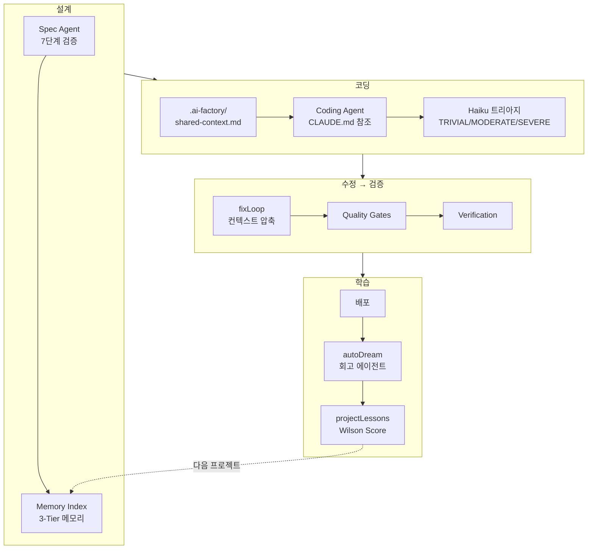

<style>
.card-link {
    text-decoration: none;
    color: inherit;
    display: block;
    width: fit-content;
    transition: transform 0.2s ease;
}
.card-link:hover {
    transform: translateY(-2px);
}
.card-link img {
    border: 1px solid #e1e4e8;
    border-radius: 8px;
    box-shadow: 0 2px 8px rgba(0, 0, 0, 0.1);
    max-width: 100%;
    height: auto;
}
</style>

3월 31일, 앤트로픽이 실수로 **Claude Code 소스코드 51만 줄**을 유출했습니다.

npm 배포 시 디버깅용 `.map` 파일이 포함되었고, 그 안에 클라우드 스토리지의 zip 경로가 노출된 것입니다. 1,906개 TypeScript 파일, 44개 숨겨진 피처 플래그, 차세대 모델 코드네임까지 전부 드러났습니다.

저는 이 코드를 직접 가져다 쓸 생각은 없었지만, **아키텍처 패턴과 설계 철학**은 배울 게 많았습니다. 특히 "프로덕션급 에이전트는 결국 단순한 while 루프"라는 점, 그리고 **3계층 메모리 + 회의적 기억(Skeptical Memory)**이라는 개념이 인상적이었습니다.

이걸 AI Factory에 이식했더니 **프롬프트 토큰 30% 절감 + 프로젝트 간 학습 시스템** 구축이라는 결과가 나왔습니다.

바로 본론으로 들어가겠습니다!!

---

## Claude Code 유출에서 눈에 띈 것들

유출된 코드에서 가장 인상 깊었던 아키텍처 패턴을 정리하면 이렇습니다.

### KAIROS — 상시 실행 자율 에이전트

소스 내에서 **150회 이상 참조**되는 핵심 기능이었습니다. 사용자가 입력하지 않아도 스스로 관찰하고, 로그를 남기고, 주도적으로 행동하는 상시 실행 에이전트입니다. append-only 일일 로그, 주기적인 tick 프롬프트, 15초 블로킹 예산(사용자 작업 흐름을 15초 이상 방해하지 않음) 같은 설계가 있었습니다.

AI Factory의 배포 후 모니터링에 이 패턴이 딱 맞겠다고 생각했습니다.

### 3계층 메모리 아키텍처

이게 가장 충격적이었습니다. 메모리를 **"저장"이 아니라 "인덱스 + 온디맨드 검색"**으로 설계하고 있었습니다.

| 계층 | 역할 | 크기 |
|------|------|------|
| Core Index | 항상 컨텍스트에 로드되는 경량 포인터 | 줄당 150자 이내 |
| Topic Files | 상세 지식, 필요할 때만 fetch | 주제별 분리 |
| Raw Transcripts | 전체 로그, grep으로만 접근 | 무제한 |

AI Factory를 돌이켜보니, 프로젝트가 끝나면 그동안 쌓인 교훈이 전부 사라지고 있었습니다.. failed-approaches.md도, git context도 프로젝트 디렉토리와 함께 삭제됩니다.

### autoDream — 유휴 시간 메모리 통합

사용자가 유휴 상태일 때 서브에이전트가 메모리를 정리하는 기능입니다. 4단계 사이클(Orient→Gather→Consolidate→Prune)로 관찰을 병합하고, 논리적 모순을 제거하고, 25KB 이하로 유지합니다.

### 회의적 메모리 (Skeptical Memory)

이건 정말 중요한 개념이었습니다. **자신의 메모리를 "힌트"로 취급하고, 실제 코드베이스에서 검증한 후에야 행동**하는 패턴입니다. 과거 프로젝트에서 "cookie 인증이 좋았다"는 메모리가 있어도, 현재 프로젝트가 JWT를 사용하고 있으면 그 메모리를 무시하는 것입니다.

### 그 외 참고한 패턴들

**정적/동적 프롬프트 분리**: 정적 지시문(코딩 규칙, TDD 프로토콜)과 동적 컨텍스트(현재 패킷 스펙)를 분리해서 정적 부분의 프롬프트 캐시 히트율을 높이는 설계.

**저비용 모델로 저비용 판단**: Haiku급 모델로 "이 에러가 단순한 건지 복잡한 건지" 사전 분류한 뒤, 복잡한 것만 Sonnet으로 보내는 패턴.

**컨텍스트 압축**: 긴 세션에서 컨텍스트가 비대해지면 구조화된 요약을 생성해서 핵심만 유지하는 3단계 압축.

이런 패턴들을 AI Factory에 대입해보니, 즉시 적용할 수 있는 것과 중기적으로 도입할 것이 명확하게 구분되었습니다. Phase 1(비용 최적화)과 Phase 2(메모리 시스템)로 나눠서 구현했습니다.

---

## Phase 1: 프롬프트 구조 개편 — 토큰 30% 절감

### 문제 진단: 같은 규칙을 매번 보내고 있었다

AI Factory의 `buildClaudeCodePrompt()` 함수를 분석해봤습니다. 패킷 하나 코딩할 때 보내는 프롬프트 구조가 이랬습니다.

```
프롬프트 (32~80KB):
├── Task + AC + Files (동적 — 매 패킷마다 다름)
├── DB Schema (동적)
├── Shared Types (동적 — 그러나 같은 wave 내에서 동일)
├── Code Context (동적 — 그러나 같은 wave 내에서 동일)
├── TDD Protocol (정적 — 매번 동일!)
├── CODE QUALITY (정적 — 매번 동일!)
└── Verification Gate (정적 — 매번 동일!)
```

TDD 프로토콜, CODE QUALITY, Verification Gate 같은 **정적 규칙이 매 패킷마다 중복 전송**되고 있었습니다. 8패킷이면 동일한 규칙 3KB가 8번, **24KB가 낭비**되는 구조입니다.

게다가 이 규칙들은 CLAUDE.md에도 일부 있었습니다. **두 곳에 같은 내용이 분산**되어 있었던 것입니다.

### 해결 1: CLAUDE.md에 정적 규칙 통합

정적 규칙을 전부 CLAUDE.md로 옮기고, 프롬프트에서는 한 줄로 참조만 했습니다.

```
변경 전 (프롬프트 내 50줄):
  ## TDD Protocol
  ... (20줄)
  ## CODE QUALITY
  ... (15줄)
  ## Verification Gate
  ... (15줄)

변경 후 (프롬프트 내 7줄):
  ⚠️ CLAUDE.md의 TDD Protocol, Code Quality, Verification Gate를
  반드시 따르세요.
```

### 해결 2: 공유 컨텍스트를 파일로 분리

같은 wave 내의 모든 패킷에서 동일한 `contractTypes`(types.ts)와 `codeContext`(완료된 패킷 목록)를 **매번 프롬프트에 인라인으로 넣고 있었습니다.** 이걸 `.ai-factory/shared-context.md` 파일로 한 번만 쓰고, 프롬프트에서는 "이 파일을 읽어라"로 참조하도록 변경했습니다.

```
변경 전: 매 패킷 프롬프트에 types.ts(3KB) + codeContext(5KB) 인라인
변경 후: .ai-factory/shared-context.md에 1회 기록 → "Read this file" 참조
```

패킷당 ~8KB 추가 축소. 8패킷이면 ~64KB → 8KB로 줄어듭니다.

이 변경은 Web, Mobile, Toss 3개 플랫폼 빌더에 모두 적용했습니다.

### 해결 3: Haiku 트리아지 — fixLoop 진입 전 에러 분류

11편에서 "프롬프트로 부탁하면 30%, 코드로 강제하면 100%"라는 교훈을 얻었는데, fixLoop에서도 비슷한 낭비가 있었습니다.

**import 누락 1개**도, **설계 결함으로 10개 파일 수정이 필요한 경우**도 동일한 fixLoop 경로를 타고 있었습니다. 3편에서 말했던 "적재적소" 원칙이 fixLoop에는 적용되지 않고 있었던 것입니다.

Claude Code 유출에서 본 "저비용 모델로 저비용 판단" 패턴을 적용했습니다. fixLoop 진입 전에 **Haiku로 에러 심각도를 사전 분류**합니다.

| 분류 | 에러 예시 | fixLoop 전략 |
|------|----------|-------------|
| TRIVIAL | import 누락, typo | Haiku 1회만 (비용 ~$0.01) |
| MODERATE | 로직 에러, 타입 불일치 | 정상 fixLoop (Haiku→Sonnet) |
| SEVERE | 설계 결함, 구조 변경 필요 | Sonnet으로 바로 시작 또는 replan |

Haiku 트리아지 1회 비용은 ~$0.01입니다. 이걸로 Sonnet fixLoop 1회(~$0.15)를 절약할 수 있으니 ROI가 15배입니다.

추가로 import 누락 같은 흔한 에러는 **regex 기반 fast path**로 Haiku 호출 없이 즉시 분류합니다. 비용 $0입니다.

### 해결 4: fixLoop 컨텍스트 압축

Claude Code 유출의 "3단계 컨텍스트 압축" 패턴을 적용했습니다.

기존 fixLoop은 에러가 나면 "에러 15줄 전부 + 이전 시도 결과 전부"를 다음 iteration에 보냈습니다. 재시도할수록 컨텍스트가 비대해져서, 정작 중요한 "남은 핵심 에러"가 묻혔습니다.

변경 후, iteration 2부터는 **핵심 에러 5개 + 이전 시도 요약**만 전달합니다.

```
## 이전 시도 결과 (1회차 → 2회차)
수정 파일: src/lib/auth.ts, src/pages/api/login.ts
에러 변화: tsc 15→12 (3개 해결, 새 에러 0개)
해결된 에러: TS2307(모듈 미발견) 3건
남은 핵심 에러:
  1. TS2741: Property 'calories' missing (src/lib/meals.ts:24)
  2. TS2322: Type 'string' not assignable to 'number' (src/pages/api/meals.ts:15)
  ...
```

그리고 `failed-approaches.md`도 강화했습니다. 기존에는 에러 시그니처만 기록했는데, **시도한 전략 + 결과 delta**까지 기록하도록 변경했습니다.

```
변경 전: tsc:15|lint:0|test:2 → tsc:14|lint:0|test:2
변경 후: Attempt 1 (Haiku): "Added missing import for UserType"
         → tsc 15→14 (1개 해결, 새 에러 0개)
```

### Phase 1 결과

| 항목 | Before | After |
|------|--------|-------|
| 정적 규칙 중복 | 3KB × 8패킷 = 24KB | 0 (CLAUDE.md 참조) |
| 공유 컨텍스트 중복 | 8KB × 8패킷 = 64KB | 8KB × 1 (파일) |
| TRIVIAL 에러 fixLoop | Sonnet 2~3회 | Haiku 1회 |
| fixLoop 3회차 품질 | 동일 에러 반복 ~20% | 압축 요약으로 반복 회피 |
| **예상 비용 절감** | | **~30%** |

3개 파일, +241/-247줄. 코드가 오히려 줄었습니다. 불필요한 중복을 제거했으니까요.

---

## Phase 2: 3-Tier 메모리 시스템 — "경험에서 배우는 AI"

### 문제: 프로젝트가 끝나면 지식이 사라진다

AI Factory에는 이미 5개의 분산된 메모리 시스템이 있었습니다. 하지만 **서로 연결되지 않고 각각 독립적**으로 작동하고 있었습니다.

| 현재 시스템 | 범위 | 한계 |
|------------|------|------|
| Git Context Memory | 프로젝트 내 패킷 간 | 최근 5커밋만. 이전 프로젝트 불참조 |
| Failed Approaches | 프로젝트 내 | 프로젝트 종료 시 삭제됨 |
| Coding Failure Patterns | 프로젝트 내 | regex 기반 6개 패턴만 |
| Past Project Patterns | 크로스 프로젝트 | API/DB 구조 패턴만. 코딩 교훈 미포함 |
| Instincts | 크로스 프로젝트 | 카테고리 16개 고정. SQL 집계만 |

가장 큰 문제는 **프로젝트 종료 시 지식 소실**이었습니다. 프로젝트 A에서 "TDS ListRow에 padding prop이 없다"는 걸 힘들게 배워도, 프로젝트 B에서 같은 실수를 반복합니다. failed-approaches.md가 프로젝트 디렉토리와 함께 삭제되기 때문입니다.

사람 팀에서도 마찬가지잖아요. 프로젝트 회고를 하지 않으면 다음 프로젝트에서 같은 실수를 반복합니다. AI도 똑같았습니다.

### Claude Code의 3계층 패턴을 AI Factory에 이식

Claude Code 유출에서 발견한 3계층 메모리 아키텍처를 AI Factory에 맞게 재설계했습니다.

```
Layer 1: memory-index.md (항상 프롬프트에 주입, <2KB)
  ├── 프로젝트별 교훈 포인터
  ├── 플랫폼별 핵심 규칙
  └── 최근 실패 요약

Layer 2: topic/*.md (패킷별 선택적 로드, <5KB)
  ├── topic/tds-patterns.md — TDS 관련 축적 패턴
  ├── topic/type-safety.md — 타입 관련 반복 실패와 해결책
  └── topic/auth-patterns.md — 인증 관련 교훈

Layer 3: Raw Data (DB 테이블, SQL로만 접근)
  ├── projectLessons (교훈 영속 저장)
  ├── codingRuns (전체 실행 로그)
  └── pipelineObservations (라벨링된 관찰)
```

**왜 3계층인가?** Layer 1(2KB)은 매 패킷에 로드해도 부담 없습니다. 하지만 모든 교훈을 다 넣으면 프롬프트가 비대해져서 9편에서 다룬 "Lost in the Middle" 현상이 생깁니다. 그래서 상세 내용은 Layer 2에 두고, 현재 패킷과 관련된 토픽만 선택적으로 로드합니다. Layer 3의 Raw Data는 절대 직접 프롬프트에 넣지 않습니다.

### projectLessons 테이블 — 교훈의 영속 저장소

기존 instincts 테이블은 에러 패턴에 특화되어 있었습니다. 새로운 `projectLessons` 테이블은 **디자인 결정, 아키텍처 선택, 최적화 교훈**까지 더 넓은 범위를 저장합니다.

핵심 필드는 `confidence`(신뢰도)와 `verified`(검증 여부)입니다. 교훈이 다음 프로젝트에서 실제로 도움이 되었는지를 추적해서 신뢰도를 조정합니다.

### autoDream — 파이프라인 완료 후 자동 회고

Claude Code의 autoDream 4단계를 AI Factory 버전으로 재구현했습니다. 파이프라인이 성공적으로 배포(deployed)되면 자동으로 실행됩니다.

```
Orient  → agentRuns + codingRuns에서 프로젝트 결과 수집
Gather  → GPT-4.1 mini로 패턴/결정/교훈 추출 (~$0.02)
Consolidate → projectLessons 테이블에 저장 + 기존 교훈과 병합
Prune   → 모순되는 교훈 제거, 오래된 미검증 교훈 deprecate
```

**왜 GPT-4.1 mini인가?** 교훈 추출은 "프로젝트 로그를 읽고 패턴을 정리하는" 작업이라 Haiku보다는 조금 더 강한 모델이 필요하지만, Sonnet까지는 필요 없습니다. 비용은 프로젝트당 ~$0.02로 무시할 수 있는 수준입니다.

### 회의적 메모리 (Skeptical Memory)

Claude Code 유출에서 가장 인상 깊었던 패턴입니다. AI Factory에 이렇게 적용했습니다.

memory-index.md의 모든 교훈에 `[HINT]` 태그를 붙이고, 코딩 에이전트 프롬프트에 이런 지시를 추가했습니다.

```markdown
아래 메모리는 과거 프로젝트의 [HINT]입니다.
현재 코드베이스의 실제 파일/타입을 반드시 확인한 후 적용하세요.
메모리와 현재 코드가 다르면 현재 코드를 우선합니다.
```

왜 이게 필요한가? 과거 프로젝트에서 "cookie 세션이 좋다"는 교훈이 있어도, 현재 프로젝트의 scaffold가 JWT를 사용하고 있으면 그 교훈을 무시해야 합니다. **메모리를 맹신하면 오히려 해로울 수 있습니다.**

### Wilson Score — 교훈 신뢰도의 수학적 관리

교훈의 신뢰도를 **감(feeling)**이 아니라 **수식**으로 관리합니다. 11편에서 Pipeline Instincts에 도입했던 Wilson Score Interval을 여기에도 적용했습니다.

```
패킷 성공 시: confidence += 0.05
패킷 실패 시: confidence -= 0.10
3회 연속 실패: 해당 교훈 deprecate
```

감소 폭(-0.10)이 증가 폭(+0.05)보다 큰 이유는, **잘못된 교훈이 퍼지는 것이 교훈이 없는 것보다 더 위험**하기 때문입니다. 보수적으로 관리하는 게 맞다고 판단했습니다.

### 토픽 기반 선택적 로드

모든 교훈을 매번 로드하면 프롬프트가 비대해집니다. 그래서 **패킷의 파일 목록과 설명에서 토픽을 추론**하고, 관련 토픽의 교훈만 로드합니다.

```
패킷 파일에 auth.ts가 있으면 → topic/auth-patterns.md 로드
패킷 설명에 "API" 키워드가 있으면 → topic/api-patterns.md 로드
패킷이 UI 패킷이면 → topic/platform-{web|toss}.md 로드
```

8개 토픽 분류(auth, db, api, ui, type, test, integration, general)로 구분합니다. LLM 호출 없이 키워드 매칭으로 분류하므로 비용 $0입니다.

### Phase 2 결과

| 항목 | Before | After |
|------|--------|-------|
| 프로젝트 간 지식 전달 | 구조 패턴만 | 구조 + 코딩 교훈 + 디자인 결정 |
| 교훈 영속 저장 | 없음 (프로젝트 종료 시 삭제) | projectLessons 테이블 |
| 교훈 신뢰도 관리 | 없음 | Wilson Score + 검증 루프 |
| 교훈 과신 방지 | 없음 | Skeptical Memory |
| 메모리 정리 | 수동 | autoDream 자동 회고 |
| 토픽별 선택 로드 | 없음 | 8개 토픽 분류 → 관련 교훈만 |
| 비용 | - | ~$0.02/프로젝트 (autoDream) |

4개 파일, +640줄. 핵심인 memory.ts가 566줄로 가장 큰 신규 파일입니다.

---

## 기존 시스템과 어떻게 공존하는가

새로운 3-Tier 메모리는 기존 시스템을 **대체하지 않고 보완**합니다.

```
기존 instincts (11편) → Layer 1의 데이터 소스
  ├── confidence ≥ 0.8인 instinct → memory-index.md에 자동 반영
  └── 에러 패턴 특화 → 유지

기존 getCodingFailurePatterns() → Layer 2의 topic 파일로 확장
  ├── regex 6개 고정 → 프로젝트별 동적 교훈으로 보완
  └── 유지 (폴백)

기존 getPastProjectPatterns() → Layer 2에 구조 패턴 포함
  ├── API/DB 구조만 → 코딩 교훈 + 디자인 결정 추가
  └── 유지 (폴백)

신규 projectLessons → 위 모든 시스템을 통합하는 저장소
```

초기 5개 프로젝트 동안은 교훈 데이터가 부족하므로 기존 시스템이 주력으로 동작합니다. 교훈이 쌓일수록 3-Tier 메모리의 비중이 올라가는 구조입니다.

---

## 12편을 마치며

이번 글의 교훈을 정리하면 이렇습니다.

1. **남의 코드를 뜯어보면 자기 코드의 빈틈이 보인다** — Claude Code 유출에서 "3계층 메모리", "회의적 기억", "정적/동적 프롬프트 분리" 같은 패턴을 발견. AI Factory에 즉시 적용 가능한 것들이었음
2. **프롬프트 중복 제거만으로 30% 절감** — 같은 규칙을 매 패킷마다 보내고 있었다는 걸 뒤늦게 발견. CLAUDE.md 참조 + shared-context.md 파일 분리로 해결
3. **Haiku 트리아지의 ROI는 15배** — $0.01로 $0.15를 절약. 3편의 "적재적소" 원칙이 fixLoop에도 적용된 셈
4. **AI도 "회고"를 해야 성장한다** — 프로젝트가 끝나면 자동으로 교훈을 추출하고, 다음 프로젝트에서 활용하는 autoDream. 사람 팀의 회고와 같은 원리
5. **메모리를 맹신하면 오히려 해롭다** — 회의적 메모리(Skeptical Memory)로 교훈을 "힌트"로 취급하고, 현재 코드베이스와 검증 후 적용. 신뢰도 감소 폭을 증가 폭보다 크게 설정

결국 이번에도 같은 결론에 도달했습니다. **"더 좋은 모델을 쓰는 것이 아니라 더 좋은 체계를 만드는 것."** 모델은 바꾸지 않았습니다. 프롬프트 구조를 정리하고, 메모리 시스템을 추가했을 뿐입니다.

다음 글에서는 이 위에 **에이전트에게 판단력을 부여하는 작업** — 구조화된 에러 분류, 코딩 코디네이터, KAIROS 건강 데몬, 그리고 SSE 실시간 이벤트까지 다루겠습니다!!

감사합니다!!

---

### 이 시점의 파이프라인 구조



---

## 참고 자료

- [Claude Code 소스코드 유출 사건](https://www.axios.com/2026/04/01/anthropic-claude-code-leak) — Axios
- [VentureBeat: Claude Code's source code appears to have leaked](https://venturebeat.com/ai/claude-codes-source-code-appears-to-have-leaked-via-exposed-source-map-files/)
- [보안뉴스: 앤트로픽 '클로드 코드' 소스 51만줄 유출](https://www.boannews.com/)
