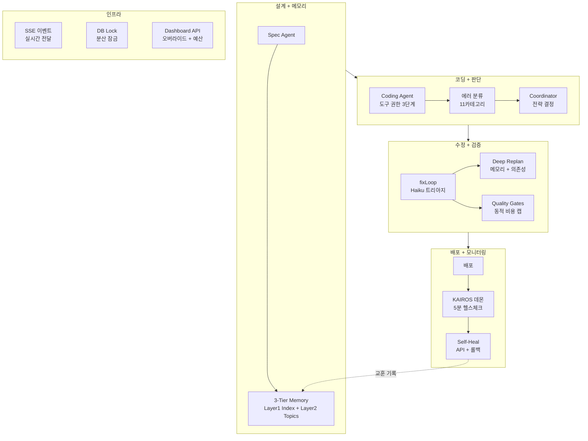

<style>
.card-link {
    text-decoration: none;
    color: inherit;
    display: block;
    width: fit-content;
    transition: transform 0.2s ease;
}
.card-link:hover {
    transform: translateY(-2px);
}
.card-link img {
    border: 1px solid #e1e4e8;
    border-radius: 8px;
    box-shadow: 0 2px 8px rgba(0, 0, 0, 0.1);
    max-width: 100%;
    height: auto;
}
</style>

12편에서 프롬프트 구조를 정리하고 3-Tier 메모리를 구축했습니다. 비용은 30% 줄였고, 프로젝트 간 학습도 가능해졌습니다.

하지만 파이프라인을 다시 돌려보니 한 가지가 더 보였습니다. **모든 판단이 하드코딩**되어 있었습니다.

에러가 나면 무조건 fixLoop 3회. 패킷이 실패하면 무조건 30초 대기 후 재시도. 비용 상한은 패킷 종류와 무관하게 $1.50 고정. 배포 후 모니터링은 사람이 직접 확인..

사람 조직으로 치면, **"뭐가 터지든 매뉴얼대로만 대응하는 팀"**과 같습니다. import 하나 빠진 건데 Sonnet을 불러오고, 설계 자체가 틀린 건데 코딩을 3번 재시도합니다.

이번 글에서는 이 하드코딩된 규칙들을 **지능적 판단 시스템**으로 교체한 과정을 다룹니다. 에러 분류 11종, KAIROS 건강 데몬, 코디네이터 의사결정, SSE 실시간 이벤트, 그리고 "백엔드는 다 만들었는데 UI에 안 보이는 문제"까지.

바로 본론으로 들어가겠습니다!!

---

## Phase 3: 에이전트 오케스트레이션 — 6가지 개선

### 1. 도구 권한 프레임워크 — "AI에게 rm -rf를 허용할 것인가"

Claude Code 유출에서 **6계층 도구 권한 시스템**이 인상적이었습니다. Config allowlist → Auto-mode classifier → Coordinator gate → 여러 단계를 거쳐야 도구를 사용할 수 있는 구조입니다.

AI Factory는 `--dangerously-skip-permissions` 플래그로 **모든 도구를 무제한 허용**하고 있었습니다. 코딩 에이전트가 원하면 `rm -rf`도, `npm publish`도, `git push --force`도 가능한 상태였습니다..

3단계 권한 레벨을 만들었습니다.

| 레벨 | 허용 도구 | 적용 패킷 |
|------|----------|----------|
| restricted | Read, Write, Glob, Grep (파일 조작만) | types/schema 정의 |
| standard | + Bash(npm, tsc, vitest, git diff) | 일반 UI/API 패킷 |
| full | + 모든 Bash 명령 | fixLoop, 특수 패킷 |

패킷의 epic과 파일 목록을 분석해서 자동으로 권한 레벨을 결정합니다. 데이터 레이어 패킷(types.ts, schema.ts만 수정)은 Bash가 필요 없으니 restricted, UI 패킷은 빌드/테스트 실행이 필요하니 standard 같은 식입니다.

`CLAUDE_CODE_USE_ALLOWED_TOOLS=false`로 기존 동작(전체 허용)으로 폴백도 가능합니다.

### 2. 구조화된 에러 분류 — 5종 문자열에서 11카테고리 구조체로

기존 에러 분류는 이랬습니다.

```typescript
// 기존: 5종 문자열
type ErrorType = "tool_missing" | "network" | "timeout" | "code_bug" | "unknown";
```

import가 빠진 것도, 타입이 안 맞는 것도, 빌드가 터진 것도 전부 `code_bug`로 분류됩니다. 결국 모든 에러에 같은 대응(fixLoop 3회)을 하게 됩니다.

**30개 이상의 regex 패턴**으로 11카테고리를 분류하는 `error-classifier.ts`를 새로 만들었습니다.

```typescript
// 변경 후: 구조화된 분류
type ErrorClassification = {
  category: "import" | "type" | "runtime" | "test" | "build" |
            "lint" | "permission" | "timeout" | "network" |
            "dependency" | "unknown";
  severity: "critical" | "major" | "minor";
  isRetryable: boolean;
  suggestedModel: "haiku" | "sonnet" | "opus";
  suggestedMaxIterations: number;
  rootCauseHints: string[];
  escalationPath: "haiku_fix" | "sonnet_fix" | "opus_fix" | "replan" | "skip";
};
```

분류 결과에 **"이 에러는 어떤 모델로 몇 번 시도해야 하는지"**까지 포함됩니다. import 에러면 Haiku 1회, 타입 에러면 Sonnet 2회, 설계 결함이면 replan. 3편에서 시작된 "적재적소" 원칙이 에러 대응에까지 확장된 셈입니다.

### 3. 비용 추정기 — "패킷마다 $1.50은 불공평하다"

기존에는 모든 패킷의 비용 상한이 **$1.50 고정**이었습니다. types.ts 하나 수정하는 패킷도 $1.50, 8개 파일을 통합하는 패킷도 $1.50.

`cost-estimator.ts`를 만들어서 **패킷별 토큰 추정 → 모델별 단가 계산 → 과거 통계 보정**으로 동적 예산을 할당합니다.

```
예측 모델:
  예상 토큰 = fileCount × 5,000 + description 길이 + AC 수 × 2,000
  예상 비용 = 예상 토큰 × 모델 단가
  fix 예산 = 코딩 비용의 50% (최소 $0.30)
  보정 = 과거 codingRuns 평균 비용과 비교
```

간단한 패킷은 $0.50, 복잡한 통합 패킷은 $3.00처럼 **패킷 특성에 맞는 예산**이 할당됩니다.

### 4. KAIROS 건강 데몬 — "배포하고 나서도 지켜본다"

12편에서 Claude Code 유출의 KAIROS 패턴을 소개했는데, 이걸 AI Factory의 배포 후 모니터링에 적용했습니다.

기존에는 배포 후 건강검진이 **1회성**이었습니다. self-heal이 있긴 하지만, 사람이 수동으로 트리거해야 했습니다. 배포 직후에는 괜찮다가 나중에 문제가 생기면 알 수가 없었습니다.

`kairos.ts`는 **5분마다 배포된 앱의 건강을 자동으로 확인**합니다.

```
KAIROS 루프:
  5분마다 →
    deployed 프로젝트 목록 조회 →
    각 프로젝트 주요 페이지 HTTP 요청 →
    ├── 정상 → 카운터 리셋
    ├── 1회 실패 → 기록만
    ├── 2연속 실패 → self-heal 자동 트리거
    └── 3연속 실패 → 알림 + 롤백 판단
```

Worker 서버가 시작될 때 KAIROS 데몬이 자동으로 기동됩니다. `KAIROS_ENABLED=false`로 비활성화도 가능합니다.

### 5. self-heal 강화 — API 라우트 발견 + 자동 롤백

기존 self-heal은 **페이지 라우트만 검사**했습니다. `/`, `/login`, `/dashboard`는 확인하지만 `/api/meals`나 `/api/auth/login` 같은 API 라우트는 빠져있었습니다. API가 500을 뱉어도 self-heal이 감지하지 못했습니다..

`discoverApiRoutes()` 함수를 추가해서 `src/pages/api/` 아래의 GET 가능한 API 엔드포인트도 자동으로 검사합니다.

그리고 **자동 롤백** 기능도 추가했습니다. self-heal이 코드를 수정했는데 오히려 상태가 악화되면(이전보다 에러가 늘면), `git revert`로 자동 롤백합니다. self-heal 결과는 12편에서 구축한 메모리 시스템(`consolidateMemory()`)에 교훈으로 기록됩니다.

### 6. 코딩 코디네이터 — wave 레벨 감독자

지금까지의 AI Factory는 코딩 페이즈에서 하드코딩된 규칙으로 판단했습니다.

```
기존:
  패킷 실패 → 30초 대기 → 재시도
  3연속 실패 → 120초 대기
  consecutiveFailures >= 3 → 파이프라인 중단
```

`coordinator.ts`는 이걸 **상태 기반 의사결정**으로 바꿉니다.

```
코디네이터:
  wave 완료 → 결과 분석 (성공률, 비용, 에러율)
    ├── 성공률 높음 + 예산 여유 → continue
    ├── 실패 있지만 재시도 가능 → backoff (동적 시간)
    ├── 예산 90% 소진 → 경고 + 남은 패킷 우선순위 재배치
    └── 연속 실패 + 예산 부족 → stop
```

사람 조직의 PM이 "이 상황에서 어떻게 할까?"를 판단하는 것처럼, 코디네이터가 **진행 상황, 예산, 에러 패턴**을 종합적으로 분석해서 다음 행동을 결정합니다.

### Phase 3 결과

| 항목 | 구현 | 규모 |
|------|------|------|
| 도구 권한 | 3단계 화이트리스트 | +70줄 |
| 에러 분류 | 11카테고리 × 3심각도 | +267줄 (신규 파일) |
| 비용 추정 | 토큰 기반 동적 예산 | +171줄 (신규 파일) |
| KAIROS | 5분 주기 건강 데몬 | +327줄 (신규 파일) |
| self-heal | API 라우트 + 자동 롤백 | +97줄 |
| 코디네이터 | 상태 기반 의사결정 | +225줄 (신규 파일) |

총 11개 파일, +1,292줄. Phase 3만으로 이전 Phase 1~2 합산보다 큰 작업이었습니다.

---

## Phase 4: 만들어놓은 것들을 연결하다

Phase 3에서 에러 분류기, 코디네이터, 메모리 시스템을 각각 만들었는데.. **서로 연결되지 않고 있었습니다.**

코디네이터는 에러 분류 결과를 모르고, replan은 메모리 교훈을 참고하지 않고, 이벤트는 DB 폴링으로만 전달됩니다. 각 모듈이 독립적으로 잘 동작하지만, **합쳐졌을 때의 시너지가 없는 상태**였습니다.

Phase 4는 이 모듈들을 **유기적으로 연결**하는 작업입니다.

### D1: 코디네이터 ↔ 에러 분류 연동

코디네이터의 `decideRetryStrategy()`가 정의만 되어 있고 **실제 호출되지 않고 있었습니다.** coding.ts의 retry 루프에서 에러가 나면 코디네이터에게 물어보지 않고 하드코딩된 규칙으로 재시도하고 있었습니다..

이제 retry 전에 **에러를 구조적으로 분류하고 → 코디네이터에게 전략을 물어봅니다.**

```
패킷 실패
  → classifyErrorStructured() — 에러 11카테고리 분류
  → coordinator.decideRetryStrategy(error, classification)
    ├── import 에러 → Haiku로 경로 수정 재시도 (저비용)
    ├── type 에러 → Sonnet으로 타입 추론 재시도
    ├── timeout → 스킵 + replan 트리거
    ├── dependency → replan 트리거 (패키지 구성 변경 필요)
    ├── build (2회 실패) → replan 트리거
    └── escalationPath=opus → Opus 에스컬레이션
```

이전에는 모든 실패가 "같은 모델로 같은 방식으로 재시도"였습니다. 이제는 **에러 특성에 맞는 대응**을 합니다.

### D2: Deep Replanning — 메모리 + 의존성 + 에러 분류 통합

기존 replan은 **에러 텍스트 100자만 보고 1회 LLM 호출**로 판단했습니다. 근본 원인을 깊이 분석하지 못하는 구조였습니다.

3가지를 추가했습니다.

**메모리 교훈 주입**: 12편에서 구축한 `buildMemoryIndex()`로 과거 유사 실패 패턴을 replan 프롬프트에 제공합니다. "이전에 비슷한 설계 결함이 있었고, 이렇게 해결했다"는 정보가 있으면 replan 정확도가 올라갑니다.

**의존성 역추적**: 패킷이 실패했을 때 **그 패킷이 의존하는 앞선 패킷의 출력**을 검증합니다. 패킷 0005가 실패했는데 원인이 패킷 0002의 API 설계 문제라면, 0005를 아무리 재설계해도 해결되지 않습니다. 이때 `UPSTREAM_FAILURE`로 분류해서 상위 패킷 재설계를 제안합니다.

**에러 분류 사전 컨텍스트**: D1에서 만든 구조화된 에러 분류 결과를 replan LLM에 hint로 전달합니다. LLM이 에러 텍스트에서 처음부터 분석하는 것보다, "이건 type_mismatch이고 severity는 major"라는 사전 정보가 있으면 더 정확한 판단을 합니다.

### D3: SSE 실시간 이벤트 스트리밍

대시보드의 이벤트 타임라인이 **DB 폴링(3초 간격)**으로 동작하고 있었습니다. 패킷이 완료되어도 3초를 기다려야 화면에 반영됩니다. 그리고 폴링마다 DB 쿼리가 발생해서 부하도 있었습니다.

**PipelineEventBus**(Node EventEmitter 기반)를 만들고, `emitEvent()`가 DB 저장과 동시에 이벤트 버스에도 브로드캐스트하도록 변경했습니다.

```
변경 전: emitEvent() → DB INSERT만 → Web이 3초마다 DB 폴링
변경 후: emitEvent() → DB INSERT + EventBus broadcast → Worker SSE → Web 프록시 → 즉시 반영
```

Worker에 `/events/stream/:projectId` SSE 엔드포인트를 추가했고, Web 앱의 stream 라우트가 이 엔드포인트를 프록시합니다. `WORKER_URL`이 설정되지 않은 환경에서는 기존 DB 폴링으로 자동 폴백합니다.

### D4: Pipeline Lock DB 영속화

기존 파이프라인 잠금이 **in-memory Set + 파일 기반 .lock**이었습니다. Worker가 크래시하면 메모리의 잠금 상태가 날아가서 같은 프로젝트가 중복 실행될 수 있었습니다.

`pipelineLocks` DB 테이블을 추가하고, **60초 하트비트 + 5분 stale 감지**로 분산 환경에서도 안전한 잠금을 구현했습니다.

| | 기존 | 변경 후 |
|---|---|---|
| 저장소 | 파일(.lock) + 메모리(Set) | DB 테이블 |
| 크래시 복구 | 불가 (수동 삭제 필요) | 5분 stale 자동 정리 |
| 멀티 인스턴스 | 불가 | 가능 (DB 기반) |
| 폴백 | - | DB 실패 시 파일 기반 |

Railway에서 스케일아웃을 하게 되면 이 변경이 필수적입니다.

### D5: 코디네이터 대시보드 API

Phase 3에서 만든 코디네이터의 판단 결과가 **대시보드에서 전혀 보이지 않았습니다.** 코디네이터가 "예산 90% 소진, 백오프 결정"이라는 판단을 내려도, 사용자는 타임라인에 뜨는 이벤트 텍스트로만 간접적으로 파악해야 했습니다.

Worker에 코디네이터 전용 API를 추가했습니다.

```
GET  /coordinator/:projectId         — 실시간 상태 (진행률, 예산, 결정 이력)
POST /coordinator/:projectId/override — 사용자 오버라이드 (skip/retry/stop/force_continue/change_model)
POST /coordinator/:projectId/budget   — 실행 중 예산 조정
```

**사용 시나리오**: 파이프라인이 돌아가는 중에 특정 패킷이 계속 실패합니다. 기존에는 파이프라인 전체를 중단하는 것만 가능했는데, 이제는 **"이 패킷만 건너뛰고 나머지 계속 진행"**을 대시보드에서 요청할 수 있습니다.

오버라이드가 5분 안에 소비되지 않으면 자동으로 만료됩니다. 파이프라인이 끝난 후 남은 오버라이드가 영향을 주는 걸 방지하기 위함입니다.

### Phase 4 결과

| 항목 | 핵심 변경 | 규모 |
|------|----------|------|
| D1: 코디네이터↔에러분류 | retry 전 구조적 분류 → 전략 분기 | ~65줄 |
| D2: Deep Replan | 메모리 + 의존성 역추적 + 에러 hint | ~80줄 |
| D3: SSE | EventBus + Worker SSE + Web 프록시 | ~105줄 |
| D4: DB Lock | 하트비트 + stale 감지 + 파일 폴백 | ~85줄 |
| D5: Dashboard API | 상태/오버라이드/예산 API | ~120줄 |

총 7개 파일, +596줄.

---

## 만들고 나니 보인 것: UI에 안 보이는 데이터 11종

Phase 1~4를 구현하고 대시보드를 열어봤습니다.

**..아무것도 안 변했습니다.**

백엔드에서 생성되는 데이터는 엄청 늘었는데, 프론트엔드에서 보여주는 건 기존 그대로였습니다. 전체를 분석해봤습니다.

### 완전히 UI에 안 보이는 데이터

| 데이터 | 생성 위치 | 가치 |
|--------|----------|------|
| 코디네이터 상태 | coordinator.ts | 높음 — 예산 소진율, 연속실패, 결정 이유 |
| 사용자 오버라이드 UI | coordinator.ts | 높음 — skip/retry/model 변경 제어 |
| 에러 분류 상세 | error-classifier.ts | 중간 — 11카테고리 × 3심각도 |
| 패킷별 비용 추정 | cost-estimator.ts | 중간 — 예산 대비 사용률 |
| 축적된 교훈 목록 | projectLessons 테이블 | 중간 — 신뢰도, 검증 횟수 |
| KAIROS 데몬 상태 | kairos.ts | 중간 — 모니터링 중인 프로젝트 |
| 메모리 인덱스/토픽 | memory.ts | 낮음 — 디버깅용 |
| DB 분산 락 | pipelineLocks 테이블 | 낮음 — 디버깅용 |
| 도구 권한 레벨 | claude-code-runner.ts | 낮음 — 디버깅용 |

### Worker API만 있고 Web 프록시가 없는 것

Worker에 API를 만들어놨지만, **Web 앱에서 이 API를 호출하는 프록시 라우트가 없어서** 대시보드에서 접근이 불가능합니다.

| Worker API | 기능 | Web 프록시 |
|-----------|------|-----------|
| GET /coordinator/:id | 코디네이터 실시간 상태 | **없음** |
| POST /coordinator/:id/override | 사용자 오버라이드 | **없음** |
| POST /coordinator/:id/budget | 예산 조정 | **없음** |
| GET /kairos/status | KAIROS 데몬 상태 | **없음** |
| GET /events/stream/:id | SSE 실시간 스트림 | 있음 ✓ |

SSE만 프록시가 있고 나머지는 전부 빠져있습니다..

### 이벤트 텍스트로만 간접 노출되는 것

타임라인에 `coordinator_decision`, `wave_backoff`, `replan_completed` 같은 이벤트가 텍스트로 표시되기는 합니다. 하지만 **구조화된 UI 요소(그래프, 배지, 필터)가 없어서** 정보를 직관적으로 파악하기 어렵습니다. "코디네이터가 backoff를 결정했다"는 텍스트는 있는데, "왜 그런 결정을 내렸는지"가 보이지 않습니다.

### 솔직한 반성

백엔드 로직을 만드는 데 집중하다 보니 **"사용자가 실제로 볼 수 있는가?"를 간과**했습니다. 11종의 데이터가 백엔드에서 열심히 생성되고 있지만, 대시보드에서 볼 수 없으면 없는 것과 마찬가지입니다.

가장 시급한 것은 **코디네이터 대시보드 UI**(상태 + 오버라이드 + 비용 게이지)와 **에러 분류 시각화**(패킷 실패 시 카테고리/심각도 배지)입니다. 이 두 가지만 있어도 Phase 3~4에서 만든 백엔드 기능의 대부분이 사용자에게 노출됩니다.

---

## Phase 1~4 전체 변화 정리

4개 Phase에 걸쳐 총 **+2,440줄**이 추가되었습니다. 변경 전후를 비교하면 이렇습니다.

| 영역 | Before | After |
|------|--------|-------|
| 프롬프트 구조 | 정적 규칙 매번 중복 전송 | CLAUDE.md 참조 + shared-context.md |
| 에러 분류 | 5종 문자열 | 11카테고리 × 3심각도 구조체 |
| 비용 관리 | $1.50 고정 | 패킷별 토큰 추정 동적 예산 |
| fixLoop | 무조건 3회, 같은 모델 | Haiku 트리아지 → 카테고리별 전략 |
| 프로젝트 간 학습 | 구조 패턴만 | 3-Tier 메모리 + Wilson Score |
| 메모리 검증 | 없음 | Skeptical Memory + 자동 감쇠 |
| 배포 후 모니터링 | 1회성 수동 | KAIROS 5분 주기 자동 |
| self-heal | 페이지만, 롤백 없음 | API 포함, 자동 롤백, 메모리 기록 |
| 파이프라인 잠금 | 파일 기반 (단일 인스턴스) | DB 기반 (분산 환경 지원) |
| 이벤트 전달 | DB 폴링 (3초 지연) | SSE 실시간 (0ms) |
| 실행 중 제어 | Stop만 가능 | 오버라이드 + 예산 조정 API |
| replan | 에러 텍스트만 | 메모리 + 의존성 역추적 + 에러 분류 |

### 신규 모듈 의존성

```
coding.ts (메인 파이프라인)
  ├── coordinator.ts (wave 감독 + 사용자 오버라이드)
  │     └── error-classifier.ts (에러 분류 → 전략 결정)
  ├── memory.ts (3-tier 메모리)
  ├── replan.ts (deep replanning)
  │     ├── memory.ts (교훈 주입)
  │     └── error-classifier.ts (사전 분류)
  └── quality-gates.ts
        └── cost-estimator.ts (동적 비용 캡)

utils.ts (인프라)
  ├── PipelineEventBus (SSE)
  └── DB Lock (pipelineLocks)

kairos.ts → self-heal.ts → memory.ts
```

---

## 13편을 마치며

이번 글의 교훈을 정리하면 이렇습니다.

1. **하드코딩된 규칙은 "모든 상황에 같은 대응"을 낳는다** — import 누락에 Sonnet을 쓰고, 설계 결함에 코딩 재시도를 3번 하는 낭비. 에러 분류 → 카테고리별 전략 분기로 해결
2. **모듈을 만드는 것보다 연결하는 것이 더 중요하다** — 에러 분류기, 코디네이터, 메모리를 각각 만들어도 연결하지 않으면 시너지가 없음. Phase 4의 핵심은 "연결"
3. **배포 후 모니터링은 데몬이어야 한다** — 1회성 검사는 "그 시점"만 확인. KAIROS처럼 주기적으로 돌아야 시간차 장애를 잡을 수 있음
4. **백엔드를 만들었으면 프론트엔드에서 보여줘야 한다** — 11종의 데이터가 UI에 안 보이면 없는 것과 같음. 코디네이터 API를 만들었지만 Web 프록시가 없어서 대시보드에서 접근 불가
5. **SSE는 DB 폴링의 확실한 상위호환** — 지연 0ms + DB 부하 제거. 단, 폴백(DB 폴링)을 반드시 유지해야 함

Claude Code 유출 코드에서 시작한 아키텍처 고도화가 Phase 1~4에 걸쳐 완료되었습니다. 프롬프트 비용 절감(Phase 1) → 학습 시스템(Phase 2) → 판단 시스템(Phase 3) → 연결 + 인프라(Phase 4)로, **"비용 → 기억 → 판단 → 통합"**이라는 자연스러운 흐름이었습니다.

다음 글에서는 UI에 안 보이는 11종의 데이터를 대시보드에 노출하는 작업, 그리고 이 고도화된 파이프라인으로 실제 앱을 만들어서 품질 변화를 측정하는 것을 다루겠습니다!!

감사합니다!!

---

### 이 시점의 파이프라인 구조


