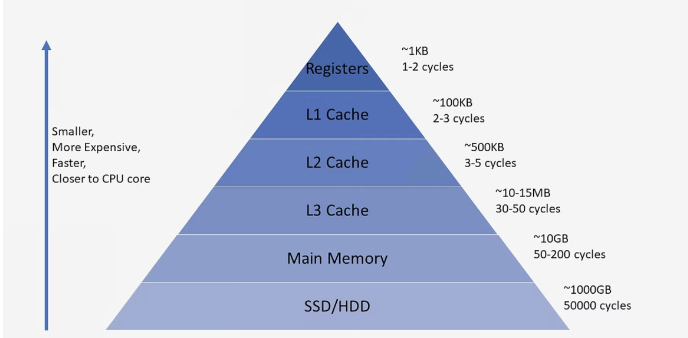

# 예시로 알아보는 CPU Cache

안녕하세요! 저는 현재 카카오테크 부트캠프 내에서 CS 세션 발표를 진행하고 있는데요! 프로젝트를 진행하며 캐시에 대한 내용이 많이 나와서 이를 정리하고 가기 위해 발표 주제로 정했습니다!

발표를 준비하며 PPT를 만들고 공부한 내용들을 다시 정리하며 공부하기 위해 오늘 포스팅을 하게 되었습니다!

그러면 캐시의 개념부터 작동 방식, 그리고 왜 필요한지까지 차근차근 살펴보겠습니다.

# CPU 캐시란?

- **데이터를 미리 저장해두는 임시 저장소**
- CPU와 메인 메모리(RAM) 사이에서 데이터 접근 속도를 높이기 위해 사용되는 **고속의 임시 저장소**
- 캐시는 CPU가 자주 사용하는 데이터나 명령어를 미리 저장해 두어, 필요한 순간에 빠르게 접근할 수 있도록 도와줍니다.

# 메모리 계층 구조와 속도



컴퓨터 시스템에서는 메모리의 **속도**와 **용량**이 반비례하는 경향이 있습니다.

- **레지스터**: 가장 빠르지만 용량이 매우 작습니다.
- **캐시 메모리**: 레지스터보다 느리지만 메인 메모리보다 빠릅니다.
- **메인 메모리(RAM)**: 캐시보다 느리지만 용량이 큽니다.
- **보조 기억 장치(HDD, SSD)**: 가장 느리지만 용량이 매우 큽니다.

이런 계층 구조 때문에, CPU의 빠른 연산 속도를 메인 메모리가 따라가지 못해 **병목 현상**이 발생할 수 있습니다. 캐시는 이 병목을 완화하기 위해 필수적입니다.

## CPU 캐시의 계층 구조
CPU 캐시는 일반적으로 **L1, L2, L3 캐시**로 구분되며, 각 계층은 속도와 용량에서 차이가 있습니다.

- **L1 캐시**: 가장 빠르고 작은 캐시로, CPU 코어 내부에 위치합니다.
- **L2 캐시**: L1 캐시보다 크지만 약간 느린 캐시로, 여전히 CPU 코어 근처에 위치합니다.
- **L3 캐시**: 여러 코어가 공유하는 캐시로, L1과 L2보다 크지만 더 느립니다.

# 캐시의 작동 방식

### 해시 테이블과 유사한 구조
캐시는 **하드웨어로 구현된 해시 테이블**과 비슷하게 동작합니다.

- 데이터를 **블록(block)** 단위로 저장합니다.
- 각 블록은 메모리의 특정 주소와 매핑되어 있습니다.
- CPU가 데이터를 요청할 때, 해당 주소의 데이터가 캐시에 있는지 확인합니다.

### 캐시 히트와 미스

- **캐시 히트(Cache Hit)**: 필요한 데이터가 캐시에 존재하여 빠르게 접근할 수 있는 경우.
- **캐시 미스(Cache Miss)**: 캐시에 데이터가 없어 메인 메모리에서 가져와야 하는 경우.

캐시의 효율은 히트율에 크게 의존하며, 높은 히트율은 시스템 성능 향상으로 이어집니다.

### **시간 복잡도와 성능**

- 캐시는 인덱스를 통해 직접 데이터에 접근하기 떄문에 데이터 접근 시간의 **시간 복잡도가 O(1)** 이 됩니다.


## 상황 예시
- 이렇게만 머리에 넣게 되면 지식이 오래 갈 수 없으니 예시를 한 번 들어보겠습니다.
--- 
- 저희는 부트캠프 교육장 내에 간식을 두는 캔틴이라는 공간이 있습니다.

- 만약 제가 초코파이를 먹고 싶으면 캔틴을 먼저 가겠죠?

- 캔틴에 만약 초코파이가 있다면 멀리 있는 편의점을 안가도 되게 됩니다. -> Cache Hit

- 그런데 캔틴에 초코파이가 없다면 멀리 있는 편의점에 가게 되겠죠 -> Cache Miss

- 이제 여기서 빠르게 갈 수 있지만 간식 종류가 적은 **캔틴**은 **캐시 메모리**이고 멀지만 많은 종류의 간식이 있는 **편의점**은 **메인 메모리**입니다.

---

- 그러면 초코파이를 원하는 교육생들이 점점 많아지면 많은 교육생들이 편의점에 가는 것보다 캔틴에 초코파이를 두어 교육생들이 멀리 가지 않고 초코파이를 가져와서 먹을 수 있는 것이 좋겠죠?

- 이렇게 자주 사용하는 데이터를 캐시 메모리에 두면 작업을 효율적으로 처리할 수 있게 됩니다.

# 캐시의 필요성

- 그렇다면 캐시의 필요성에 대해 더 알아보겠습니다.

## 파레토의 법칙과 데이터 접근
- **파레토의 법칙(80/20 법칙)** 은 전체 결과의 80%가 원인의 20%에서 발생한다는 원리입니다. 이 법칙은 캐시에도 적용되는데요

> 프로그램은 전체 데이터 중 일부(20%)에 자주 접근합니다.

- 따라서 자주 사용되는 20%의 데이터를 캐시에 저장하면 전체 시스템의 성능을 크게 향상시킬 수 있습니다.

## 캐시의 지역성
캐시의 효과적인 활용은 **지역성(Locality)** 원리에 기반합니다.

### 1. 시간적 지역성 (Temporal Locality)
- 최근에 접근한 데이터는 가까운 미래에 다시 접근할 가능성이 높습니다.
- 예를 들어, 반복문에서 사용되는 변수나 함수 호출 등.

### 2. 공간적 지역성 (Spatial Locality)
- 특정 메모리 주소에 접근할 때, 그 주변 주소도 곧 접근할 가능성이 높습니다.
- 예를 들어, 배열이나 연속된 메모리 구조체를 순회하는 경우.

이러한 지역성을 활용하여 캐시는 데이터 블록을 미리 가져오고 저장하여 성능을 향상시킵니다.

### 공간적 지역성 예제

캐시의 공간적 지역성을 이해하기 위해 파이썬 코드를 통해 실험해보겠습니다.

``` python
import time

SIZE = 10000
array = [[0] * SIZE for _ in range(SIZE)]
start = time.time()

for i in range(SIZE):
    for j in range(SIZE):
        array[i][j] += 1

end = time.time()

print("Row-major order: {:.2f} s".format(end - start))

start = time.time()

for i in range(SIZE):
    for j in range(SIZE):
        array[j][i] += 1

end = time.time()

print("Column-major order: {:.2f} s".format(end - start))
```

#### 결과

Row-major order: 9.67 s

Column-major order: 23.39 s

#### 분석
- **Row-major order**: 메모리를 행 단위로 접근하므로, 인접한 메모리 주소를 순차적으로 읽게 됩니다. 이는 공간적 지역성을 극대화하여 캐시 히트율을 높입니다.
- **Column-major order**: 열 단위로 접근하여 메모리 주소를 건너뛰게 됩니다. 이는 캐시 미스를 증가시켜 성능이 저하됩니다.

따라서 데이터 구조와 접근 방식에 따라 캐시의 효율이 크게 달라질 수 있습니다.

# CPU 캐시 외의 종류

이러한 캐시는 CPU 외에도 다양한 분야에서 사용되며, 성능 최적화에 중요한 역할을 합니다.

### 1. 데이터베이스 캐시
- **예시**: JPA의 영속성 컨텍스트
- 데이터베이스 쿼리 결과를 메모리에 저장하여 반복적인 데이터베이스 접근을 줄입니다.
### 2. CDN (Content Delivery Network)
- 전 세계에 분산된 서버에 콘텐츠를 캐시하여 사용자에게 빠르게 제공하는 시스템입니다.
- 지리적으로 가까운 서버에서 콘텐츠를 제공하므로 응답 시간이 단축됩니다.
### 3. 브라우저 캐시
- 웹 브라우저는 방문한 웹 페이지의 리소스(이미지, CSS 파일 등)를 로컬에 저장하여 재방문 시 로딩 시간을 줄입니다.
### 4. Redis
- 인메모리 데이터베이스로, 빠른 데이터 접근을 필요로 하는 경우에 캐시로 활용됩니다.

# 정리

캐시가 중요하고 사용을 잘 해야한다는 것은 알고 있었는데 개념부터 다시 정리하니 더욱 더 명확해지는 것 같습니다!

성능 최적화를 위해 다양한 형태의 캐시, 각각의 원리와 적용 방법을 이해하는 것이 중요할 것 같습니다!

앞으로의 프로젝트나 개발 과정에서 캐시를 적절히 활용하여 더 효율적인 시스템을 구축해보도록 노력해야할 것 같습니다!

**참고 자료**

- 컴퓨터 시스템 구조 및 운영체제
- [Understanding Cache Memory](https://www.geeksforgeeks.org/cache-memory-in-computer-organization/)
